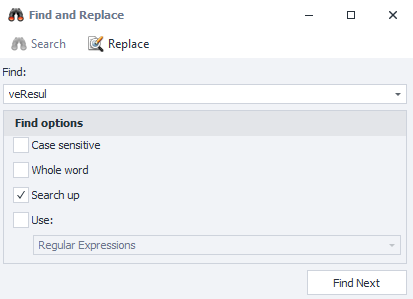
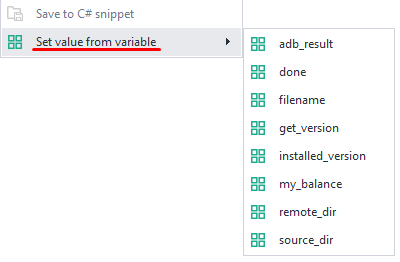

---
sidebar_position: 1
title: C# код
description: Код на C# в ZennoDroid.
---  
:::info **Пожалуйста, ознакомьтесь с [*Правилами использования материалов на данном ресурсе*](../../Disclaimer).**
:::  
_______________________________________________   
## Описание.  
С помощью этого экшена можно вставлять в проект куски кода, которые написаны на языке программирования C#. Тем самым функционал ZennoDroid заметно расширяется, как и область его использования.  

Хоть C# — это и объектно-ориентированный язык, но в данном экшене не используются некоторые преимущества такого подхода. Например, классы и наследования. Код будет исполняться последовательно за исключением использования классов и публичных переменных из [**Директив Using и общего кода**](./Directives_Using).  

#### Где можно применить:  
- Практически любые действия кубиков можно заменить через C#. При этом ускоряется разработка и эффективность с помощью выполнения кода.  
- Использование любых разработок на C# в своём проекте.  
- Интеграция сторонних библиотек и применение их в коде.  

_______________________________________________ 
## Как добавить в проект?  
Через контекстное меню: **Добавить действие → Свой код → C# код**.  


_______________________________________________   
## Как работать с экшеном?  
Кубик **C# код** представляет собой обычный текстовый редактор с базовой подсветкой кода.  

В него можно передавать любые переменные проекта, а результат сохранять в текстовом файле, таблице, базе данных или также в переменной.  

Для использования методов и свойств проекта используется сущность `project`. Например, если вы хотите вставить переменную проекта в код, то вызывать ее нужно так: `project.Variables["counter"].Value`, где `counter` — имя переменной.
_______________________________________________
### Контекстное меню.  
Нажав ПКМ по полю ввода в свойствах действия, вы откроете контекстное меню.  

  
_______________________________________________
#### Отменить/Повторить.  
Отменяет последнее изменение в коде. Однако если это было сделано случайно, то можно повторить отмененный ввод.  

Данные действия работают только в коде окна C# и не вызывают изменений в других кубиках. Для аналогичной функции с другими кубиками нужно зайти в раздел **Редактирование** на верхней панели ProjectMaker.  
_______________________________________________
#### Вырезать\Копировать\Вставить\Удалить.  
Стандартные действия по работе с кодом как с текстом.  
_______________________________________________
#### Закомментировать\Отменить комментирование.  
Добавляет к выделенному коду символы `//`, превращая его в комментарий. То есть эти строки будут отключены из общего выполнения.  

Это особенно полезно при работе над большими проектами или для отладки кода. В комментариях также можно разместить информацию об изменениях, связях или функционале.  
_______________________________________________
#### Нумерация строк.  
   

Включает/отключает числовое обозначение строк. Помогает в быстрой навигации по коду, а также для нахождения ошибок по информации из лога.  

На небольших проектах нумерацию можно отключить, чтобы расширить рабочее пространство.  

<details>
<summary>**В настройках ProjectMaker можно задать поведение по умолчанию.**</summary>
<!--All you need is a blank line-->

     
</details>  
_______________________________________________
#### Перенос строк.  
Включает автоматический перенос строк, если в текущем окне не хватает места.  
|   | | 
|:--:| :--:|
| *Настройка выключена* | *Настройка включена* |   

<details>
<summary>**В настройках ProjectMaker можно задать поведение по умолчанию.**</summary>
<!--All you need is a blank line-->

     
</details> 
_______________________________________________
#### Перейти к строке.
Позволяет быстро показать необходимую строку, введя номера линии и столбца в открывшемся диалоговом окне.  


Используется для поиска ошибочного участка кода по информации из лога.  
_______________________________________________
#### Поиск.  
Открывает окно поиска по коду этого экшена. Искать можно с учетом параметров:  
- *С учетом регистра*;  
- *Слово целиком*;  
- *Искать назад*;  
- *Использовать: Регулярные выражения или Знаки подстановки*;  

  

После нажатия на кнопку *Найти далее* курсор переходит на первое найденное значение. Повторное нажатие переводит курсор на следующее найденное значение и т. д.  
_______________________________________________
#### Замена.  
Похоже на **Поиск**, но сразу после нахождения искомого значения производится его замена на введенное значение.  

  

Работать может в пошаговом режиме, либо сразу *Заменить все* найденные вхождения.  
_______________________________________________
#### Вставить C# сниппет.  
В место, где сейчас находится курсор, будет вставлено всё содержимое выбранного файла.  

  

Изначально этот пункт меню не отображается. Чтобы он появился, надо в ***Директорию C# сниппетов*** добавить хотя бы один файл.  


Сохранить фрагмент кода в файл, например, можно с помощью функции **Сохранить в C# сниппет** (описано ниже).  
Файлы в директории можно помещать в папки и таким образом удобно их группировать.  
_______________________________________________
#### Сохранить в C# сниппет.  
Позволяет сохранять выделенный фрагмент кода в TXT-файл. Этот сниппет можно быстро использовать в дальнейшем и вставлять в другие проекты.  
_______________________________________________
#### Установить значение из переменной.  
При наведении курсора на этот пункт открывается список всех [**Своих**](../../Data/WorkWithVariables) и [**Авто-сгенерированных**](../../pm/Creating/Variables) переменных проекта.  

  

Выбрав нужную переменную в редакторе появляется конструкция вида `project.Variables["myVar"].Value`. Это значение всегда имеет строковый тип (string), и для его использовании в качестве других типов необходима конвертация.
_______________________________________________
### Не возвращать значение.  
После отключения этого чекбокса результат выполнения кода будет передан с помощью оператора `return`.  
_______________________________________________
### Положить результат в переменную.  
Если отключен предыдущий чекбокс, то результат выполнения `return` можно сохранить в любую переменную.  

:::info **Каждая строка C# обязательно должна заканчиваться символом `;` .**  
Это помогает компилятору определить, где заканчивается строка. Без этого символа проект просто выдаст ошибку на этапе запуска.
:::  
_______________________________________________
## Настройки по умолчанию.  
В настройках программы есть блок настроек специально для кубика **C#**. Выше мы уже упоминали некоторые из них.  

  
_______________________________________________
## Конвертация экшенов в код.  
В ZennoDroid есть функция, которая позволяет новичкам быстро освоиться с C#. Некоторые из экшенов можно конвертировать в код и дальше работать с ним, как если бы это был кубик.  

Вам нужно **нажать на необходимый кубик ПКМ → Конвертировать в C# → вставить скопированный код в поле кубика C#**.  

  
_______________________________________________
## Отладка C#.  
В сложных и больших фрагментах C# иногда бывает сложно быстро найти ошибку. Поэтому необходима отладка (debug) C# кода с пошаговым мониторингом изменения переменных и данных в списках, таблицах и базах данных. Каждый экшен C# можно отладить в Project Maker с помощью установки одной или нескольких точек останова.  

  

Для добавления точки останова нужно кликнуть в поле слева от редактора кода напротив нужной строки. Нажатием *Далее* запускаем исполнение кубика. Можно проверять работу кода по шагам или до следующей точки останова с помощью кнопок над редактором. Смотрим изменения в [**Окне переменных**](../../pm/Creating/Variables) и эффективно исправляем ошибки.  
_______________________________________________
## Примеры использования.  
Обучение программированию на C# выходит за рамки данной документации. Однако мы можем дать несколько советов и показать практические примеры, которые часто используют пользователи ZennoDroid при работе с C#.  
_______________________________________________
### Арифметические действия с целыми числами.  
```C  
int value1 = Convert.ToInt32(project.Variables["value1"].Value);
int value2 = Convert.ToInt32(project.Variables["value2"].Value);
int value3 = value1 + value2; //или value1 - value2 или value1 * value2 и т. д.
return value3.ToString(); //сумма двух чисел  
```  
_______________________________________________
### Округление результата деления.  
```C  
float value1 = Convert.ToSingle(project.Variables["value1"].Value);
float value2 = Convert.ToSingle(project.Variables["value2"].Value);
return Math.Ceiling(value1/value2); // округление в большую сторону
//или
return Math.Ground(value1/value2); // округление в меньшую сторону  
```  
_______________________________________________
### Создание списка со случайными числами от 1 до 10.  
:::tip **В этом примере ключевое слово `var` ссылается на тип неявным способом.**  
Это любой псевдоним, а реальный тип определит компилятор C#.
:::  

```C  
var list = project.Lists["numbers"];//обращаемся к списку списков проекта для получения сущности одного из них.
list.Clear();//очищаем список перед заполнением
int value;//объясляем цельночисленную переменную
List <string> tempList = new List<string> ();//создаём новый список из строк, но этот список существует только в рамках этого экшена и будет уничтожен после выполнения экшена
for (int i = 0; i < 10; i++) {//цикл из 10 иттераций 
	value = i;//присваиваем значение счетчика цикла чтобы не имзменять его
	value++;//увеличиваем на 1 значение переменной
	tempList.Add(value.ToString());//добавляем во временный список строковое значение числа
}//повторяем так 10 раз
tempList.Shuffle();//перемешиваем список
list.AddRange(tempList);//добавляем в результирующий список перемешанный список чисел от 1 до 10  
```  
:::info **Обратите внимание, в этом примере экшен C# ничего не возвращает, в отличии от двух примеров выше.**  
Здесь результат работы сохраняется в списке, а не с помощью оператора возврата `return` попадает в указанную кубиком переменную. 
:::  
_______________________________________________
### Получение случайной строки из файла с доступами к аккаунтам и разделение её на логин и пароль.  
Ключевое слово **null** является литералом, представляющим пустую ссылку, которая не ссылается на объект. А оператор `return` можно использовать для возврата **null**. При этом экшен C# выйдет по красной линии и это бывает удобно при создании взаимосвязей с другими кубиками.  

```C  
IZennoList list = project.Lists["accounts"];//получаем список с привязанным TXT-файлом в котором построчно хранятся доступы в формате логин:пароль
if (list.Count== 0) return null;//Если список пустой, то выходим из кубика по красной линии
Random rnd = new Random();//создаем генератор случайных чискел
string str = list[rnd.Next(0, list.Count)];//вычисляем случайное чисто от 0 до количества элементов списка (не включительно) и назначаем значение найденного индекса строковой переменной
string [] arr = str.Split(':');//формируем массив строк разделяя переменную с помощью делимера :
project.Variables["login"].Value = arr[0];//берем первый элемент массива, который является логином (индесы массивов, списков всегда начинаются с 0) и присваиваем это значение переменной login
project.Variables["password"].Value = arr[1];//второй элемент массива будет паролем 
```  

В этом примере мы выводим предупреждение при пустом списке аккаунтов и заполняем пустой список из TXT новыми доступами.   
Тоже самое можно выполнить с помощью метода `project.SendInfoToLog("Пустой список", true);`.  
_______________________________________________
### Работа с файлами: получение разрешения (ширина x высота) изображения.  
```C  
Image img = Image.FromFile(project.Directory + @"/temp.jpg");//получаем изображение из файла
int width = img.Width;//получаем ширину картинки
int height = img.Height;//и высоту
return width.ToString() + "х"+ height.ToString();//формируем строку с данными  
```  
:::info **Символ `@` означает, что компилятор будет использовать строку за ним буквально, а не как escape-последовательность.**  
Если убрать этот символ, то для корректной работы кода в пути пришлось бы ставить двойной слэш вместо одинарного.  
:::  
_______________________________________________
### Работа с OwnCode и с изображениями: наложение полупрозрачного “водяного знака” по центру.  
На практике часто требуется вывести некоторые функции на C# в отдельное место и обращаться к ним из разных экшенов. С этим поможет ***OwnCode (свой код)***. В этот класс можно вставить функцию, которая будет доступна из кубиков. Она может принимать параметры (аргументы) и возвращать результаты вычислений.  

```C  
Image original = Image.FromFile(project.Directory + @"/image.jpg");//исходная картинка на которую нужно наложить водяной знак

int w = original.Width;//азмеры исходной картинки
int h = original.Height;

int w_wm = (int) w/10;//ширина водяного знака, в данном случае эта ширина составляет 10 исходной картинки

Image wm = OwnCode.CommonCode.SetImageOpacity(Image.FromFile(project.Directory + @"/wm.png"), .5F);//в одной строке получаем изображение из файла и обрабатываем его (накладываем эффект полупрозрачности) с помощью функции SetImageOpacity, которая находится в классе общего кода
float scale = (float)wm.Height / wm.Width; //пропорции водяного знака
int h_wm = (int) (w_wm * scale);//вычисляем новую высоту водяного знака в зависимости от новой ширины и пропорций
int x = (int) (w/2 - w_wm/2);//позиция x водяного знака (середина основной картинки минус середина новой ширины водяного знака)
int y = (int) (h/2 - h_wm/2);//позиция y водяного знака

Graphics gr = Graphics.FromImage(original);//создаём графический объект из исходкого изображения
gr.DrawImage(wm, x, y, w_wm, h_wm);//рисуем поверх исходной картинки водяной знак с вычисленными ранее координатами и новыми размерами

original.Save(project.Directory + @"/image_result.jpg", System.Drawing.Imaging.ImageFormat.Jpeg);//сохраняем картинку в формате JPEG по указанному пути
original.Dispose();//уничтожаем объекты, которые уже не нужны, чтобы они не занимали память
wm.Dispose();
gr.Dispose();
```  

В данном примере создаётся функция `SetImageOpacity`. На входе она принимает изображение вместе со значением для изменения прозрачности, а на выходе отправляет измененное изображение. Эта функция требует `using System.Drawing.Imaging;`  

А дальше используем функцию `SetImageOpacity`, которую нужно вставить в классе `OwnCode.CommonCode`.  

```C  
using System.Drawing.Imaging;
public static Image SetImageOpacity(Image image, float opacity)  
{  
    try  {  
		Bitmap bmp = new Bitmap(image.Width, image.Height);
        //создание графики из картинки
        using (Graphics gfx = Graphics.FromImage(bmp)) {
            //создание объекта color matrix  
            ColorMatrix matrix = new ColorMatrix();      
            //установка прозрачности 
            matrix.Matrix33 = opacity;  
            //создание новых атрибутов
            ImageAttributes attributes = new ImageAttributes();      
            //установка цвета прозрачности картинки
            attributes.SetColorMatrix(matrix, ColorMatrixFlag.Default, ColorAdjustType.Bitmap);    
            //отрисовываем картинку
            gfx.DrawImage(image, new Rectangle(0, 0, bmp.Width, bmp.Height), 0, 0, image.Width, image.Height, GraphicsUnit.Pixel, attributes);
        }
        return bmp;  
    }  
    catch (Exception ex)  
    {  
        return null;  
    }  
}   
```  
_______________________________________________
### Работа с Regex.  
С помощью регулярных выражений в C# можно: 
- *парсить данные*;  
- *находить нужные значения*;  
- *обрабатывать и присваивать переменные*;  
- *очищать тексты от мусора*.  

В примере ниже мы очистим от всех тегов HTML-содержимое некоторого элемента.  
```C  
string html = project.Variables["value1"].Value;//присваиваем значение переменной где содержится исходный код элемента
return Regex.Replace(html, @"<.*?>", String.Empty);//заменяем HTML-теги на пустоту и возвращаем результат
```  
_______________________________________________
### Работа с макросами.  
С помощью объекта `Macros` можно получить доступ ко множеству функций для работы с файловой системой или для обработки текстов. Например, можно в C# организовать обработку `Spintax`, аналогичную соответствующему кубику.  
```C  
return Macros.TextProcessing.Spintax("{0|1|2}");//случайно выведет одно из трёх значений
```
_______________________________________________
## Полезные ссылки.  
- [**Полное руководство по языку программирования С#**](https://metanit.com/sharp/tutorial/?ysclid=m6tuqoibxu646819911).
- [**Логические операции в ZennoDroid**](../../category/логика-в-zd).  
- [**Тестер регулярных выражений**](../../Tools/RegEx_Tester). 

