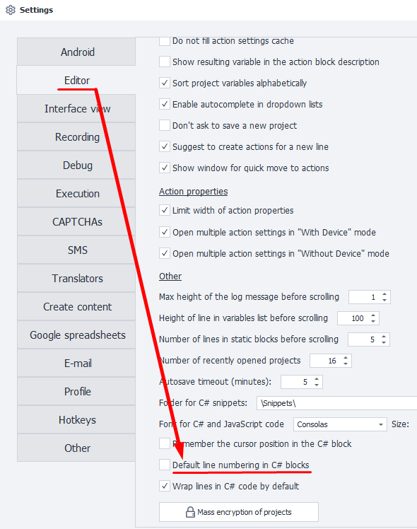

:::info **Please read the [*Material Usage Rules on this site*](../../Disclaimer).**
:::
_______________________________________________
## Description.
With this action, you can insert code snippets written in C# into your project. This noticeably expands ZennoDroid's functionality as well as the ways you can use it.

Even though C# is an object-oriented language, this action doesn’t use some of those advantages, like classes and inheritance. The code will execute sequentially, except when using classes and public variables from [**Using Directives and General Code**](./Directives_Using).

#### Where can you use it:
- You can replace almost any action block with C#, making development and efficiency faster thanks to direct code execution
- You can use any C# development in your project
- It allows you to integrate third-party libraries and use them in your code

_______________________________________________
## How do you add it to your project?
Via the context menu: **Add Action → Custom Code → C# code**.


_______________________________________________
## How do you work with the action?
The **C# code** block is a regular text editor with basic code highlighting.

You can pass any project variables into it, and save the result in a text file, table, database, or another variable.

To use methods and properties of the project, you use the `project` entity. For example, if you want to insert a project variable into your code, call it like this: `project.Variables["counter"].Value`, where `counter` is the name of the variable.
_______________________________________________
### Context menu.
If you right-click on the input field in the action properties, you'll open the context menu.


_______________________________________________
#### Undo/Redo.
This undoes the last change in your code. If you did that by accident, you can redo the undone input.

These actions work only inside the C# code window and don’t affect other blocks. To use similar features in other blocks, go to the **Edit** section on the top menu of ProjectMaker.
_______________________________________________
#### Cut/Copy/Paste/Delete.
These are the standard actions for editing code as text.
_______________________________________________
#### Comment/Uncomment.
Adds `//` to the selected code, turning it into a comment. Those lines won’t execute.

This is especially useful when working on big projects or debugging code. You can also add notes on what changed, how things are connected, or what the code does, right in the comments.
_______________________________________________
#### Line numbering.


Turns line numbering on or off. This helps you quickly navigate through the code or find errors based on what you see in the logs.

For small projects, you can turn off line numbers to get more workspace.

<details>
<summary>**In ProjectMaker settings you can choose the default behavior.**</summary>

    
</details>
_______________________________________________
#### Word wrap.
Turns on auto line break if there’s not enough space in the current window.
|   | |
|:--:| :--:|
| *Setting off* | *Setting on* |

<details>
<summary>**In ProjectMaker settings you can choose the default behavior.**</summary>

    
</details>
_______________________________________________
#### Go to line.
Lets you quickly go to the line you need, just enter the line and column number in the dialog window.


This is used to find the error spot in the code using info from the logs.
_______________________________________________
#### Find.
Opens the search window for this action’s code. You can search with the following options:
- *Case sensitive*
- *Whole word*
- *Search backwards*
- *Use: Regular expressions or wildcards*


After pressing *Find Next* the cursor moves to the first found value. Repeating it moves to the next match, and so on.
_______________________________________________
#### Replace.
Works like **Find**, but after finding the value it immediately replaces it with the value you entered.


You can work step by step or replace all at once with *Replace all*.
_______________________________________________
#### Insert C# snippet.
Wherever your cursor is, everything from the selected file will be inserted.


At first, this menu item isn’t shown. To make it appear, you need to add at least one file to the ***C# Snippets Directory***.


You can save a code fragment to a file, for example, by using the **Save to C# snippet** function (explained below).
You can put files into folders within the directory and group them however you like.
_______________________________________________
#### Save to C# snippet.
Lets you save the selected code fragment to a TXT file. You can quickly use this snippet later and insert it into other projects.
_______________________________________________
#### Set value from variable.
When you hover over this item the full list of [**Custom**](../../Data/WorkWithVariables) and [**Auto-generated**](../../pm/Creating/Variables) project variables appears.


After picking a variable, the editor inserts something like `project.Variables["myVar"].Value`. This value is always a string type, so if you need it as another type, you’ll need to convert it.
_______________________________________________
### Don’t return a value.
When you uncheck this box, the result of your code will be returned via the `return` statement.
_______________________________________________
### Save result to variable.
If the previous checkbox is unchecked, you can save the value returned by `return` to any variable.

:::info **Every line of C# has to end with a `;`**
This lets the compiler know where the line ends. Without this character, the project will just give an error at runtime.
:::
_______________________________________________
## Default settings.
The program has a special section in the settings for the **C#** block. We’ve already mentioned some of them above.


_______________________________________________
## Converting actions to code.
ZennoDroid has a feature that lets beginners get comfortable with C# fast. Some actions can be converted to code so you can work with them as if they were a block.

Just **right-click the needed block → Convert to C# → paste the copied code into the C# block field**.


_______________________________________________
## C# debugging.
With complex and large C# fragments it's sometimes tricky to quickly find errors. That’s why you need to debug C# code step by step, watching how variables and data in lists, tables, and databases change. Every C# action can be debugged in Project Maker by setting one or more breakpoints.


To add a breakpoint, click in the field to the left of the code editor next to the needed line. Hit *Next* to start running the block. You can check the code step-by-step or go to the next breakpoint using the buttons above the editor. Watch changes in the [**Variables window**](../../pm/Creating/Variables) and efficiently fix errors.
_______________________________________________
## Usage examples.
Learning C# programming is outside the scope of this documentation. But we can offer a few tips and show some practical examples that ZennoDroid users often use when working with C#.
_______________________________________________
### Arithmetic with integers.
```C
int value1 = Convert.ToInt32(project.Variables["value1"].Value);
int value2 = Convert.ToInt32(project.Variables["value2"].Value);
int value3 = value1 + value2; //or value1 - value2 or value1 * value2 etc.
return value3.ToString(); //sum of two numbers
```
_______________________________________________
### Rounding division results.
```C
float value1 = Convert.ToSingle(project.Variables["value1"].Value);
float value2 = Convert.ToSingle(project.Variables["value2"].Value);
return Math.Ceiling(value1/value2); // round up
//or
return Math.Ground(value1/value2); // round down
```
_______________________________________________
### Creating a list with random numbers from 1 to 10.
:::tip **In this example, the `var` keyword references the type implicitly.**
It’s just an alias, and the actual type gets determined by the C# compiler.
:::

```C
var list = project.Lists["numbers"];//we access the project list entity by name
list.Clear();//clear the list before filling it
int value;//declare an integer variable
List <string> tempList = new List<string> ();//create a new local string list; it exists only inside this action and will be destroyed after execution
for (int i = 0; i < 10; i++) {//loop 10 times
	value = i;//assign the loop counter value to avoid modifying the counter itself
	value++;//increase the variable by 1
	tempList.Add(value.ToString());//add the string value to the temp list
}//repeat 10 times
tempList.Shuffle();//shuffle the list
list.AddRange(tempList);//add the shuffled list of numbers 1 to 10 to the main list
```
:::info **Notice: in this example, the C# action doesn't return anything, unlike the first two examples.**
Here, the result is stored in the list, not returned by `return` to the variable in the block.
:::
_______________________________________________
### Getting a random line from a file with account credentials and splitting into login and password.
The **null** keyword is a literal representing an empty reference that doesn’t point to any object. And you can use the `return` operator to return **null**. In this case, the C# action will exit along the red line, which can be convenient for setting relationships with other blocks.

```C
IZennoList list = project.Lists["accounts"];//get the list attached to a TXT file with lines like login:password
if (list.Count== 0) return null;//If the list is empty, exit the block via the red line
Random rnd = new Random();//create a random number generator
string str = list[rnd.Next(0, list.Count)];//pick a random index and assign its value to a string variable
string [] arr = str.Split(':');//split the string into an array using the : delimiter
project.Variables["login"].Value = arr[0];//use the first element (index 0) as login value
project.Variables["password"].Value = arr[1];//second element is the password
```

In this example we show a warning when there are no account entries, and fill the empty list from the TXT with new credentials.
You can do the same thing using this method: `project.SendInfoToLog("Empty list", true);`.
_______________________________________________
### Working with files: getting image resolution (width x height).
```C
Image img = Image.FromFile(project.Directory + @"/temp.jpg");//get image from file
int width = img.Width;//get width
int height = img.Height;//and height
return width.ToString() + "x"+ height.ToString();//create a string with this info
```
:::info **The `@` symbol means the compiler treats the string as literal, not an escape sequence.**
If you leave it out, you’d need to use double backslashes in the path rather than single for the code to work right.
:::
_______________________________________________
### Working with OwnCode and images: adding a semi-transparent watermark in the center.
In practice, it’s often useful to offload some functions to C# and access them from different actions. That’s where ***OwnCode (custom code)*** helps. You can put a function in this class and call it from blocks. It can take arguments (parameters) and return values.

```C
Image original = Image.FromFile(project.Directory + @"/image.jpg");//original image to watermark

int w = original.Width;//get original dimensions
int h = original.Height;

int w_wm = (int) w/10;//watermark width: 1/10 of original

Image wm = OwnCode.CommonCode.SetImageOpacity(Image.FromFile(project.Directory + @"/wm.png"), .5F);//get the image and apply half transparency using SetImageOpacity from the common code class
float scale = (float)wm.Height / wm.Width; //watermark proportions
int h_wm = (int) (w_wm * scale);//calculate new watermark height
int x = (int) (w/2 - w_wm/2);//x position: middle of main image minus half watermark width
int y = (int) (h/2 - h_wm/2);//y position

Graphics gr = Graphics.FromImage(original);//create graphics object from original image
gr.DrawImage(wm, x, y, w_wm, h_wm);//draw the watermark over the original at given size and coordinates

original.Save(project.Directory + @"/image_result.jpg", System.Drawing.Imaging.ImageFormat.Jpeg);//save image as JPEG
original.Dispose();//free objects to release memory
wm.Dispose();
gr.Dispose();
```

This example creates a `SetImageOpacity` function. It takes an image and a value for the opacity, and returns the modified image. This function requires `using System.Drawing.Imaging;`.

Next, use the `SetImageOpacity` function, which you need to add to the `OwnCode.CommonCode` class.

```C
using System.Drawing.Imaging;
public static Image SetImageOpacity(Image image, float opacity)
{
    try  {
		Bitmap bmp = new Bitmap(image.Width, image.Height);
        //create graphics from image
        using (Graphics gfx = Graphics.FromImage(bmp)) {
            //make color matrix
            ColorMatrix matrix = new ColorMatrix();
            //set opacity
            matrix.Matrix33 = opacity;
            //make new attributes
            ImageAttributes attributes = new ImageAttributes();
            //set transparency for image color
            attributes.SetColorMatrix(matrix, ColorMatrixFlag.Default, ColorAdjustType.Bitmap);
            //draw image
            gfx.DrawImage(image, new Rectangle(0, 0, bmp.Width, bmp.Height), 0, 0, image.Width, image.Height, GraphicsUnit.Pixel, attributes);
        }
        return bmp;
    }
    catch (Exception ex)
    {
        return null;
    }
}
```
_______________________________________________
### Working with Regex.
With regular expressions in C# you can:
- *parse data*
- *find needed values*
- *process and assign variables*
- *clean up text from junk*

In the example below, we’ll remove all HTML tags from an element’s content.
```C
string html = project.Variables["value1"].Value;//get variable where the source code is stored
return Regex.Replace(html, @"<.*?>", String.Empty);//replace HTML tags with nothing and return result
```
_______________________________________________
### Working with Macros.
Using the `Macros` object you get access to lots of functions for working with the file system or processing text. For example, in C# you can handle `Spintax` the same way as with a block.
```C
return Macros.TextProcessing.Spintax("{0|1|2}");//randomly returns one of three values
```
_______________________________________________
## Useful links.
- [**Complete C# Programming Language Guide**](https://metanit.com/sharp/tutorial/?ysclid=m6tuqoibxu646819911)
- [**Logical operations in ZennoDroid**](../../category/логика-в-zd)
- [**Regular Expression Tester**](../../Tools/RegEx_Tester)