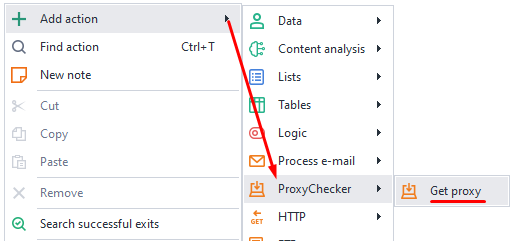
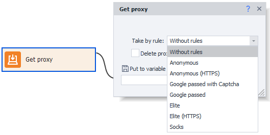

:::info **Please read the [*Material Usage Rules on this site*](../Disclaimer).**
:::
_______________________________________________

In ZennoDroid, you can use a third-party proxy server to work with apps while running a project. This action is suitable for getting values from Proxychecker.
_______________________________________________
## How to add to your project?
Right-click menu: **Add action → Proxychecker → Get proxy**.

_______________________________________________
## How does this action work?

### Pick by rule.
A few options are available:
- **No rules**
- **Anonymous/Anonymous (HTTPS)**
- **Google passed with Captcha**
- **Google passed**
- **Elite/Elite (HTTPS)**
- **Socks**

You need to edit these rules in Proxychecker.

If you choose ***No rules***, proxies will be taken in order.

And the option **Remove proxy from live list** deletes the proxy server from the list after you take it.

You can also **Put the received proxy into a variable**.
On the screenshot above, it's `{-Variable.taken_proxy-}`.
_______________________________________________
## Useful links.
- [**Basic terms**](../basicterms)
- [**Mail setup**](../get-started/ProxyCheckerZD)
- [**Proxy traffic**](../Settings/Proxy_Traffic)