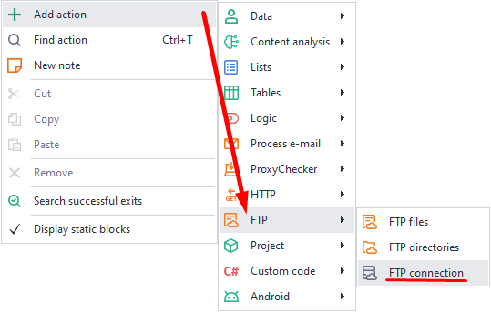
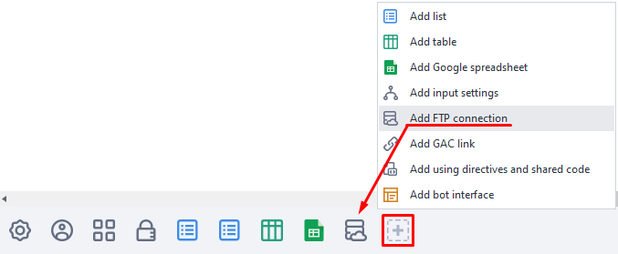
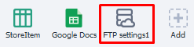
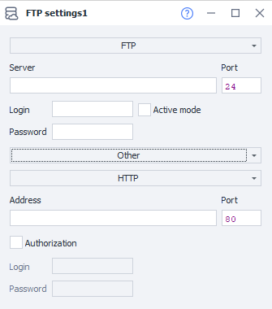

---
sidebar_position: 6
title: FTP Connection
description: FTP connection settings.
---
:::info **Please read the [*Material Usage Rules on this site*](../../Disclaimer).**
:::
_______________________________________________
### How to create one?
You can create a new FTP connection from the context menu:
**Add Action → FTP → FTP Connection**

or via the ***Static Blocks Panel***:

_______________________________________________
## How does it work?

### Available settings.

#### Choosing the file transfer protocol type.
Clicking on the very top field brings up a list of available protocols:
- **FTP (File Transfer Protocol).**
Standard protocol designed for file transfers.
- **FTPs (FTP + SSL).**
A secure file transfer protocol.
- **sFTP (SSH(Secure Shell) + FTP).**
A protocol for file operations over a reliable, secure connection.

#### Server (required).
Enter the FTP server name here.

#### Port (required).
Specify the FTP connection port. By default, it's `21`.

#### Login and Password.
Credentials for connecting. You can leave these blank if the server allows it.

#### Active mode.
Tick this box if you need to use active FTP mode.
:::info **Main feature of active mode**
The *server initiates the connection* to transfer data. This can cause problems if you have a Firewall or NAT enabled that blocks incoming connections.
:::

#### Proxy.
You can leave it on *No proxy*, or choose between:
- *String in the format protocol://login:pass@ip:port*
- *Other*

In the *Other* mode, you can paste the proxy in any format, filling in the required info in the fields.
You get the address, port, and auth data from your provider.
_______________________________________________
## Useful links.
- [**More about Protocols**](https://blog.skillfactory.ru/glossary/protokol/)
- [**What are static blocks?**](../Static%20Block%20Panel/CommonPrinciples)
- [**Traffic Proxying**](../../Settings/Proxy_Traffic)