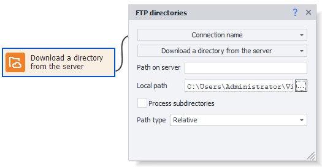

:::info **Please read the [*Rules for using materials on this site*](../../Disclaimer).**
:::  
_______________________________________________
This action lets you work with directories, specifically:
- ***Download** a directory with your project’s data files located on the FTP server;*
- ***Upload** a project data directory to the FTP server;*
- ***Delete** a directory with files from the server;*
- ***Get** a list of working files located in a specific directory;*
- ***Rename** a directory on the server.*
_______________________________________________
### How to add it to your project?
Through the context menu: **Add Action → FTP → FTP files**.

_______________________________________________
## How to use the action?

_______________________________________________
### Available actions:

#### Download a directory from the server.
Lets you download a directory from the server to your computer.

#### Upload a directory to the server.
Uploads a directory from your computer to the server.

#### Delete a directory on the server.
Deletes a directory from the server. You’ll need to specify its path.

#### Rename a directory on the server.
Used to change the directory name on the server. Specify the directory path and its new name.

#### Get a list of files.
Used to get a list of files contained in a specific directory on the server.
You need to specify the list where the file names will be saved.
_______________________________________________
### Available settings:

- **Server path**
The path to the desired directory on the server.
- **Local path**
The path on your personal computer where the downloaded directory will be saved.
- **Process subdirectories**
Subdirectories inside the main directory will be taken into account, if they exist.
- ***Include directory names***
 *(An extra option for* **Get a list of files**).  
 Adds folder names to the resulting file list.
- **Path type**
Relative (relative to the current folder) or absolute (from the system root) path on the server.
_______________________________________________
## Usage example.

### Downloading a folder with files.
**1.** Check if there are files in the directory on the FTP server.  
**2.** If the directory isn’t empty, download it for further work.  
**3.** Get the list of files.  
**4.** If there’s more than 0 lines in the list, download all the files from the FTP server and work with them.  
**5.** When there are no lines left, show a notification about it and finish.
_______________________________________________
## Useful links.
- [**List**](../Lists%20and%20Google%20Sheets/Lists)
- [**IF Operator**](../Logic/IF)
- [**Notification**](../Logic/Notification)