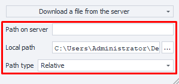

:::info **Please read the [*Rules for using materials on this resource*](../../Disclaimer).**
:::
_______________________________________________
ZennoDroid has built-in features for working with FTP resources. You can automatically upload files to an FTP server, create and delete directories, and do other operations as well. This is useful if your project files are stored on an FTP server.

This action lets you work with files, specifically:
- ***Upload a single** file FROM or TO the server;*
- ***Upload several** files FROM or TO the server;*
- ***Delete** one or more files from the server;*
- ***Rename** a file on the server.*
_______________________________________________
### How to add it to your project?
Via the context menu: **Add Action → FTP → FTP files**.

_______________________________________________
## How to work with this action?

_______________________________________________
### Available action types:

#### Download a file from the server.
Lets you download a file from the server to your computer.

#### Upload a file to the server.
Uploads a file from your computer to the server.

#### Download files from the server.
Needed for downloading several files from the server to your computer.
The file paths are listed in a ***List***. The action processes just one line from the list at a time.

#### Upload files to the server.
Used for uploading several files from your computer to the server.
The file paths are provided in a ***List***. The action processes just one line from the list at a time.

#### Delete a file on the server.
Deletes a file from the server. You need to specify its path.

#### Rename a file on the server.
Lets you change the name of a file on the server. You enter the path to the file and its new name.
_______________________________________________
### Available settings:

- **Path on server**
Path to the needed file on the server.
- **Local path**
Path on your PC where the downloaded file will be saved.
- **Path type**
Relative (from the current folder) or absolute (from the root of the system) path on the server.
_______________________________________________
## Usage example

### Downloading files from the FTP server using a list
The file paths you need to download are stored in a list.
**1.** Get the line count from the list.
**2.** If the list isn't empty, download the file from the FTP server.
**3.** Then delete the line that contains the path of the already downloaded file.
**4.** Return to the start of the loop (step 1).
**5.** When there are no lines left in the list, show a notification saying all files are downloaded.
_______________________________________________
## Useful links
- [**How to connect to a server via FTP**](https://help.reg.ru/support/hosting/dostupy-i-podklyucheniye-panel-upravleniya-ftp-ssh/kak-podklyuchitsya-k-serveru-po-ftp-i-nachat-rabotu#0)
- [**IF Operator**](../Logic/IF)
- [**Notification**](../Logic/Notification).