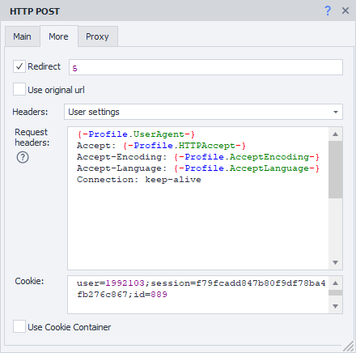
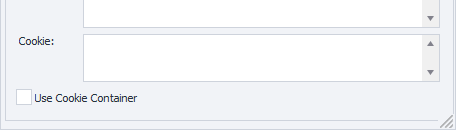
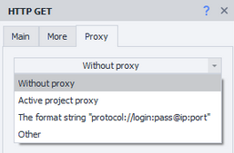
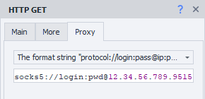
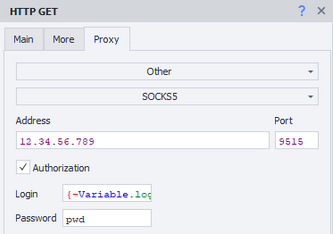

---
sidebar_position: 1
title: GET Request
description: Retrieving data using GET requests
---  
:::info **Please read [*Usage Guidelines for Materials on this Resource*](../../Disclaimer).**
:::  
_______________________________________________  

In ZennoDroid, you can use ***HTTP requests*** when working with different websites.  
For example, you can get data using **GET requests**:  
- *request search engine results*,  
- *download files*,  
- *parse data*,  
- *run templates without a browser*,  
- *work with API of web services and apps*.  
_______________________________________________ 
### How to add it to a project?  
Via the context menu: **Add Action → HTTP → GET Request**.  


_______________________________________________ 
## "Main" Tab   
  
_______________________________________________ 
### URL.  
The target website address (link) the request will be sent to. *You can use a variable.*  
_______________________________________________ 
### Referer.  
The [**Referer**](https://developer.mozilla.org/ru/docs/Web/HTTP/Headers/Referer) header is used to specify the URL the user came from to reach the current page. It helps analyze traffic and see which resources are most often used as referral sources.  

:::warning **The *Referer* header can reveal info about visited pages, which may lead to privacy issues.**
:::  
_______________________________________________ 
### Encoding.  
Select the encoding for the request.  
_______________________________________________ 
### Timeout.  
The maximum time to wait for a website response, in seconds.  
If the timer runs out, the action will end with an error and follow the *red branch*.  
You can use variable macros.  
_______________________________________________ 
### Download.  
#### Content only.  
Only the response body is saved to the variable.  
<details>
<summary>**Example response for *https://httpbin.org/get*.**</summary>
<!--All you need is a blank line-->

   ```JS
   {
  "args": {}, 
  "headers": {
    "Accept": "text/html,application/xhtml+xml,application/xml;q=0.9,image/avif,image/webp,image/apng,*/*;q=0.8,application/signed-exchange;v=b3;q=0.9", 
    "Accept-Encoding": "gzip, deflate", 
    "Accept-Language": "en-US,en;q=0.8", 
    "Host": "httpbin.org", 
    "Referer": "https://google.com", 
    "User-Agent": "Mozilla/5.0 (Windows NT 10.0; Win64; x64) AppleWebKit/537.36 (KHTML, like Gecko) Chrome/87.0.4280.141 Safari/537.36", 
    "X-Amzn-Trace-Id": "Root=1-26erb44t-465basaw0z2qwbji492yh5t3"
  }, 
  "origin": "1.2.3.4", 
  "url": "https://httpbin.org/get"
    }
   ```
</details>   

#### Headers only.  
Only the headers are saved.  
<details>
<summary>**Example response for *https://httpbin.org/get*.**</summary>
<!--All you need is a blank line-->

   ```JS
   HTTP/1.1 200 OK
    Date: Sat, 23 May 2020 01:56:45 GMT
    Content-Type: application/json
    Content-Length: 613
    Connection: keep-alive
    Server: gunicorn/19.9.0
    Access-Control-Allow-Origin: *
    Access-Control-Allow-Credentials: true
   ```
</details>  

#### Headers and content.  
Both the response header and body are saved together to the variable, separated by two blank lines.  
<details>
<summary>**Example response for *https://httpbin.org/get*.**</summary>
<!--All you need is a blank line-->

   ```JS
HTTP/1.1 200 OK
Date: Sat, 23 May 2020 01:56:45 GMT
Content-Type: application/json
Content-Length: 613
Connection: keep-alive
Server: gunicorn/19.9.0
Access-Control-Allow-Origin: *
Access-Control-Allow-Credentials: true


{
  "args": {}, 
  "headers": {
    "Accept": "text/html,application/xhtml+xml,application/xml;q=0.9,image/avif,image/webp,image/apng,*/*;q=0.8,application/signed-exchange;v=b3;q=0.9", 
    "Accept-Encoding": "gzip, deflate", 
    "Accept-Language": "en-US,en;q=0.8", 
    "Host": "httpbin.org", 
    "Referer": "https://google.com", 
    "User-Agent": "Mozilla/5.0 (Windows NT 10.0; Win64; x64) AppleWebKit/537.36 (KHTML, like Gecko) Chrome/87.0.4280.141 Safari/537.36", 
    "X-Amzn-Trace-Id": "Root=1-26erb44t-465basaw0z2qwbji492yh5t3"
  }, 
  "origin": "1.2.3.4", 
  "url": "https://httpbin.org/get"
}
   ```
</details>  

#### As file.  
Pick this mode if you want to download a file through the request.  
The variable will have the path to the downloaded file.  

:::info **By default, files are downloaded to the `Trash` folder in the program directory.**  
The path may look like this:  
`C:\Program Files\ZennoLab\RU\ZennoPoster Pro V7\7.4.0.0\Progs\Trash\googlelogo_color_92x30dp.png`  

You can change this in the settings, but only globally for all projects. 
:::  

#### File + headers.  
Headers and the path to the downloaded file are saved together to the variable.  
_______________________________________________ 
### Save to variable.  
Pick (or create a new) variable where the request result will be saved.  
_______________________________________________ 
## "Advanced" Tab  

_______________________________________________ 
### Redirect.  
Used to set up redirects. If the response has a *redirect code*, ZennoDroid will move to the next page using the ***Location*** header.  

Here you set the max number of hops with numbers. For example, `0` — stay on the original page, `5` — number of hops before the final URL.  
_______________________________________________ 
### Use the original URL.  
If this option is enabled, URL encoding from the "Main" tab will be ignored. Example:  
- **Default URL (encoded):**  
`https://ru.wikipedia.org/wiki/%D0%9F%D1%80%D0%B8%D0%B2%D0%B5%D1%82%D1%81%D1%82%D0%B2%D0%B8%D0%B5`  
- **Original URL:**  
`https://ru.wikipedia.org/wiki/Приветствие`  
_______________________________________________ 
### Headers.  
#### Use default.  
Default headers will be added to the request. The `Host` header changes depending on the request address.  

<details>
<summary>**Example response for *https://httpbin.org/get*.**</summary>
<!--All you need is a blank line-->

   ```
Host: httpbin.org
User-Agent: Mozilla/5.0 (Windows NT 10.0; WOW64; rv:45.0) Gecko/20100101 Firefox/45.0
Accept: text/html,application/xhtml+xml,application/xml;q=0.9,*/*;q=0.8
Accept-Encoding: gzip, deflate
Accept-Language: en-US,en;q=0.5
   ```
</details>  

#### Current profile.  
Headers from the current ***project profile*** will be added.  

#### Load from profile.  
You need to pick a file or give a variable with the profile path to load headers from for the request.  

#### Custom settings.  
  

Lets you specify each header manually, following these rules:  
- :warning: The **User-Agent string always comes first!** Then all other headers.  
- Each header must start on a new line.  
- You can set *static values*, *your variables*, or *profile variables*.  
_______________________________________________ 
### Use CookieContainer.  
This option lets you sync cookies with the whole browser or between separate requests. You don't have to parse or insert them manually.  

<details>
<summary>**Example usage.**</summary>
<!--All you need is a blank line-->

   Imagine your project works with a site using requests. You need to be logged in. The login process is too complicated to repeat through requests. So, you log in using browser mode.  

   Then you ***turn off the browser*** and start working with requests. With **Use CookieContainer** turned on, cookies will sync automatically between browser and requests, no need to paste them by hand.    

    If the site sends new cookies in some request, they will be synced with the browser automatically and used afterwards.
</details>  
_______________________________________________ 
### Cookie.  
:::info **This field is visible only if the previous option is off.**
:::    

 

You can paste ready cookies or use one from a variable.  

**Format:** `name=value`, multiple values separated by `;`  
***Example:*** `user=1992103;session=f79fcadd847b80f9df78ba4fb276c867;id=889`  
_______________________________________________ 
## "Proxy" Tab  
  
_______________________________________________ 
### No proxy.  
The action will use the real IP of your computer or server.  
_______________________________________________ 
### Format line.  
  

Specify the proxy in the format (you can use a variable):  
- ***With authentication***. `socks5://login:password@ip:port` or `http://login:password@ip:port`  
- ***Without authentication***. `socks5://ip:port` or `http://ip:port`  
- ***No protocol specified (http:// by default)***. `login:password@ip:port` or `ip:port`  
_______________________________________________ 
### Other.  
  

Use this if you need to set detailed proxy settings.  
Proxy type, auth data, address, and port — check with your provider.  
You can use variables in any field.  

:::info **If you don't specify a protocol, http:// is used by default**
:::  
_______________________________________________ 
## How the request is sent
ZennoDroid has two methods to work with requests:  
- **Standard**. Default option (Chilkat library).  
- **Alternative**. Our own implementation.  

If something doesn't work right with HTTP requests, try switching to the alternative method.  
Do this via **Settings → Execution → Use alternative HTTP request method**.  

  
_______________________________________________
## Useful links.    
- [**GET Requests in Practice: Rules, Principles, and Examples**](https://habr.com/ru/companies/X5Tech/articles/798681/).  
- [**Environment Variables**](../../pm/Creating/Variables)  
- [**Proxying Traffic**](../../Settings/Proxy_Traffic).