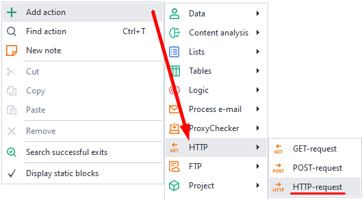
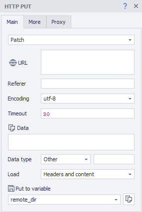
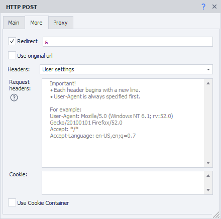
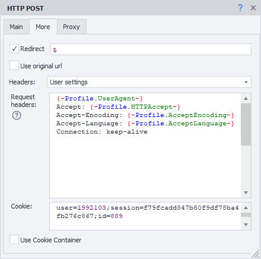
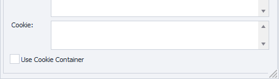
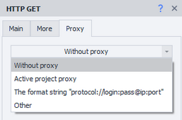
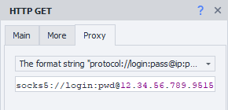
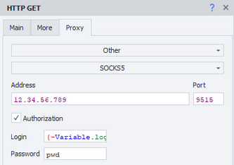
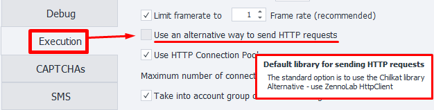

---
sidebar_position: 3
title: HTTP Requests
description: Other types of requests
---
:::info **Please read the [*Material Usage Rules on this site*](../../Disclaimer).**
:::
_______________________________________________
With this action, you can create any type of HTTP request:
- **Put** – completely updates information
- **Delete** – deletes records
- **Head** – gets only response headers, without the content
- **Options** – requests information about supported methods
- **Patch** – partially updates records
- **Trace** – diagnostic request for debugging

There are separate actions for [**GET**](./GET) and [**POST**](./POST) requests.
_______________________________________________
### How to add it to your project?
Use the context menu: **Add action → HTTP → HTTP Request**


_______________________________________________
## “Main” Tab

_______________________________________________
### Request type.
Pick the request you need from the list.
### URL.
The target website address (link) where the request will be sent. *You can use a variable*.
_______________________________________________
### Referer.
The [**Referer**](https://developer.mozilla.org/ru/docs/Web/HTTP/Headers/Referer) header is used to specify the URL from which a user came to the current page. It helps analyze traffic and see which sources users come from most often.

:::warning The *Referer* header can reveal information about your browsing history, which may lead to privacy issues.
:::
_______________________________________________
### Encoding.
Pick the encoding for the request.
_______________________________________________
### Timeout.
Max wait time for a response from the site, in seconds.
If it reaches the set limit, the action will end with an error and go through the *red branch*.
You can use variable macros.
_______________________________________________

### Data.
Write the request body here.
_______________________________________________
### Data type.
Here you pick what kind of data will be sent in the request. The set type will be passed in the header as [***Content-Type***](https://developer.mozilla.org/ru/docs/Web/HTTP/Headers/Content-Type).

Available options:
#### urlencoded.
:::info ***`Content-Type: application/x-www-form-urlencoded`***
:::

Use this when you’re sending *text information* to the server. In the **Data** field, specify it like this:
`parametername1=value1&parametername2=value2`

#### multipart.
:::info ***`Content-Type: multipart/form-data`***
:::
This type is used when you’re sending *binary data (files)* to the server.

#### Other.
You can set any other data type if the two default ones aren’t what you need.

For example, to work with the [**CapMonster Cloud**](https://docs.capmonster.cloud/ru/docs/category/api) API, you need to send POST requests in JSON format. For this, set **Data type** to `application/json`
_______________________________________________
### Download.
#### Content only.
Only the response body will be saved to the variable.

#### Headers only.
Only the headers will be saved.

#### Headers and content.
The variable will get both the response headers and the body, separated by two blank lines.

#### As file.
Pick this mode if you need to download a file via the request.
The variable will get the path to the downloaded file.

:::info By default, files are saved to the `Trash` folder inside the program’s directory.
The path might look like this:
`C:\Program Files\ZennoLab\RU\ZennoPoster Pro V7\7.4.0.0\Progs\Trash\googlelogo_color_92x30dp.png`

You can change this in the settings, but only for all projects at once.
:::

#### As file + headers.
The variable will contain the response headers and the path to the downloaded file.
_______________________________________________
### Put in variable.
Here you need to pick (or create) a variable to save the request’s result.
_______________________________________________
## “Advanced” Tab

_______________________________________________
### Redirect.
Used for setting up redirects. If the response has a *redirect code*, ZennoDroid will go to the next page using the ***Location*** header.

Enter the max number of redirects as a number. For example, `0` — stay on the original page, `5` — up to 5 redirects until the final URL.
_______________________________________________
### Use original URL.
When this option is on, URL encoding from the “Main” tab will be skipped. Example:
- **Default URL (with encoding):**
`https://ru.wikipedia.org/wiki/%D0%9F%D1%80%D0%B8%D0%B2%D0%B5%D1%82%D1%81%D1%82%D0%B2%D0%B8%D0%B5`
- **Original URL:**
`https://ru.wikipedia.org/wiki/Приветствие`
_______________________________________________
### Headers.
#### Use default.
Default headers will be added to the request. The `Host` header changes based on the address in the request.

<details>
<summary>**Example response when requesting *https://httpbin.org/get*.**</summary>

   ```
Host: httpbin.org
User-Agent: Mozilla/5.0 (Windows NT 10.0; WOW64; rv:45.0) Gecko/20100101 Firefox/45.0
Accept: text/html,application/xhtml+xml,application/xml;q=0.9,*/*;q=0.8
Accept-Encoding: gzip, deflate
Accept-Language: en-US,en;q=0.5
   ```
</details>

#### Current profile.
Headers from the current ***project profile*** will be used.

#### Load from profile.
You’ll need to pick a file or specify a variable with the path to a profile with headers to load for the request.

#### Custom settings.


You can set each header yourself, following these rules:
- :warning: The first line must *always be the User-Agent*! Only then all other headers.
- Each header starts on a new line.
- You can use *static values*, *your own variables*, or *profile variables*.
_______________________________________________
### Use CookieContainer.
With this option, you can sync cookies with the whole browser or between separate requests. You won’t have to parse and insert them manually.

<details>
<summary>**Example of use.**</summary>

   Let’s say your project works with a site using requests. To work, you need to be logged in. But the login process is too hard to repeat via requests. So you use browser mode to log in.

   After you’re logged in, ***turn off the browser*** and start working with requests. If **Use CookieContainer** is enabled, cookies will sync automatically between browser and requests — you don’t have to insert them yourself.

   If one of your requests gets new cookies, they’ll be synced automatically with the browser and used in the future.
</details>
_______________________________________________
### Cookie.
:::info **This input is shown only if the previous option is off.**
:::



You can enter ready-made cookies or use a variable.

**Format:** `name=value`, several values separated by `;`
***Example:*** `user=1992103;session=f79fcadd847b80f9df78ba4fb276c867;id=889`
_______________________________________________
## “Proxy” Tab

_______________________________________________
### No proxy.
The action will use the computer or server’s real IP.
_______________________________________________
### Format string.


Enter the proxy in the format (you can use a variable):
- ***With authentication***. `socks5://username:password@ip:port` or `http://username:password@ip:port`
- ***No authentication***. `socks5://ip:port` or `http://ip:port`
- ***No protocol (defaults to http://)***. `username:password@ip:port` or `ip:port`
_______________________________________________
### Other.


Pick this if you need to set detailed proxy settings.
Proxy type, auth data, address, and port — get them from your provider.
You can use variables in all fields.

:::info **If no protocol is set, http:// is used by default**
:::
_______________________________________________
## Method of sending the request.
ZennoDroid has two ways to work with requests:
- **Standard**. Enabled by default (Chilkat library).
- **Alternative**. Our own development.

If something works wrong with HTTP requests, try switching to the alternative method.
You can do this through **Settings → Execution → Use alternative method for HTTP requests**.


_______________________________________________
## Useful links.
- [**HTTP Basics**](https://habr.com/ru/articles/813395/)
- [**How to use cURL with a proxy**](https://blog.capmonster.cloud/ru/blog/bypass-captcha/how-to-use-curl-with-proxy)
- [**What is web scraping and why do you need it?**](https://blog.capmonster.cloud/ru/blog/sel-1/what-is-website-parsing-and-why-do-you-need-it).