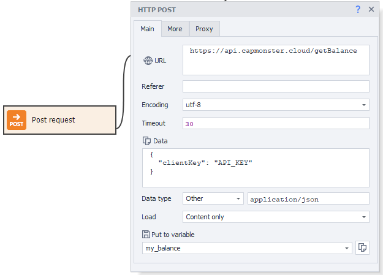
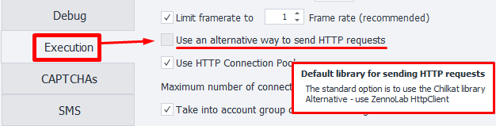

:::info **Please read the [*Material Usage Rules on this site*](../../Disclaimer).**
:::
_______________________________________________
ZennoDroid lets you send data in **POST requests**. With this action you can:
- *send info to register on a website*,
- *upload files to a server*,
- *quickly send data*,
- *run templates without a browser*,
- *work with the API of web services and apps*.
_______________________________________________
### How do you add it to a project?
Use the context menu: **Add action → HTTP → POST request**.


_______________________________________________
## "Main" tab

_______________________________________________
### URL.
Target site address (link) where the request will be sent. *You can use a variable*.
_______________________________________________
### Referer.
The [**Referer**](https://developer.mozilla.org/ru/docs/Web/HTTP/Headers/Referer) header is used to specify the URL from which the user came to the current page. It helps analyze traffic and track which resources users are coming from most often.

:::warning **The *Referer* header can reveal information about the browsing history, which can be a privacy issue.**
:::
_______________________________________________
### Encoding.
Choose the encoding for the request.
_______________________________________________
### Timeout.
Maximum time to wait for a response from the site, in seconds.
If the set time is reached, the action will fail and go down the *red branch*.
You can use variable macros.
_______________________________________________

### Data.
Write the request body text here.
_______________________________________________
### Data type.
Here you choose what type of data will be sent in the request. The specified type is passed in the headers as [***Content-Type***](https://developer.mozilla.org/ru/docs/Web/HTTP/Headers/Content-Type).

Available options:
#### urlencoded.
:::info ***`Content-Type: application/x-www-form-urlencoded`***
:::

Best for sending *text information* to the server. In the **Data** field, enter it like:
`paramname1=value1&paramname2=value2`

#### multipart.
:::info ***`Content-Type: multipart/form-data`***
:::
Use this when your request sends *binary data (files)* to the server.

#### Other.
You can set any other data type if the two presets aren't suitable.

For example, to work with the [**CapMonster Cloud**](https://docs.capmonster.cloud/ru/docs/category/api) API, you need to send the POST request in JSON format. For this, set the **Data type** to `application/json`
_______________________________________________
### Download.
#### Only content.
Only the response body will be saved to the variable.

#### Only headers.
Only the headers will be saved.

#### Headers and content.
Both the response header and body will be saved to the variable, separated by two blank lines.

#### As file.
Choose this mode if you need to download a file with the request.
The variable will hold the path to the downloaded file.

:::info **By default, files are downloaded to the `Trash` folder in the program directory.**
The path may look like this:
`C:\Program Files\ZennoLab\RU\ZennoPoster Pro V7\7.4.0.0\Progs\Trash\googlelogo_color_92x30dp.png`

You can change this in the settings, but only globally for all projects.
:::

#### As file + headers.
The variable will hold the response headers and the path to the downloaded file.
_______________________________________________
### Save to variable.
Here you need to select (or create a new) variable where the result of the request will be saved.
_______________________________________________
## "Advanced" tab.

_______________________________________________
### Redirect.
Sets up redirection. If the response contains a *redirect code*, ZennoDroid will go to the next page using the ***Location*** header.

Here you specify the max number of redirects as a number. For example, `0` — stay on the current page, `5` — up to 5 redirects to the final URL.
_______________________________________________
### Use original URL.
When this option is on, encoding of the URL from the "Main" tab is turned off. Example:
- **Default URL (with encoding)**:
`https://ru.wikipedia.org/wiki/%D0%9F%D1%80%D0%B8%D0%B2%D0%B5%D1%82%D1%81%D1%82%D0%B2%D0%B8%D0%B5`
- **Original URL**:
`https://ru.wikipedia.org/wiki/Приветствие`
_______________________________________________
### Headers.
#### Use default.
The default headers will be used in the request. The `Host` header changes based on the request address.

<details>
<summary>**Example response for *https://httpbin.org/get*.**</summary>
<!--All you need is a blank line-->

   ```
Host: httpbin.org
User-Agent: Mozilla/5.0 (Windows NT 10.0; WOW64; rv:45.0) Gecko/20100101 Firefox/45.0
Accept: text/html,application/xhtml+xml,application/xml;q=0.9,*/*;q=0.8
Accept-Encoding: gzip, deflate
Accept-Language: en-US,en;q=0.5
   ```
</details>

#### Current profile.
Headers from the current ***project profile*** will be used.

#### Load from profile.
You need to select a file or specify a variable holding the path to the profile from which headers will be loaded for the request.

#### Custom settings.


Lets you specify each header field yourself, following these rules:
- :warning: **User-Agent must ALWAYS be first!** Then all other headers.
- Each header starts on a new line.
- You can use *static values*, *your variables*, or *profile variables*.
_______________________________________________
### Use CookieContainer.
This option syncs cookies with the entire browser or between individual requests. You won't have to parse and use them manually.

<details>
<summary>**Usage example.**</summary>
<!--All you need is a blank line-->

   Let's say your project works with a site using requests. You need to be logged in to work. Logging in through requests is really complicated. So you log in using browser mode.

   After logging in, ***turn off the browser*** and start working with requests. With **Use CookieContainer** enabled, cookies are auto-synced between the browser and requests, no need to set them manually.

    If any request gets new cookies from the site, they'll be auto-synced to the browser and used from then on.
</details>
_______________________________________________
### Cookie.
:::info **This field is shown only when the previous option is off.**
:::


You can enter ready-made cookies or take them from a variable.

**Format:** `name=value`, multiple values separated by `;`
***Example:*** `user=1992103;session=f79fcadd847b80f9df78ba4fb276c867;id=889`
_______________________________________________
## "Proxy" tab.

_______________________________________________
### No proxy.
The action will use the real IP of your computer or server.
_______________________________________________
### Format string.


Specify the proxy in the following format (you can use a variable):
- ***With auth***. `socks5://login:password@ip:port` or `http://login:password@ip:port`
- ***No auth***. `socks5://ip:port` or `http://ip:port`
- ***Without protocol (defaults to http://)***. `login:password@ip:port` or `ip:port`
_______________________________________________
### Other.


Choose this if you need to set detailed proxy settings.
Type, auth info, address, and port should be checked with your provider.
You can use variables in any of the fields.

:::info **If you don't specify the protocol, http:// is used by default**
:::
_______________________________________________
## Request sending method.
ZennoDroid has two ways to work with requests:
- **Standard**. Default (Chilkat library).
- **Alternative**. Our own development.

If something is not working right with HTTP requests, try switching to the alternative method.
Do this via **Settings → Execution → Use alternative HTTP request sending method**.


_______________________________________________
## Usage example.
Suppose you need to send a ReCaptchaV2 answer to a site to solve a captcha.


1. CM Cloud solves the captcha and sends us the answer.
2. Add the POST action for it.
3. Fill in all the fields. Enter the captcha answer in the *Data* field in the required format.
4. Send the request to the target site.
5. The captcha is solved.

Working without a browser saves time and resources that'd normally be spent solving the captcha in a tab window.
_______________________________________________
## Useful links.
- [**Variables window**](../../pm/Interface/Variables)
- [**What is an API**](https://practicum.yandex.ru/blog/chto-takoe-api/)
- [**CapMonster Cloud API**](https://docs.capmonster.cloud/ru/docs/category/api/).