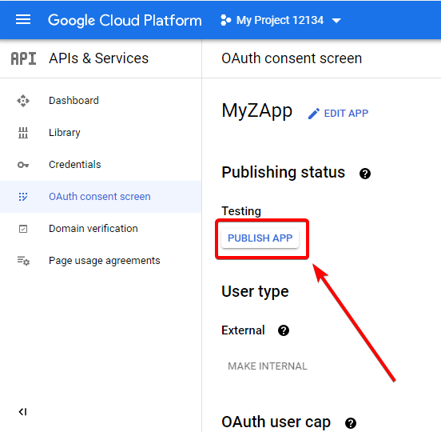
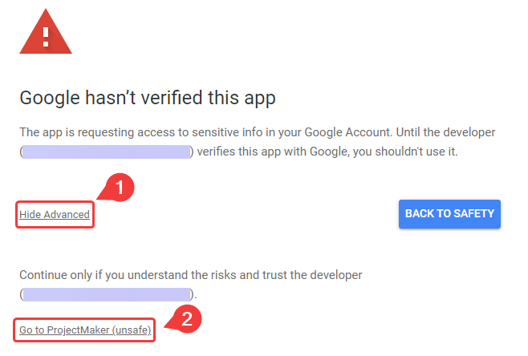
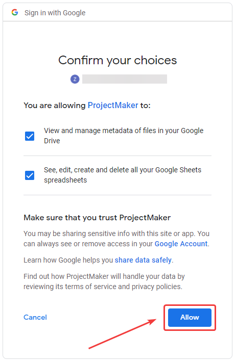

:::info **Please read the [*Material Usage Rules on this site*](../../Disclaimer).**
:::

To use Google Sheets in ZennoDroid, you need to follow the steps described in this article.
_______________________________________________
## Adding a new app.
- Log into your Google account or create a new one.
_______________________________________________
- Go to [**Google Cloud Platform**](https://console.cloud.google.com/projectselector2/apis/credentials/consent?supportedpurview=project). The first time, you'll need to:
    - select your country (1);
    - read the terms and accept them (2);
    - choose to subscribe or not to emails (3);
    - at the end, click **AGREE AND CONTINUE** (4);

_______________________________________________
- On the left panel, select **OAuth consent screen (1)** and click **CREATE PROJECT (2)** to start a new project.

_______________________________________________
- Enter any project name in the **Project name (1)** field, but only in English. Add **Location (2)** if needed, then click **CREATE (3)**.

_______________________________________________
- In the next window, pick **External (1)** and click **CREATE (2)** again.

_______________________________________________
- In the new window, enter any app name in **App name (1)** and pick an email from the **User support email (2)** list.

_______________________________________________
- Scroll down to the bottom of the page and enter your **email (3)** again, then hit **SAVE AND CONTINUE (4)**.

_______________________________________________
- In the ***Scopes*** window, just scroll to the bottom and click **SAVE AND CONTINUE**.

_______________________________________________
- On the ***Test users*** screen, scroll down and click **SAVE AND CONTINUE**.

_______________________________________________
- In the ***Summary*** window, scroll down and click **BACK TO DASHBOARD**.

_______________________________________________
## Publishing the project.
### Testing mode.
You can leave the app in testing mode. In that case, it's only available to the owner account and users added to the ***Test Users*** list.
:::warning **The number of test users is limited.**
There can be no more than 100. And after you add someone to the test user list, you can't remove them!
:::
#### How to add users to the Test Users list?
- Go to the **OAuth consent screen** tab, scroll down a bit, and in the ***Test users*** section, click **`+ADD USERS`**.
- In the pop-up window, add the email of the needed account and hit **SAVE**.

_______________________________________________
### Publish App.
Now you can publish the app so it's available to anyone with a Google account. To do that, just hit **PUBLISH APP**.

_______________________________________________
## Creating credentials.
- In the **Credentials (1)** section, click **`+CREATE CREDENTIALS`** (2) and pick **OAuth client ID (3)**.

_______________________________________________
- Choose ***Desktop app*** in the *Application type (1)* dropdown and hit **CREATE (2)**.

_______________________________________________
- A new window **OAuth client created** will open, click **`OK`**.

_______________________________________________
- Then click the name of the app you just created, or its edit icon.

_______________________________________________
- In the opened window, you need to download the key as a file: click **`DOWNLOAD JSON`**.

_______________________________________________
## Working with the API.
### Enabling Google APIs.
:::warning **It's very important to enable both APIs: for Sheets and Drive, otherwise the program won't work right.**
:::
- [**Google Sheets API enable link**](https://console.developers.google.com/apis/library/sheets.googleapis.com). Pick your project and click **ENABLE**.

_______________________________________________
- [**Google Drive API enable link**](https://console.developers.google.com/apis/library/drive.googleapis.com). Also pick your project, then hit **ENABLE**.

_______________________________________________
### Adding the key to the program.
:::warning **You have to connect Google Sheets separately for ProjectMaker and ZennoDroid.**
:::

- Open **Google Sheets Connection Settings** (***Edit → Settings → Google Sheets***).
- Click the ellipsis […] on the right side of the field for the path, pick the ***credentials file (1)***, then click **Connect (2)**.
:::info **The file must have a .json extension.**
:::

_______________________________________________
- Then a browser window will open where you need to log in to the Google account you created the key with.
- Most likely, you'll get a warning window. Since you trust your own app, pick *Advanced (1)* and *Go to "Your App" page (2)*.

_______________________________________________
- Now allow access to the account data so you can read and write to your sheets.

  
_______________________________________________
- And once more.

_______________________________________________
- If you did everything right, you'll see this message:
`Received verification code. You may now close this window`.
_______________________________________________
### API request limits.
#### What are the limits?
There are limits on the number of requests: 300 per minute per project, with no overall daily limit. *Info as of July 2024.*
#### Where can you see your current requests count?
You can find this info on the [**Google Cloud Platform Dashboard**](https://console.cloud.google.com/apis/dashboard?hl=ru), just pick your project.
#### How do you increase these limits?
Check the official Google docs — [**Request a higher quota**](https://cloud.google.com/docs/quotas/view-manage#requesting_higher_quota).
#### How does ZennoDroid use up your limit?
Two main things affect the number of requests: *if the sheet has changed* and *if checking for external changes is enabled*.

For example, if checking for outside changes is on, every minute there will be a request to the Google Drive API to compare the sheet versions.

When you change the sheet itself, different types of requests are used. Usually it's around 5 requests per sheet per minute. So if you’re actively changing 10 sheets, that's a max of about 60 requests per minute (Sheets API + Drive API).
_______________________________________________
### Authorization error (403: access_denied).
#### Exact error message:
*The developer hasn’t given you access to this app. It’s currently being tested and it hasn’t been verified by Google. If you think you should have access, contact the developer.*
#### Cause:
You're trying to authorize in an app that's in ***Testing Mode*** from an account that's not listed as a test user (and isn't the owner).
_______________________________________________
## Useful links.
- [**Google Cloud**](https://console.cloud.google.com).
- [**Google Sheets Guide**](https://www.unisender.com/ru/blog/google-tablicy-dlya-nachinayushchih/).