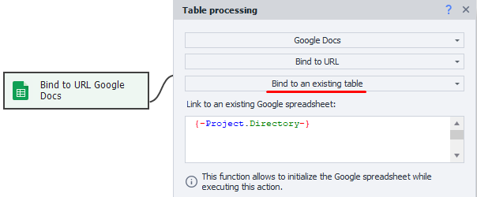
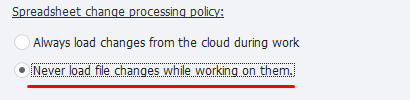

:::info **Please check out the [*Terms of Use for materials on this resource*](../../Disclaimer).**
:::

In the previous two articles, we [looked at what Google Sheets look like in ZD](./Google_Sheet), and also [set up their connection](./Connecting_GoogleSheets). Now let’s see what operations you can perform with them.

For the most part, they’re similar to simple [Tables](./Tables). The same *Table Operations* action is used for working with them, and all actions are also available (except *File Binding*). But Google Sheets do have some unique functions, which we’ll check out below.
_______________________________________________
## How to add the action to your project?
Through the context menu: ***Add Action → Tables → Table Operations***.


_______________________________________________
## Actions with Google Sheets
:::info **Table Operations Action**
This article only covers functions unique to Google Sheets. For all other operations, you can read the article [Table Operations](./Tables).
:::

### Reload table


This function lets you refresh your Google Sheet and get the latest data from it. It’s handy if changes were made in the sheet manually or with another template.

:::warning **The local table will be overwritten with the data from the cloud sheet.**
:::
_______________________________________________
### Bind to URL → Bind to existing table
This action lets you connect to a sheet as your project is running. It’s convenient if you don’t know the sheet address at the start of the template.



In the input field, just paste the link to the sheet you want to bind to.
_______________________________________________
### Bind to URL → Create new sheet
Creates a new sheet in your Google spreadsheet.


- **Link to existing Google spreadsheet**. Here, you specify the link to the spreadsheet where you want to create a new sheet.
- **New sheet name**. Set the name for the new sheet here.
- **Save URL to variable**. Specify the variable where the link to the new sheet will be saved.
_______________________________________________
### Bind to URL → Create new spreadsheet
This action lets you create a new Google spreadsheet.


- **New spreadsheet name**. Make up a name for your sheet.
- **New sheet name**. Set the name for the sheet here.
- **Save URL to variable**. Specify the variable where the link to the new spreadsheet will be saved.
_______________________________________________
## Multithreaded work with Google Sheets
### General info
**ZennoDroid supports multithreaded work with Google Sheets.**
This means you can interact with one sheet from multiple threads at once. For each thread, a virtual sheet instance is created while running, and changes from it are synced with the cloud regularly.

**Several copies of ZennoDroid can work with the same Google Sheet.**
But note that changes from the program don’t reach the cloud instantly, there’s up to a 60-second delay. So this delay will apply between different program copies. To maintain data integrity, we recommend using atomic row addition. You can enable it in the static block settings.
_______________________________________________
### Atomic row addition
When this setting is enabled, new rows will be added to the cloud by a special request, independent of cell addresses. This guarantees that new data is added to the sheet without losing any existing data, which can happen if already-filled cells get overwritten.

But there are a few quirks. Since rows are sent in a separate request, the data will be consecutively added to the end of the sheet. Because of that, there might be a mismatch between the local version and the cloud.

For example, consider this sequence of actions:
```
1. Write cells in rows 0-5
2. Add a row (in the program, this will be row 6)
3. Write cells in rows 7-10
4. Add a row (in the program, this will be row 11)
```
In the end, data added by the ***Add Row*** actions will actually end up in rows 11 and 12 in Google cloud, even though in the program those are rows 6 and 11.

:::tip **If you’re using atomic row addition, we recommend adding data ONLY with the *Add Row* action.**
:::

Even though this method is safer, editing and deleting rows can still cause sync delays between program copies. So, for important data, we suggest using a separate sheet in your Google spreadsheet for each copy of your program.
_______________________________________________
### Optimizing multithreaded writing
If you’re parsing a lot of data and saving all results to one Google Sheet, sync can take a while, because ZennoDroid always tries to keep data up to date between the program and the cloud.

In this case, you can enable fast write mode via:
**Edit → Settings → Google Sheets → Table change handling policy**



With this mode, each program copy will only send data, without spending time matching it up with the cloud.
_______________________________________________
## Useful Links
- [**Table Operations**](./Table_Processing)
- [**Value Ranges**](../../pm/Creating/Value_Ranges)
- [**Environment Variables**](../../pm/Creating/Variables)