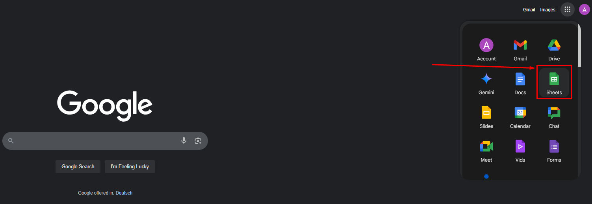
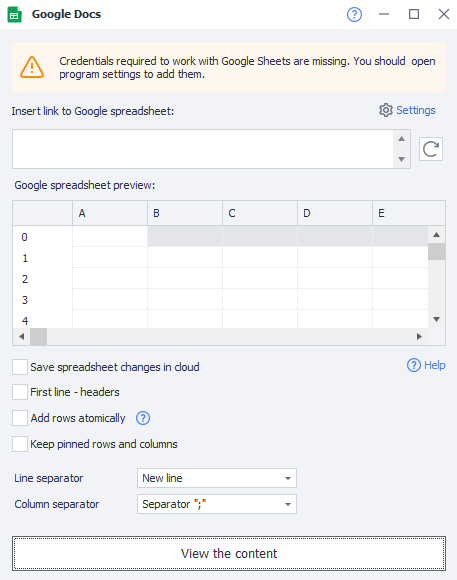
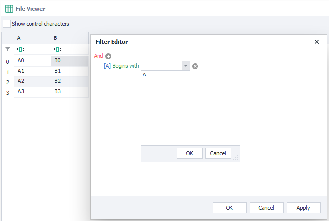

:::info **Please read [*the rules for using the materials on this resource*](../../Disclaimer).**
:::

## Creating a Google Sheet:
### Using ProjectMaker.
- From the context menu: ***Add Action → Tables → Google Sheet***:

- Through the ***Static Blocks Panel***:

The sheet you created will show up in the bottom panel:

_______________________________________________
### Through the cloud.
Go to Google.com → sign in to your account → click the icon with 9 dots → pick **Sheets** → create a Blank sheet.

_______________________________________________
Or through [**Google Drive**](https://drive.google.com/drive/my-drive) → Create → Google Sheets → Create blank spreadsheet.

_______________________________________________
After you create a sheet any way you like, copy the URL from the address bar to link it with ProjectMaker.
_______________________________________________
## Sheet settings.

:::info **Connection.**
You need to connect Google Sheets to the program before you start using them.
We’ll go over how to do this in the next article [**Setting up Google Sheets connection**](./Connecting_GoogleSheets).
:::

### Let’s go over each section in detail:
#### Paste your Google Sheet link.
Paste the link (URL) for the sheet you want to work with in this field.
_______________________________________________
#### Reload Google Sheet.

Click this button to refresh the data in the sheet.
:::info **Why do you need this?**
*This can be useful if you changed something not through the program but in a browser or on another device.*
:::
_______________________________________________
#### Google Sheet preview.
In this window you’ll see your sheet’s data. If it’s large, you might not see all the data here, just part of it.
_______________________________________________
#### Save sheet changes to the cloud.
Check this box if you want to save every change you make through ZennoDroid to the cloud.
_______________________________________________
#### First row as headers.
The first row in your sheet will become the header.
_______________________________________________
#### Use atomic row append.
Turning this on might be handy if you’re working with several copies of ZennoDroid at once.
You can read more about atomic row appending in [**Operations and Multithreaded Work with Google Sheets**](./GoogleSheet_Processing).
_______________________________________________
#### Remember frozen rows and columns.
This option lets you save the frozen state of rows and columns.
It will send an extra request to the API, which uses up your limit.
_______________________________________________
#### Row separator.
Here you choose what will be used as the row separator in your sheet:
- **New Line**
- **Custom Separator**
- **Multiple Separators**
_______________________________________________
#### Column separator.
Here, you set the separator for your sheet’s columns:
- The `;` character
- Tab character
- Any custom separator
- Multiple custom separators
_______________________________________________
#### View content.
This button opens the sheet so you can look at everything inside. In the window you can turn on control character display, set a filter to search for a specific row or cell, or use the filter builder.

_______________________________________________
### Some quirks of working with Google Sheets.
- Every time you start a new project in the program, a virtual copy of the Google Sheet is made.
- The virtual copy has all the data from the original sheet.
- During the project, you work with the virtual copy.
- If you turn on **Save sheet changes to the cloud**, the data will be updated from the virtual copy to the original Google Sheet from time to time.
:::info **Data in the Google Sheet doesn't show up instantly — it takes anywhere from 10 to 60 seconds.**
:::
_______________________________________________
## Useful links.
- [**Google Sheets Guide**](https://www.unisender.com/ru/blog/google-tablicy-dlya-nachinayushchih/)
- [**Google Sheets**](https://docs.google.com/spreadsheets/)