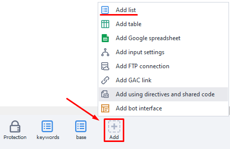

:::info **Please read the [*Material Usage Rules on this site*](../../Disclaimer).**
:::

A list is an ordered set of lines. With lists, you can pull data from a text document, save them to a file, or just work with a set of strings in memory, without tying them to a specific file.  
_______________________________________________
## Creating a list.  
You can create a new list from the context menu: ***Add action → Lists → List***.

Or through the *Static Blocks Panel*: ***click on the icon*** `+` ***→ Add list***.

The list you create will show up on the static blocks panel:

When you open the list, you’ll see its settings and a preview of what's inside.  
If the list is linked to a file, then you’ll see that file’s contents.  
But if there’s no file attached, you can set your own default values.  
_______________________________________________
## List settings.

#### Load from file.  
If you check this box, it means you’ll be getting data for the list from a `.txt` text file.  
If you leave it unchecked, then each thread will get its own separate copy of the list.

#### Save list changes to a file.  
If you turn this option on, any work you do with the list will automatically be saved to the linked text file.

If the previous setting, *Load from file*, is enabled but *Save to file* is off, then every thread will get its own local copy of the list based on the selected file. Changes to the list within the threads won’t affect the attached file at all.

But if this option is on, then all threads will work with a single shared copy of the list. So, all changes will be saved to the linked file.

#### Leave empty file.  
This determines whether to keep an empty file or delete it when all data in the list runs out.

#### Separator.  
Here you set what’s going to be used as the string separator in the list. This could be the **Enter** key, any text you want, or a regular expression (Regex).

#### File path.

Here you set the path to the text document you’ll be loading the list from. Data from it will be loaded into the list when the project starts.
:::tip **If you don’t know the file path.**
Sometimes, the path is only set during project runtime. In that case, you can use the **List action** with the ***Attach to file*** function.
:::
_______________________________________________
## Viewing contents.

Here you can view the entire list.  
You can also show control characters, set a filter to search for a specific line, and use the filter constructor.
:::tip **What are control characters?**
*These are invisible symbols used for things like formatting text and other extra functions: line breaks, tabs.*
:::
_______________________________________________
## Useful links.
- [**What are static blocks?**](../Static%20Block%20Panel/CommonPrinciples)
- [**Regular expression tester**](../../Tools/RegEx_Tester).
- [**Control characters in programming**](https://otus.ru/journal/simvoly-upravleniya-v-programmirovanii/).