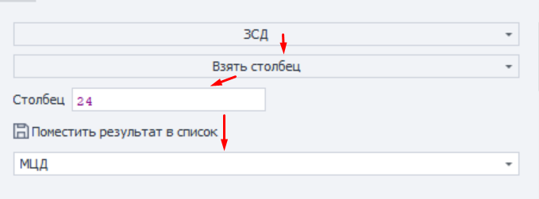
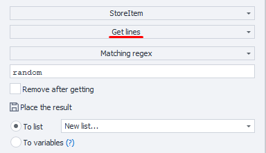
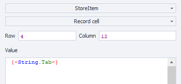
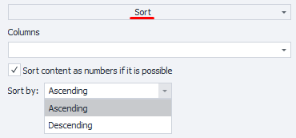
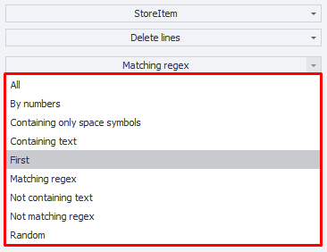
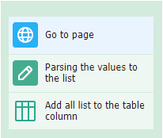

:::info **Please read the [*Terms of Use for materials on this site*](../../Disclaimer).**
:::

Tables are used to handle more complex, organized data than [**lists**](./Lists). For example, an online store catalog where each row has different data: name, price, description, etc.

#### Tables can be used for:
- Working with a set of data
- Adding and getting table elements
- Deleting rows, columns, and duplicates
- Linking to a file
- Getting the number of rows and columns
_______________________________________________
## How to add to your project?
Right-click: ***Add Action → Tables → Table Operations***.

_______________________________________________
## Available functions:
:::tip **Note**
*For column numbers, you can use either numbers (starting at zero) or uppercase Latin letters.*
:::

### Get column
Lets you take the values of a certain table column and put them into a list.

Choose the Table → select the Function → specify the Column you want to get → choose the List to put the column in.
_______________________________________________
### Get rows
You can get rows with the option to delete them from the table and write them to a list or variables.

- **Row selection criteria:**
    - *All*
    - *Does not contain text*
    - *Does not match regex*
    - *First*
    - *By indices*
    - *Random*
    - *Contains text*
    - *Matches regex*
- **Delete after getting.** Decides if the rows you got will stay in the table.
- **Put result in:** You can put the row into a List or Variables. There's a table below to set this up.
_______________________________________________
### Add list
This does the opposite — you can put a chosen list into a specific table column.

***Pick a column to fill → Select a list.***
_______________________________________________
### Add row
:::tip **Recommended**
*If you need to add several rows at once, use the action **Text Processing with “To Table” function**.*
:::
With this function, you can put static text (string) or a variable into a table. These will be added to the end of the table.

:::warning **Note**
If your table is linked to a file with `.csv`, `.xls(x)`, or `.ods` extension, use `{-String.Tab-}` as a separator.
:::
_______________________________________________
### Write cell
Adds text to a specific cell.

- **Row and Column.** Here you set the static cell coordinates or do it through variables.
- **Value.** Enter static text (string) or a variable.
_______________________________________________
### Get column count
Find out how many columns are in the table.
You can put the result into a variable (***numeric value only (int)***).
_______________________________________________
### Get row count
Shows how many rows are in the table.
You can put the result into a variable (***numeric value only (int)***).
_______________________________________________
### Link to file
Lets you link the table to a file while your project is running.

You need this action if you don’t know the file path when launching the template, and will get it while running.

- **File path.** Choose a file or variable with the file path.
- **Create file if missing.** If there’s no file, it’ll be created automatically.
_______________________________________________
### Read cell
Get the value from a specified cell.

- **Row and Column.** Set static cell coordinates, or use variables.
- **Put into variable.** Pick a variable to put the result in.
_______________________________________________
### Sort table
Sorts table elements in ascending or descending order.

- **Columns.** Select the ones you need.
ZennoDroid will pick up columns with values and suggest them.
- **Sort as numbers where possible.** Uses numeric sorting if it’s possible.
:::info **Condition for use**
*This option only works if the column contains only whole numbers. If there are decimals, it sorts as strings.*
:::
- **Sort type.** Sort Ascending or Descending.
_______________________________________________
### Save to file
Saves the table to a file while the project runs. You need to pick a file or variable with the path.

:::warning **Note**
This function only **overwrites** an existing file.
:::
_______________________________________________
### Remove duplicates
This function deletes duplicate values from the table.

- **Columns.** Check for duplicates in All or specific columns.
ZennoDroid will pick up columns with values and suggest them.
_______________________________________________
### Remove column
Deletes the selected column from the table entirely.

- **Column.** Enter a specific column or variable.
:::warning **Note**
The column will be deleted **with all its values**.
:::
_______________________________________________
### Remove rows
Lets you delete certain rows across all columns.

- **Row selection criteria:**
    - All
    - Does not contain text
    - Does not match regex
    - First
    - By indices (*starts from zero*)
    - Random
    - Contains text
    - Only whitespace
    - Matches regex

:::warning **Note**
The specified row gets deleted **from all columns**.
:::
_______________________________________________
## Tips for working with tables
:::tip **This info helps for proper project use**
:::

- Avoid linking very large files (*100 MB or more*) to a table without using ***“Save table changes to file”***, especially if you have low RAM.
- If you’re working with a table linked to the same file in several projects at once, use the same separator everywhere. For example, if one template uses `;` for columns and another uses `-`, it’ll cause errors.
- If your project runs with multiple threads, and each thread handles its own row, you should turn on ***“Save table changes to file”***. This lets you get data from the table and *delete it after you take it*.
- If you sync with a file, changes made by any thread will instantly show up in the project since the table is shared across all threads.
- But if you’re not syncing with a file, every thread makes its own copy of the table. That means deleting a row in one thread won’t change the table in the others.
- Keep in mind: tables in RAM take up much more space than the original file. For example, a 10 MB CSV-based table in 100 threads with no file sync can use up 5 GB of RAM. So try not to use lists and tables in ***“no sync”*** mode unless you really have to.
_______________________________________________
## Example
Open the marketplace app, collect product names you want into a list, and then add them to a table for future use.

_______________________________________________
## Useful links
- [**Value ranges**](../../pm/Creating/Value_Ranges)
- [**Environment variables**](../../pm/Creating/Variables)