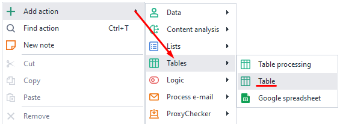
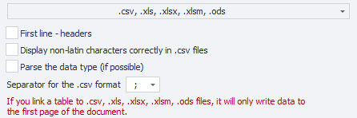

---
sidebar_position: 3
title: Table
description: How to work with tables.
--- 
:::info **Please read the [*Material Usage Rules on this site*](../../Disclaimer).**
::: 

A table is a structured set of data organized into rows and columns. Rows usually represent individual records, and columns represent different attributes or parameters of those records. Tables let you save and retrieve data from a file in various formats, or just work with data in memory without needing a file at all.  
_______________________________________________ 
## Creating a table.  
You can make a new table from the context menu: ***Add action → Tables → Table***  

 

Or through the *Static Blocks Panel*: ***click the icon*** `+` ***→ Add table***. The table you make will also show up on this panel.    

   
_______________________________________________ 
## Table settings.  
  
_______________________________________________ 
### Viewing the contents.  
This option lets you see the complete contents of the whole table.  
Here you can also turn on the display of control characters, set a filter to search for a specific row or cell, and use the filter builder.

 
_______________________________________________ 
### Load from file.  
Lets you take the table’s data from a file.  

If you don’t load the table from a file, then every thread will have its own independent copy of the table.  
_______________________________________________ 
### Save table changes to a file.  
The result of working with the table will be automatically saved to the linked file.  

If the previous setting *Load from file* is enabled, but *Save to file* is off, then each thread will have its own local copy of the table based on the selected file. Changes to the table inside the threads won’t affect the linked file.  

But if this option is enabled, all threads will work with one copy of the table. So, all changes will be saved to the linked file.  
_______________________________________________ 
### Leave file empty.  
If all the data in the table runs out, should you leave an empty file or just delete it?  
_______________________________________________ 
### Custom format.  
You can use your own file format or pick one of the ready-made table formats.  
   

If you pick a standard table format, extra settings pop up:  

  

- **First row — headers**. Use the first row of the table as headers  
- **Proper display of non-Latin letters in Excel for .csv files**  
- **Parse data type (if possible)**. Figures out the data type in the contents  
- **Separator for .csv format**. Choices: `;` and `,`  

:::warning **Pay attention.**
When you pick a ready-made format, you’ll only be working with the first sheet of the document.
:::  
_______________________________________________ 
### Row separator. 
This parameter sets what will be used to split up the rows in the table.  
Separators can be: a new line (`Enter`), your own custom separator, or multiple separators.  
_______________________________________________ 
### Column separator.  
Sets how the columns in the table should be separated.  
Options: the character `;`, the `Tab` key, or your own one or several separators.  
_______________________________________________ 
### File path.  
If you plan to load the table from a file, this is where you need to set the path to it. The data will load at project startup.  

:::tip **If you don’t know the file path.**
Sometimes you only get the path while the project is running. In that case, you can use the **Work with tables** action with the ***Link to file*** function.  
:::  
_______________________________________________
## Useful links.  
- [**What are static blocks?**](../Static%20Block%20Panel/CommonPrinciples)  
- [**Variables window**](../../pm/Interface/Variables).