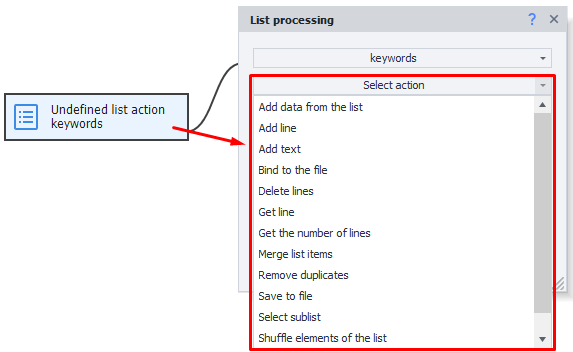
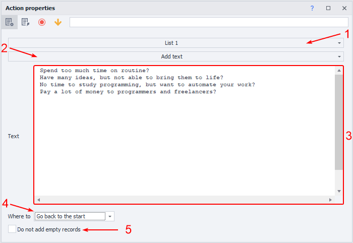

:::info **Please check out the [*Rules for using materials on this resource*](../../Disclaimer).**
:::

Lists are used for getting lines of data from a text document or for saving data to a file.
For example, you have a file with a list of URLs you need to visit one by one. Or maybe you’re parsing some values from a website (like e-mail addresses), and you need to sort them, remove duplicates, and save them to a file.
_______________________________________________
## How do you add this action to your project?
From the context menu: ***Add action → Lists → List operations***.

### What’s it used for?
- Adding and getting list items
- Deleting lines and duplicates
- Linking to a file
- Getting the number of lines
- Shuffling
- Sorting values
_______________________________________________
## How to work with the action?
After you add the action to the project, go to its properties, pick the list you want to work with, and then select the action you need.

_______________________________________________
**Let’s look at each available action in detail:**
### Select a sublist
Selects part of the lines from the list.

- **List.** Choose the list where the result will go.
- **Range.** How you want to filter the sublist. You can also pick:
    - *Items not containing the text.*
    This will pick all lines that don't have the given text. You can use variables.
    - *Items not matching a regular expression.*
    Set the search criteria using Regex (regular expressions).
    - *Items containing the text.*
    Picks the values that have the needed text. You can use variables.
    - *Items matching a regular expression.*
    Set the search criteria using Regex (regular expressions).
- **Field for criteria.** Enter the values you want based on the previous point.
- **Delete lines after picking.** Lines that match the criteria will be deleted.
- **Stop with error if the list is empty.** If the list is empty, the project will switch to the red branch.
_______________________________________________
### Add data from a list
Add data from one list to another.

- **List.** Choose the list where the result will go.
- **Destination.** Where to put the result: `to end`, `to start`, `to position`.
- **To position.** If you picked this, enter the line number or a variable in the next field.

:::info *When you copy, lines are not removed from the source list.*
:::
_______________________________________________
### Add a line
Add a line to a list.

**1.** Pick the list you want to add a line to.
**2.** Set the function.
**3.** Enter a value or variable.
**4.** Where to put the result: `to end`, `to start`, `to position`.
**5.** If you picked `to position`, enter the line number or variable in the next field.
***Marked with a red line.*** The value being copied in this example.
_______________________________________________
### Add text
Adds text to an existing list.

**1.** Pick the list you want to add text to.
**2.** Set the function.
**3.** Text or set of characters to add to the list (you can use a variable).
**4.** Where to put the result: `to end`, `to start`, `to position`.
**5.** Add empty lines if there’s no text.
_______________________________________________
### Join list items
Join list items with a chosen separator and optionally save to a variable.

- **Separator.**
    - *New line.* Each item will be written on a new line.
    - *Custom.* Enter your text or characters, which will go between the list items.
    - *Defined in the list.* Uses the separator from the list settings.
- **Save to variable.** Variable for storing the result after processing.

### Shuffle list items
Shuffles the items in the list randomly.

:::info *Changing positions doesn’t mean you lose the line values.*
:::
_______________________________________________
### Get line count
Lets you find out how many lines are in the list.

#### Filter options:
- All;
- Don’t contain text;
- Don’t match a regex;
- With a value;
- Contain text;
- Match a regex;

:::info *The variable will always only have a numeric value.*
:::
_______________________________________________
### Get line
This function gets a line, and you can also remove it from the list and save it to a variable.

- **Filter options:**
    - *Doesn’t contain text;*
    - *Doesn’t match regex;*
    - *First;*
    - *By number;*
    - *Random;*
    - *Matches regex;*
- **Delete line after picking.** Once you’ve taken a line from the list, it’ll be deleted after.
- **Save to variable.** Here you set your custom variable where the copied line will go.
_______________________________________________
### Link to a file
Links the list to a file while the project runs.

- **Path to file.** Pick a specific file or set a variable with the path.
- **Create file if not found.** If there’s no file at the given path, one will be created automatically.
_______________________________________________
### Sort
Sorts list items in ascending or descending order.

- **Sort as numbers if possible.** Use numeric sorting when you can.
- **Sort type.** Ascending or descending.

:::info *You can’t always sort alphabetic and symbol-only lines in order.*
:::
_______________________________________________
### Save to file
Saves the list to a file.

- **Separator.** Sets what to use as separator:
    - *New line;*
    - *Custom;*
    - *Defined in the list;*
- **Path to file.** Pick a file or set a variable with the file path.
- **Append to the end of the file.** Lets you add new data to a file or overwrite it completely.
_______________________________________________
### Remove duplicates
Removes repeating lines in the list.

:::info *It may take a while to process a file with many lines.*
:::
_______________________________________________
### Delete lines
Removes lines from the list with set criteria.

- **Criteria for removing lines:**
    - *All;*
    - *Not containing text;*
    - *Not matching regex;*
    - *First;*
    - *By numbers (ranges allowed);*
    - *With a value;*
    - *Containing text;*
    - *Containing only whitespace;*
    - *Matching regex;*
_______________________________________________
### Example: working with lists
Let’s say you need to go through all pages in a list + collect their titles + put them in another list.

**1.** Create `List_1` with several pages and first link it to a file.
**2.** Remove duplicates so you won’t visit the same page twice.
**3.** Create `List_2` and link it to a file.
**4.** Parse the needed info from the `List_1` pages and copy it to `List_2`.
**5.** Remove duplicates.

This way, you can fill lists with the data you need for later use and processing.
_______________________________________________
## Useful links
- [**Value ranges**](../../pm/Creating/Value_Ranges)
- [**Environment variables**](../../pm/Creating/Variables)
- [**Creating a list**](./Lists)