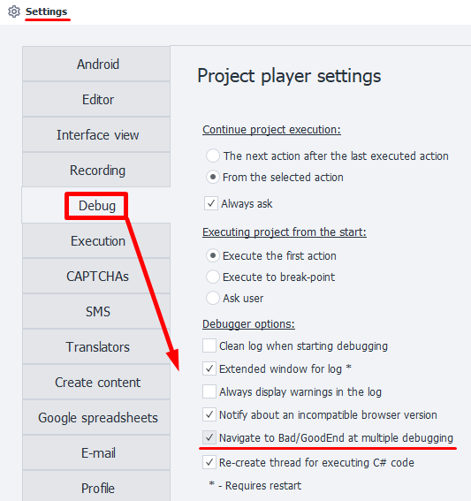

---
sidebar_position: 5
title: BadEnd 
description: Exit through the red branch.
---  
:::info **Please read the [*Rules for using materials on this resource*](../../Disclaimer).**
:::  
_______________________________________________  
If there's an error in any of the actions or you exit the cube through the red branch, the project moves to the block that's linked to the **Bad End** action. This is needed so you can set up extra steps for when the template finishes its work with an error.   

#### When do you use it?  
While the template is running, errors might pop up:  
- The website layout changed, so the template can't find the HTML element it needs anymore  
- The logic of the template wasn't fully thought through and doesn't cover certain cases  

Because of this, the project won't complete and will end with an error.  
To prevent issues like this, ***you can use Bad End for***:  

- Returning data back to lists or tables so you don't lose it and can use it later  
- Logging errors  
- Adding bad info to the Blacklist  
- Saving a backup  
_______________________________________________ 
### How do you add it to a project?  
Through the context menu: **Add Action → Logic → BadEnd**  

  
_______________________________________________ 
### How do you work with the action?  
If the template ends with an error, the actions linked to Bad End will run:  

  

Bad End will also trigger if you interrupt the template or if the global timeout is reached.  
This is controlled by the project setting in ZennoDroid — [**Run BadEnd on project interrupt**](../../Execution/Stopping):  

 

:::info **Bad End runs once for each thread.**
:::  

### Multiple jumps into BadEnd  
By default, while debugging, the project goes to BadEnd just once. After that, you need to restart the project with the **From Beginning** button.  
If you want to be able to go into BadEnd several times in a row, you need to turn on [**Jump into Bad/GoodEnd on repeated debugging**](../../Settings/Debugging) in *Settings*.  

 
_______________________________________________ 
## Examples  
### Restoring data after an error  
Let's say you take a line from a list to work with and then delete it. If your project crashes with some error before you've processed that line, the data would be lost. To avoid this, use Bad End together with the action that adds the line back into the list. That way, if the run fails, any unprocessed data gets saved back to the list for next time.  

### Track and fix an error  
Every action in the template has its own unique identifier, which lets you find it. To get the ID of the action with the error, right-click on the error in the log and hit ***Copy action ID***.  

  

Then you can use `Ctrl+F` to search, paste the ID, and click **Find**.  
The program will highlight the problem action with a blue border:  

 

You can also highlight the faulty action by right-clicking on it in the log and choosing the right option:  

  

Since it's hard to catch every error, we suggest logging them into a file. For this, after **BadEnd**, add the [**Write to file**](../../Android/ProLite/Files) cube and paste this text in:  
```  
{-TimeNow.Date-} {-Project.LastExecutedActionId-}  
```   

  

Now, if an error shows up in your project, a file called `log.txt` will be created where you'll see the time and error ID.  

If just the ID isn't enough to figure things out, you can save:  
- ***a screenshot of the screen***  
- ***the page's source code***  
- ***the values of variables***  
This will let you fully reconstruct what led to the error and make fixes.  

### Adding bad info to the Blacklist  
You can make a list to store info that leads to errors, like wrong login details. The next time the template runs, it'll check if the data is in the *Blacklist* and swap it out if it matches.  

 

### Saving a backup  
You can save the working profile so that if an error happens, you don't lose it. Then, once you fix the problem, you can load it back in and keep working.  


_______________________________________________
## Useful links  
- [**Project debugging**](../../pm/Debugging)
- [**Log window**](../../pm/Interface/Log_window)  
- [**Project playback settings**](../../Settings/Debugging)