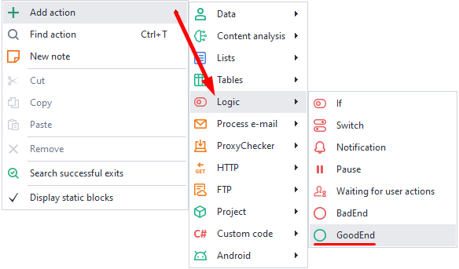
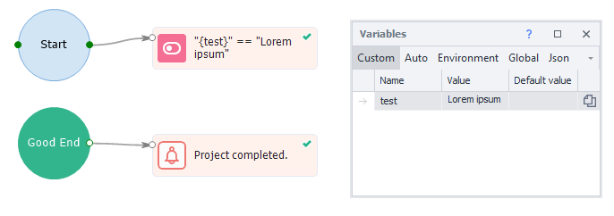
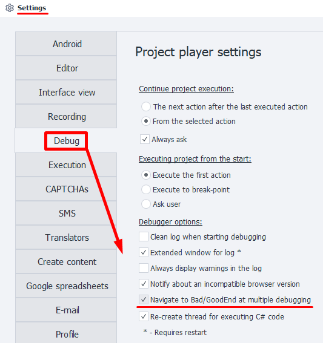

:::info **Please read the [*Terms of Use for materials on this site*](../../Disclaimer).**
:::
_______________________________________________
This action is meant for carrying out some extra steps after the successful completion of a project.
It can work together with the [**Bad End**](./BadEnd) action.

_______________________________________________
### How do you add it to a project?
Right-click for the context menu: **Add Action → Logic → GoodEnd**.

_______________________________________________
### How do you work with the action?
If the last block of the project finishes through the green route, control moves to the action linked to **GoodEnd**.

### Multiple transitions to GoodEnd.
When debugging, the project goes into *GoodEnd* by default just once. After that, you’ll need to restart the project using the **From the Start** button.
If you want to go into *GoodEnd* several times in a row, turn on the [**Go to Bad/GoodEnd when debugging multiple times**](../../Settings/Debugging) option in *Settings*.

_______________________________________________
## Useful links.
- [**Project Debugging**](../../pm/Debugging).
- [**Log Window**](../../pm/Interface/Log_window).
- [**Project Playback Settings**](../../Settings/Debugging).