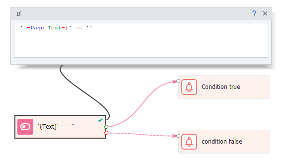

:::info **Please read [*Rules for using materials on this resource*](../../Disclaimer).**
:::
## Description.
The **IF** block is one of the main logical actions used in ZennoDroid. It works using logic from *JavaScript*. Logical operators are used for comparison.

For example, in the simplest form, the `if` operator compares two values. If the operator’s condition is true, the block gets the value `True` (***it goes out through the green branch***), and if it’s false — `False` (***through the red branch***).

In the action’s properties there’s an input field — you can insert project and environment variables there, as well as constants. The **IF** block only works with two data types: numbers and strings.

#### What it’s used for:
- Compare number values;
- Match text strings;
- Check conditions.
_______________________________________________
## How to use the IF action?
### Adding to the project.
Through the context menu: **Add action → Logic → If**.

### Example #1
**Let’s look at a simple example to understand how this operator works:**

**1.** Create a variable `value1` and set it to `1`.
**2.** Add the **IF** block via: ***Logic → If***.
**3.** In the block properties field, insert the operand: `{-Variable.value1-}`
**4.** Add the *equals* operator: `==`
**5.** Insert the second value to compare: the constant `1`.
**6.** If you run the block now, it’ll end on the green line (*a green check will appear*). That’s because the value is correct (***True***), since variable `value1` equals `1`.
**7.** But if you change the variable value to `2`, the block will end on the red line (*a red cross will appear*). That’s because the value is wrong (***False***).

In this example we used number data and the `==` comparison operator. Next, we’ll check out the Not Equals operator: `!=`
_______________________________________________
### Example #2.
:::warning **Quotes when comparing values.**
For text data and variables, you **must** use quotes (single or double). But for numbers they are **not needed**. Otherwise, the comparison won’t work right.
:::

**1.** Create a variable `value1` and set it to `“Hello World“`.
**2.** Add the **IF** block like this: ***Logic → If***.
**3.** In the block property field, insert the operand: `{-Variable.value1-}`
**4.** Add the *not equals* operator: `!=`
**5.** Insert the second value to compare: the constant `“Hello World“`.
**6.** If you run the block now, it’ll end on the red line. That’s because the value is wrong (***False***), since the variables are equal (but we are using the Not Equals operator).
**7.** When you change the variable `value1` to `“Goodbye World“` and run the block again, it’ll end on the green line (***True***).
_______________________________________________
### Example #3
You can also use comparison to check if there’s at least some text loaded on a page.

**1.** Check the environment variable `{-Page.Text-}` for emptiness.
**2.** If there’s no text on the page (it’s empty), the block will go through the green branch (***True***).
**3.** Then you can reload the page or add an extra pause, waiting for the page to load.

The **IF** block is also often used in counter loops to compare with some maximum value.
_______________________________________________
## Available operators.
:::info **For logical comparison, you can also use a similar operator from C# code, as well as the IF block.**
:::
#### Table of all operators:
| Operator  |      Description     |  Usage example |
|----------|:-------------:|------:|
| `<` |  Less than | `1<2` |
| `>` |  Greater than   |   `5>3` |
| `<=` | Less than or equal | `7 <= 10` |  
| `>=` |  Greater than or equal | `8 >= 8` |
| `==` |    Equal   |   `“Hello” == “Hello”` |
| `!=` | Not equal | `“Hello” != “Bye”` |
| `&&` |  Logical **AND** | `“Hello” != “Bye” && 5>3` |
| &#124;&#124; |    Logical **OR**   |  “Day“ == “Night” &#124;&#124; 2 > 1  |
_______________________________________________
### The OR operator ||
This operator is written as two vertical slashes. It lets you compare several conditions in a chain, going left to right. The block will output **True** if at least one of the conditions came out true. To get **False**, all the conditions have to be false.

**1.** Set variable `{-Variable.value1-}` to `1`, and `{-Variable.value2-}` to `12`.
**2.** In the action’s input field, write: `{-Variable.value1-} > 0 || {-Variable.value2-} < 10`.
**3.** Even though the second comparison is *not correct*, the block still ends on the green branch. That’s because **OR** returns ***True*** if at least one comparison is **true**.
**4.** Change the first variable’s value to `-6` — then the block gives ***False***, because all values are **false**.
_______________________________________________
### The AND operator &&
The **AND** operator is written as two ampersands `&&` and returns ***True*** when all arguments are true, and ***False*** if even one is false.

Let’s see how this operator works with text strings.

In this case both arguments are true. Variable `value1` is not (**Not equal**) to `“Hello“`, and `value2` is exactly (**Equal**) to `“World“`. So the block ends on the green branch.
:::warning **Operator precedence.**
The **AND &&** operator has higher precedence than **OR ||**, so **AND** runs first if they’re both in the same block.
:::
_______________________________________________
## Useful links.
- [**Environment Variables**](../../pm/Creating/Variables).
- [**Value ranges**](../../pm/Creating/Value_Ranges).
- [**BadEnd**](./BadEnd).