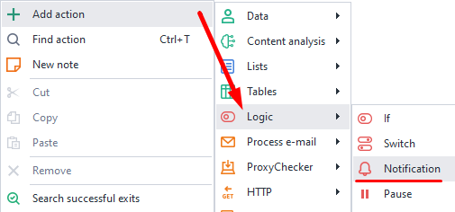
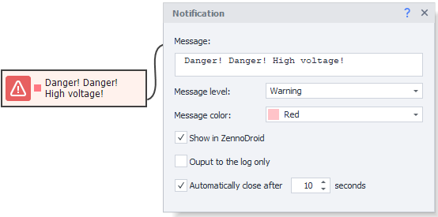
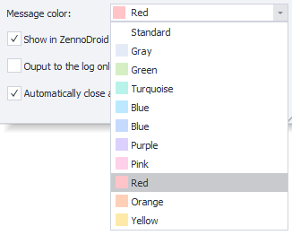
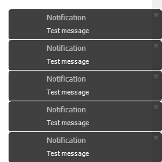

---
sidebar_position: 3
title: Notification
description: How to notify a template user.
---  
:::info **Please read the [*Material Usage Rules on this site*](../../Disclaimer).**
:::  
_______________________________________________
With this action, you can notify the user about events happening in the project. Messages will be shown in the [**Log Window**](../../pm/Interface/Log_window).

Used for:  
- Logging actions in the template  
- Notifying users about changes  
- Informing about the template version and its workflow stages  
- Alerting about how much data was processed  
_______________________________________________
### How do you add this to the project?  
Right-click: **Add Action → Logic → Notification**

_______________________________________________
## How to work with this action?

_______________________________________________
### Available parameters:
#### Message text
Here you write the text that will show up for the user. You can use macros.

#### Message level
Here you choose the type of notification:
- Info
- Warning
- Error

This affects the notification icons and lets you sort by type in the [**Log Window**](../../pm/Interface/Log_window).

#### Message color

Sets the background color for the notification. In the [**Log Window**](../../pm/Interface/Log_window) you can sort by color.

#### Show in ZennoDroid
If you check this, notifications will also be shown in ZennoDroid, not just in ProjectMaker.

#### Only show in log
If you leave this option off, notifications will pop up right on your desktop.

:::info **Note**
If the ***Only show notification in log*** option is already enabled in the program settings, you won’t see desktop notifications no matter what.
:::

#### Auto-close after N seconds
Set how long the notification will stay on your desktop after it pops up.
_______________________________________________
## Useful links
- [**The “Log” tab in ZennoDroid**](../../Execution/Log).
- [**Other settings**](../../Settings/Other_Settings).