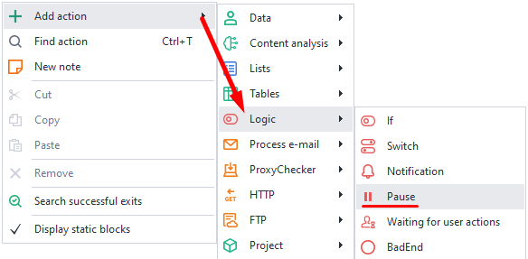
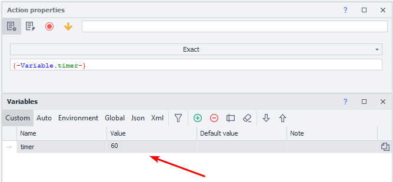
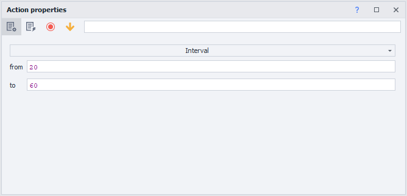

:::info **Please read the [*Material Usage Rules on this site*](../../Disclaimer).**
:::
_______________________________________________
This action lets you stop running the project for a set amount of time in seconds.

Used for:
- Waiting until the app fully loads
- Making things look more human with random pauses
- Setting pauses between different actions
_______________________________________________
### How do I add it to my project?
Through the context menu: **Add action → Logic → Pause**.

_______________________________________________
## How does this action work?
:::info **The value is set in seconds.**
If you use variables, the value must be numeric.
:::

### Exact pause.
The project will stop for the exact number of seconds you set. You can enter a number or use a variable.

### Interval pause.
You set a pause within a certain range of seconds, you can use variables too.

- **FROM**. Minimum time in seconds.
- **TO**. Maximum pause in seconds (**NOT INCLUDED**).

For example, with the settings in the screenshot, the project will wait for a randomly chosen time between 20 and 59 seconds.
_______________________________________________
### Example.
Say you need to do a few similar things in your app. So it doesn't look robotic because everything runs instantly, we suggest adding random pauses between actions.

It can look like this:
1. Open the app.
2. Do what you need to do.
3. Set a pause within an interval.
4. Do the next actions.

Adding pauses like this makes the site think there's a *real* user, not a bot.
_______________________________________________
## Helpful Links.
- [**Value ranges**](../../pm/Creating/Value_Ranges)
- [**Working with variables**](../../Data/WorkWithVariables)