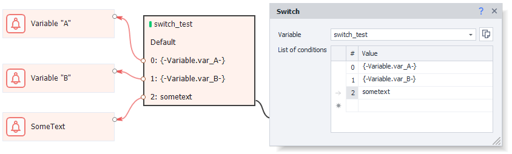

:::info **Please read the [*Terms of Use for materials on this site*](../../Disclaimer).**
:::

export const VideoSample = ({source}) => (
  <video controls playsInline muted preload="auto" className='docsVideo'>
    <source src={source} type="video/mp4" />
</video>
);

The Switch operator is like an advanced version of [**IF**](./IF). But the **IF** operator only has two outcomes — ***True*** or ***False*** (*green or red branches*), while **Switch** lets you pick from several different options. If there’s no suitable option, the block will exit through the *Default* branch.

### How to add it to your project?
Through the context menu: **Add action → Logic → Switch**.

_______________________________________________
## How to use it?
This action is used to pick an option from a preset list, or to check for a specific match.

_______________________________________________
### Available properties.
#### Variable.
Specify the variable you want to check here. If you haven’t created it yet, you can set it right in this field.

#### List of conditions.
Here, you write the conditions for exit. The value from the *variable* will be checked against each condition, and if there’s a match, it’ll exit through the matching branch.

You don’t have to use only hard-coded text for these conditions — you can use variables too. Like in this example:

#### Default exit.
If no matches are found, the action will go through the ***Default*** branch. If this branch isn’t connected to an action, you’ll get an error.
_______________________________________________
### Example in action.

_______________________________________________
### Example on video.
Let’s imagine you have some value for the variable `switch_test`.

Next, create [**Notification**](./Notification) operations for each of the options.

Video example:

<VideoSample source={require("@site/static/video/Switch.mp4").default}/>
_______________________________________________
## Useful links.
- [**Working with variables**](../../Data/WorkWithVariables).