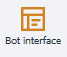
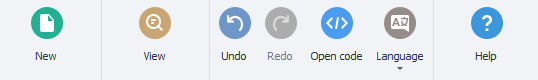
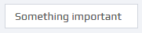
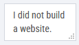
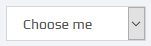
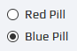
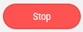
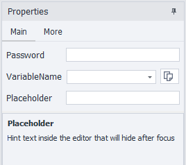

---
sidebar_position: 3
title: Bot Interface
description: Visual builder for creating an interface.
---  
:::info **Please read the [*Rules for using materials on this resource*](../../Disclaimer).**
:::
_______________________________________________   
## Description  
The bot interface (bot user interface, or BotUI) is a visual builder for creating interfaces based on web technologies: HTML, CSS, JavaScript.

With this editor, you can easily and quickly create a beautiful and user-friendly interface for your projects without needing any web development skills!

BotUI includes settings functionality and lets you pass input parameters to a template or plugin for later use in ZennoDroid.
_______________________________________________ 
## How to add it to your project?  
Via the context menu: **Add action → Project → Bot interface**.

Or through the ***Static block panel***:

 The matching icon will appear on the panel.
_______________________________________________   
:::info **This settings block is not compatible with *Input settings*.**
So, if you add one, the other is immediately removed from the project. Be careful and save your settings first.

:::
_______________________________________________

## Bot interface editor  

_______________________________________________
### Main settings  
#### Menu  

- **New**. Creates a new interface. When you do this, the main canvas is completely cleared and all existing items on it are deleted.
- **Preview**. Shows a preview of the interface
- **Undo**. Go back one step.
- **Redo**. Go forward one step.
- **Open code**. Opens the source code editor hidden behind the visual shell.
- **Language**. Switches the interface language.
- **Help**. Takes you to this help article.

#### Work area  

**1. Toolbar.**  
Here you’ll find various elements for building the client interface. For example: text input forms, selection options, extra modules and services, buttons, and checkboxes.

**2. Interface appearance.**  
A canvas for future input settings. You can drag different elements onto it from the left panel and arrange them as you want.

**3. Element properties.**  
Here you adjust the properties of a specific element—set color, font, variable and more.
_______________________________________________
### Items in the Toolbar  
| Name              | Appearance | Description |
| :----------------: | :------: | :----: |
| ***Text***        |      | Plain text for notes on the canvas. |
| ***Textbox***     |      | Single-line input field. |
| ***Password***    |     | Password field—symbols appear as dots. |
| ***Number***      |     | For integer values only. |
| ***Boolean***     |     | Checkbox for True or False. |
| ***TextArea***    |     | Multi-line text field. |
| ***Select***      |     | Dropdown list. Options are set in **Options**, where `Text` is what’s displayed, `Value` is for the variable. |
| ***Radio***       |     | Group of buttons to pick one option. |
| ***Filename***    |     | Field for entering a file path. Default path is set in **FilePath**. |
| ***Button***      |     | Button you can link to a JavaScript event. |
| ***Multiselect*** |     | Dropdown list where you can pick several options. |
| ***Captcha Modules*** |     | Pick a ***captcha recognition*** service from available options. |
| ***Sms Services*** |     | Pick a ***SMS receiving*** service from available options. |
| ***Translate Services*** |     | Pick a ***text translation*** service from available options. |
| ***Tab*** |     | Collection of tabs. You can add any other element inside except ***Tab*** itself. Edited through **Tabs**. |
| ***Language Selector*** |     | Picks the interface language—set up in **Localization**. |
| ***Start Button*** |     | Start button. |
| ***Stop Button*** |     | Stop button. |
| ***Interrupt Button*** |     | Button to interrupt an action. |
| ***Proxy Control*** |     | Uses proxies from current project. Proxies are set up through ZennoDroid. |
| ***Mapper*** |     | Element for syncing lists/tables/Google Sheets of this project with a plugin. |
| ***User Control*** |    | Here you can add any custom elements using HTML code. |
_______________________________________________
### How do you add an item to the interface?  
You can drag any item onto the canvas with the mouse. You can only place them in the visible area.

_______________________________________________
### Interface appearance  

_______________________________________________
### Element properties  
When you click an item on the canvas, its properties show up on the right.
#### Main  

Every element has unique parameters you can change in this window, like font, size, and text color.

**Clicking any parameter gives you a description at the bottom.**

<!--All you need is a blank line-->

    

#### Advanced  

Additional properties (metadata) for finer display settings. Description of every setting is also at the bottom of the window.
:::tip **Example for password field.**

:::
_______________________________________________
## Localization  
Here you set how certain settings show up in different languages. Add languages using the **Select languages** button in the top left corner.

_______________________________________________
## Example of the final interface  
You can open the user interface in ZD by right-clicking the project in the list → Settings. Or just double-click it.

You end up with a simple, clear interface you can use for your template or plugin and share it with others.
_______________________________________________
## Useful links  
- [**Variables window**](../../pm/Interface/Variables)
- [**What are static blocks?**](../Static%20Block%20Panel/CommonPrinciples)
- [**Project localization**](../../Tools/Localization)