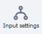
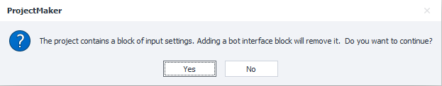
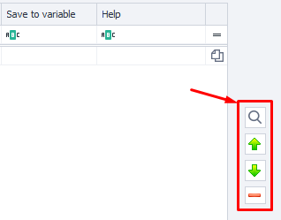
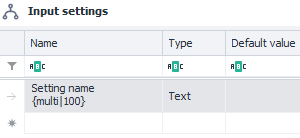
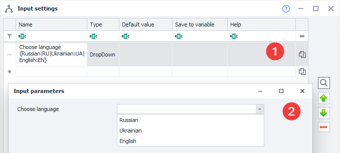
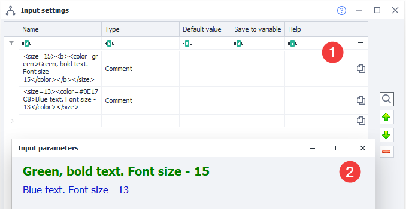

:::info **Please read the [*Material Usage Rules on this site*](../../Disclaimer).**
:::
_______________________________________________
With input settings, you can set the values needed to run the project properly.

:::warning **Input settings are only read at startup!**
Changing them while the project is running won't apply until you restart.
:::
_______________________________________________
## How do you add "Input Settings" to a project?
Via the context menu: **Add action → Project → Input settings**.

Or through the ***Static Blocks Panel***:

 The corresponding icon will appear on the panel.
_______________________________________________
:::info **This settings block is not compatible with the *Bot Interface*.**
So if you add one, the other is immediately removed from the project. Be careful and save your settings beforehand.

:::
_______________________________________________
## Editing input parameters.

_______________________________________________
### Available fields:
#### Name.
This is where you give a name to the setting you're creating.

#### Type.
 

Different data types are supported. They decide what kind of info a user can enter, and also how the setting appears visually.

Below, in a separate section, we'll go over each one in detail.

#### Default value.
The initial value for the parameter. When the project starts, it'll also be in the ***project variable***.

#### Save to variable.
The variable name where the value will be stored.

#### Hint.
A reference note about the setting. This shows up as a tooltip.

_______________________________________________
### Buttons on the right.

#### Preview.
The "Magnifier" icon lets you check what the settings you've created will look like at any time.

#### Move settings up and down.
To move a setting higher or lower in the list, select it and use the arrows.

#### Delete a setting.
To delete, just select a setting and click the minus button.

#### Copy variable macro.
To copy the macro to the clipboard, click on the file icon on the right.

_______________________________________________
### Preview buttons.

#### Export.
Lets you save the current settings to a file.

#### Import.
Allows you to load settings from a file that you previously saved.

#### Default.
Resets settings to their default values.
_______________________________________________
## Available parameter types.
### Label.
Heading. Used for visually splitting up logical sections.

_______________________________________________
### Boolean.
Checkbox. It's either checked or not (True or False).

_______________________________________________
### Number.
Field for an integer.

_______________________________________________
### Text.
Text field.
#### Single-line text.

Used by default.

#### Multi-line text.

To insert multi-line text, add an extra option to the name: `{multi|height}`, where `height` is the field height in pixels.

_______________________________________________
### Select.

A button group that lets you pick from several options. Set all possible options in the parameter name, for example: `{HTTP|SOCKS4|SOCKS5}`.

_______________________________________________
### FileName.
Input field for specifying a file path or directory in the file system. You can type it in or use the file picker window by clicking the […] button.

**Available options:**
#### Open file.
Opens a window to choose an existing file. This is the default behavior.

#### Save file.
Saves the result to a file. To call this option, add `{save}` to the setting name.

:::info **You can even save to a file that doesn't exist yet.**
While the "Open file" option only works with existing files.
:::

#### Directory path.
To work with a folder, add `{folder}` to the parameter name.
_______________________________________________
### Dropdown.
Dropdown list for selecting a value. 2 options available:
#### Show items "As is".

Options in the dropdown will appear just like in the settings editor. Syntax: `Setting name {Option1|Option2|Option3}`.

#### Named items.

Syntax: `Setting name {Option1:Value1|Option2:Value2|Option3:Value3}`.
`Option` is what's visible to the user.
`Value` is what gets stored in the variable.
_______________________________________________
### DropDownMultiSelect.
Dropdown with multiple selection. Lets you tick several options at once.

You can put several default values separated by commas in the **Default values** field. The syntax is the same as DropDown. If several options are chosen, they'll be saved to the variable separated by commas.
:::info **Only "As is" items. Named values aren't supported.**
:::
_______________________________________________
### SmsServices.
Select a service for receiving SMS from a list of available ones.

_______________________________________________
### TranslateServices.
Select a ***text translation*** service from the list of available ones.

_______________________________________________
### Tab.
Add another tab to the settings window. For example, you can split "Main" and "Additional settings" into tabs.

_______________________________________________
### Comment.
A field that lets you insert text across the whole settings window width. Can be used as a description or comment for other settings.

You can format the displayed text in this field. Supported tags:
| Feature | Syntax |
| ------- | ------ |
| Bold text  | `<b>Text</b>`  |
| Font color | `<color=red>Red font color</color>`  |
| Font size| `<size=6>Text size</size>`    |

:::tip **Example from the screenshot above.**
- **First line:** *`<size=15><b><color=green>Green, bold text. Font size - 15</color></b></size>`*
- **Second line:** *`<size=13><color=#0E17C8>Blue text. Font size - 13</color></size>`*
:::
_______________________________________________
### Password.
Anything entered here is hidden from view. But it will be visible inside the project!

_______________________________________________
:::info **Unicode symbols.**
You can use Unicode symbols in any field. For example — ± ♻ 📞 💙 🚢.
Even though the browser shows them in color, in the program's settings they'll be black and white.
:::
_______________________________________________
## Overview of input settings in ZennoDroid.
You can open input settings in ZD by right-clicking on a project in the list → Settings. Or just double-click it.

And you get this kind of simple and clear input settings interface. Now you can share the project with another user.
_______________________________________________
## Useful links.
- [**Variable window**](../../pm/Interface/Variables).
- [**What are static blocks?**](../Static%20Block%20Panel/CommonPrinciples)
- [**SMS processing services**](../../Data/SMS_Services).