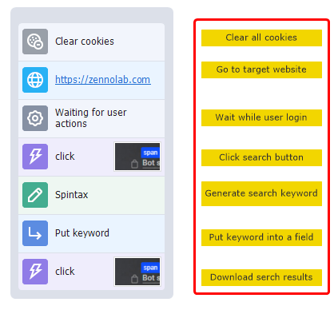
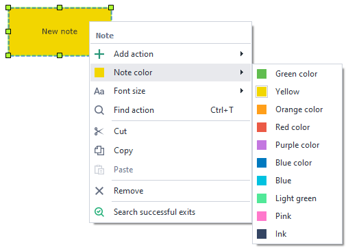

:::info **Please read the [*Material Usage Rules on this site*](../../Disclaimer).**
:::
_______________________________________________

A note is a canvas where you can leave a multi-line comment. Just like the sticky notes you put up in your office or on the fridge.
_______________________________________________
## How do you add a note to a project?
Via the context menu: **Add action → Project → Note**:

Or **Right-click on canvas → New note**:

_______________________________________________
## Usage examples.
### Detailed description of a specific action.

Sometimes you need to describe your actions in more detail, since it might not be obvious at first glance. Internal comments in the action body are limited to just a few words. That's where Notes come in handy.
_______________________________________________
### Commenting on a bunch of actions at once.

Sometimes a project gets so big it's hard to navigate visually. For example, in the screenshot above there are two separate action trees, and above them green notes with short descriptions.
_______________________________________________
### Sharing a template with other people.

If you want to share your project with someone else, Notes can contain useful info or your contact details. Their use is only limited by your imagination.
_______________________________________________
:::info **You can also find different usage examples in the test projects on the *Start page*.**
:::
_______________________________________________

## Settings.
Right-click on a note to change how it looks.
_______________________________________________
### Note color.

_______________________________________________
### Font size.
The default size is 8.

_______________________________________________
## Sample designs.
 
_______________________________________________
## Useful links.
- [**Device actions**](../../Android/ProLite/action).
- [**Recognize captcha**](../../Android/ProLite/CaptchaSolving).
- [**Text processing**](../../Data/Text).