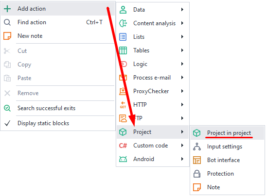

:::info **Please read the [*Rules for using materials on this site*](../../Disclaimer).**
:::
_______________________________________________
## What is it for?
This action lets you plug a ready-made project into the one you’re still working on.

It’s most often used for repeating parts. For example:

**1.** Say you have several separate templates for working with a specific site:
- Product parser
- User parser
- Message sender

**2.** You need to be logged in everywhere.
**3.** Each template has the same authorization block.
**4.** You move this block into a separate subtemplate and connect it wherever you need it.
**5.** Now you only need to make changes in one subtemplate, not several projects at once.

This action is also great for:
- Moving universal functions into a subtemplate to use in other projects:
    - *text generation*
    - *uniqueness check*
    - *uploading images to hosts*
- Breaking up one big template into several small ones, each for its own function.
- Using a template as a nested part. You’re only limited by your imagination.
_______________________________________________
## How do you add it to a project?
Right-click: **Add Action → Project → Project in Project**.

_______________________________________________
## How do you work with this action?

_______________________________________________
### Basic settings.

#### Path to nested project
Here you need to specify the absolute path to the subtemplate. You can use variables, like `{-Project.Directory-}` *(path to the current project folder)*.

#### Pass project context (project.Context)
This option is used when working with ***C# code***. `project.Context` lets you save C# objects and pass them between different parts of the template.
_______________________________________________
### Passing variables

#### Matching variables
In this window, you pass data from the outer project into the inner one.
Data can only be passed using variables.

#### Match variables with the same names
When you turn this option on, all variables with identical names in both projects will be matched automatically—no need to set them up by hand.

:::warning **Manual setup has higher priority.**
For example, both projects have a variable called `variable`. You turned on *Match variables*, but you manually linked this variable to another one—`second_var`. So now, `variable` from both projects matches with `second_var` and not each other.
:::

#### Don’t pass values back on failure
By default, all changes to variables in the inner project will also update the variables in the outer project. If you turn this option on, any changes to variables will be ignored by the outer project if the inner one fails.
_______________________________________________
## Usage example
Let’s send a notification to ourselves by Email as an example.

We create a template that’ll automatically figure out the settings to connect to the server based on the Email we send in. Then all we’ll need to do is pass the message text and sender/receiver info from the outer project.
_______________________________________________
## Project loading error

If you see this error when creating a project, it most likely means you’re trying to run a closed template on inactive hardware.

To fix it, go to your [**Personal account → Hardware tab**](https://userarea.zennolab.com/lk/userarea/UserAddHardware.aspx) and activate the hardware you’re working from right now.
_______________________________________________
## Useful links
- [**Creating content**](../../Data/ContentCreator)
- [**What is parsing?**](https://blog.capmonster.cloud/ru/blog/sel-1/what-is-website-parsing-and-why-do-you-need-it)
- [**Working with variables**](../../pm/Interface/Variables#работа-с-переменными)