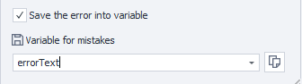
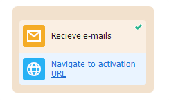

:::info **Please read the [*Terms of Use for materials on this resource*](../Disclaimer).**
:::
_______________________________________________  
## Description  
Lets you find the email you need and the info in it. Good for handling large volumes of incoming mail.

Suitable for:
- Quick access to emails
- Getting data from emails
- Account activation
- Deleting unwanted emails
- Deleting downloaded emails
_______________________________________________
## How do I add it to my project?
Right-click menu: **Add Action → Work with mail → Receive Mail**.

_______________________________________________
## How do I use this action?
:::info **Before starting, make sure your account has IMAP access enabled.**
:::
_______________________________________________
### “Main” tab

#### “Advanced view” button
When you click this button, the ***Mail Processing*** window opens.

#### Email and Password
Enter the email and password for the mailbox here
_______________________________________________
### Connection settings

#### Auto detect settings
When on, ZennoDroid will automatically select settings for connecting to the mail server.

:::warning **Doesn’t work with all mail providers.**
:::

#### Server, Port, Username, Use SSL, Protocol
You need to get all these settings from your mail provider’s documentation.
_______________________________________________
### How to search for an email

#### Imap folders

Here you can pick which mailbox folders the emails will be searched in.

  This button refreshes the list of available folders.

#### Reg. expr. (Regular Expression)
Type in a regular expression here to filter the emails you want in the mailbox.

#### Mail fetch intervals
Emails from services can come with a delay. So you can set the interval in seconds and how many times to try downloading the list of emails.

The divider `;` shows the number of attempts. For instance, in the screenshot it’s: *first try after 15 sec, second - 30 sec, third - 60 sec*.

#### Download no more than X emails from folder
Set the number of emails to be downloaded.

#### Delete found email
If on, the found email will be deleted from the mailbox after it’s processed.
_______________________________________________
### Search text in email

You can save the results of a few different regular expressions at once!

For example, in the email you might have:
- activation code,
- website address,
- phone number,
- name and surname.
You can pull all this out in one go! Just write a regex for each item and add variables to save the results into.

#### Regular Expression
Write the regex for finding the text you need.

#### Match #
Often a single regex may have more than one match. Here you’ll see the zero-based number of the found item. ***Counting starts at zero***.

:::warning **We recommend not relying on the match number.**
The project structure can change, so can the order of links.
Try to write your regex so that it only matches one result.
:::

#### Save to variable
In this column, pick an existing variable or create a new one – this is where the regex result will be stored.
_______________________________________________
### Save error to variable

If there’s an error during the action, this setting will save its text in a variable (new or existing).
_______________________________________________
### “Proxy” tab

#### No Proxy
The action will work through your computer’s/server’s actual IP.

#### Format string

Enter the proxy in one of these formats:
- ***With authorization***  `socks5://login:password@ip:port` or `http://login:password@ip:port`
- ***Without authorization***  `socks5://ip:port` or `http://ip:port`
- ***Without protocol*** *(defaults to http://)*  `login:password@ip:port` or `ip:port`

:::tip **You can use variables here.**
:::

#### Custom

Pick this option if you need detailed proxy settings: proxy type, auth details, address, and port. You can get this info from your service provider.

:::tip **You can use variables in any field.**
:::

:::info **If you don’t specify a protocol for the proxy, http:// will be used by default**
:::
_______________________________________________
## Example
Let’s say that after registering in an app, you need to confirm your account by clicking the link in the email.

1. Sign up in the app.
2. Add the **Receive Mail** action to your project and set it up.
3. Get the activation email.
4. Click the link.
5. Account is successfully confirmed.

This is especially handy when automating things in apps, since not using a separate mail client saves time and resources.
_______________________________________________
## Useful links
- [**Mailbox Settings**](../Settings/Mailbox)
- [**Regex Tester**](../Tools/RegEx_Tester)
- [**Environment Variables**](../pm/Creating/Variables)