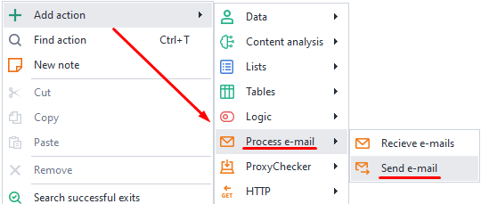
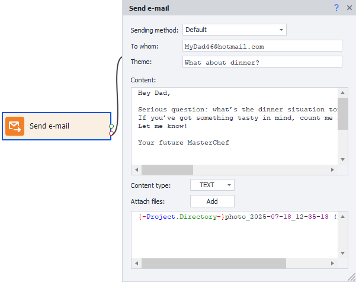

:::info **Please read the [*Material Usage Rules on this site*](../Disclaimer).**
:::  
_______________________________________________  
## Description  
With this action, you can send an email to any address using an SMTP server.

Good for:
- Sending notifications about events in a project (successful completion, errors, and so on)
- Sending messages to specified addresses from your own mailbox

### How to add it to your project?  
From the context menu: **Add action → Work with mail → Send email**

_______________________________________________ 
## How to work with this action?  
:::info **Before you start, add your mailbox info.**
You can do this in the program settings in the [**Mail**](../Settings/Mailbox) section. There you specify the accounts from which emails will be sent.
:::

### Sending method
Here you'll see all the mailboxes you've added in [**Program Settings**](../Settings/Mailbox). Pick one to send your email from.

You can use [**Project Variables**](../Data/WorkWithVariables).

### To whom
Enter the recipient's email address.

### Theme  
Set the subject line for your email.

### Content  
Here's where you put the main text of your message. HTML is supported.

### Content type  
#### TEXT  
Leave this selected if you want to send plain text.
#### HTML  
Pick this if your message contains HTML markup.

### Attach files
You can send any number of files with your email. Here, put the path to each file, one per line.

You can enter the path manually or select it using the **Add** button. [**Project Variables**](../Data/WorkWithVariables) are also supported.
_______________________________________________  
## Useful links
- [**Receive email**](./RecieveEmails)
- [**Mail Settings**](../Settings/Mailbox)
- [**Variables window**](../pm/Interface/Variables)