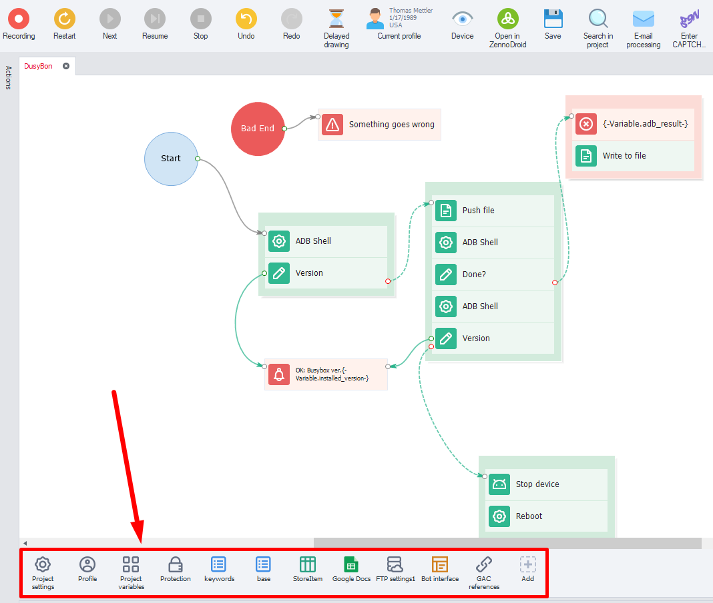
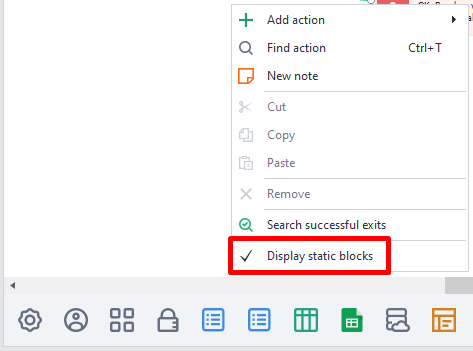
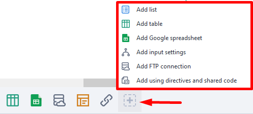
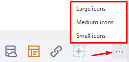
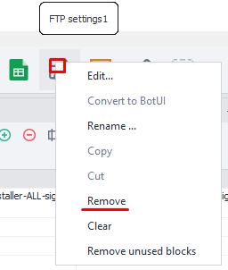

---
sidebar_position: 3
title: General Principles
description: Static blocks panel.
--- 
:::info **Please read the [*Terms of Use for materials on this resource*](../../Disclaimer).**
:::  

## What are static blocks?  
  

Every project has a special field at the bottom — the static blocks panel. These are elements that belong to the entire project and are available from anywhere in it. Unlike actions (cubes), which run one after the other over time.  

Each static block is responsible for one or several project properties. Things like project settings, profile settings, encryption, as well as lists and tables with data.  

When you create a project, it already has several required static blocks that you can't delete.  
_______________________________________________
## How do you show this panel?  
  

If you don't see the static blocks panel, right-click anywhere in an empty spot on the canvas and choose **Show static blocks** from the context menu.  
_______________________________________________
## Adding static blocks.  
  

Use the icon with the **+** sign.  
_______________________________________________
## Changing the size of the panel.  
  
_______________________________________________
## Deleting a static block.  
**Right-click on the block → Delete:**  

  

If the **Delete** button is inactive, you can't delete this static block.