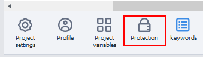
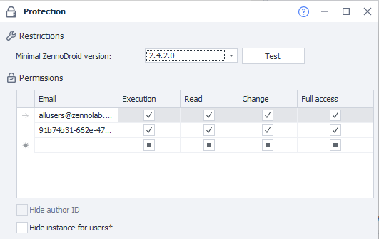

:::info **Please read the [*Rules for using materials on this resource*](../../Disclaimer).**
:::

Encryption allows you to protect your projects from unexpected copying and editing. For example, this can come in handy when you're passing a template to another user so only that person has access.

## Where is it?

After creating a project, you'll see a lock icon at the bottom, on the static blocks panel. That's the encryption block.
_______________________________________________
## Field descriptions

_______________________________________________
### Minimum ZennoDroid version
You can select the minimum version required to run the template from the dropdown list.

When you click **Check**, it'll test the template to determine the minimum possible version.
_______________________________________________
### Permissions
| Email              | Execute | Read | Edit | Full access |
| :----------------: | :------: | :----: |:------: | :----: |
| Field for entering ID |  Allows running the project | Lets you see the project structure | Lets you edit the project  | All of the above plus granting rights to other users. |

#### Accepted ID formats:
- **support@zennolab.com**. The email linked to ZennoDroid.
- **e927aabf-5ee3-4d3d-9ba7-e0f70537b923@zenno.club**. You can get it in your [**Personal account**](https://account.zennolab.com/personal-area-profile).
- **allusers@zennolab.com**. A universal address that applies to all users.

#### More about access settings
**Execute → Read → Edit → Full access**. Access is given in this hierarchy.
For example, if you give **Edit** rights, **Read** and **Execute** will be granted automatically. Conversely, if you remove **Execute**, all the following permissions also become inactive.
_______________________________________________
### Hide author ID
Turn this option on if you don't want to reveal your internal ZennoLab system ID when you're passing the template to other users.
_______________________________________________
### Hide instance for users
You should turn on this option if you don’t want the browser to be visible when you pass the template to other users.

This setting doesn’t affect project execution and only hides the browser from showing up in ProjectMaker. It applies to users who only have **Execute** rights for the template.

Specifically, it hides the browser window in ProjectMaker when the project is run as a plugin or subproject. But it doesn't apply to the ***Wait for user actions*** action.