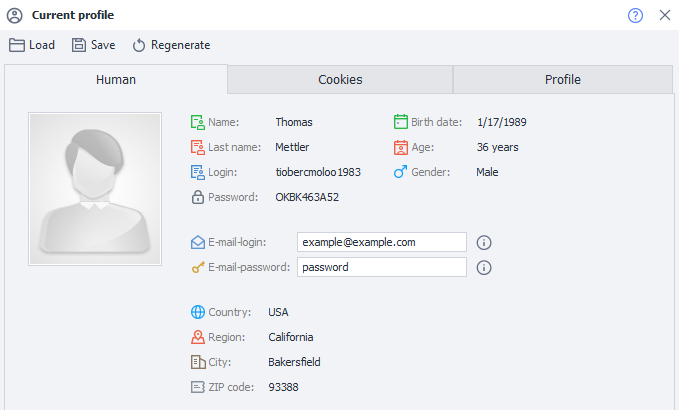
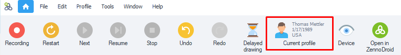
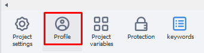
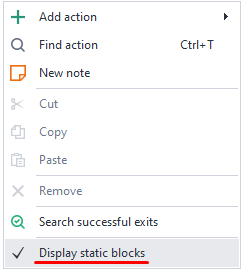
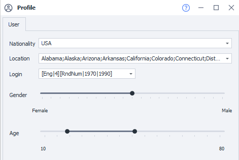
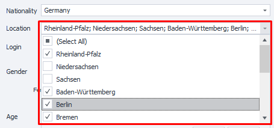
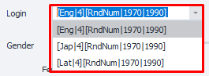

---
sidebar_position: 2
title: Profile
description: Profile generation for your project
---
:::info **Please read the [*Material Usage Rules on this site*](../../Disclaimer).**
:::

  
_______________________________________________
**Profile** is a virtual persona whose parameters are generated every time you launch a new template. In ProjectMaker, generation happens when you click the **"Start Over"** button; in ZennoDroid, it's with every new project run. Detailed info about the profile is shown in the **Profile Window**.

When the project runs, all the needed data will be generated in the profile. These include:  
- personal info, which is used for registration;  
- device info, necessary for working with services.  
:::warning **Important.**
It's better not to reassign individual profile settings within a single project run — instead, just finish the project and run it again as many times as you need. This way, you don't complicate your project with internal cycles.
:::

When you're registering accounts, the right workflow is:  
**1.** Start the project.  
**2.** Generate one new profile.  
**3.** Perform the needed actions.  
**4.** End the project.
_______________________________________________
## Setting up profile generation for the current project
To open the profile generation settings, click the **Profile** icon in the **Static Block Panel**. You'll find it below the action canvas.

:::info **Can't see the *Static Block Panel*?**
Just right-click any empty spot on the action canvas and pick the right setting in the context menu to enable this area.

:::

## "User" Tab

### Nationality
:::tip **Default nationality**
*You can set this up in Settings, on the Profile tab. You can also set your email and its password there.*
:::

You can pick from 6 nationalities:  
- Russia,  
- USA,  
- Germany,  
- France,  
- Spain,  
- United Kingdom.
_______________________________________________
### Location
Location is set through a dropdown list where you can choose several options. The list content depends on the country you picked:  
- Russia — regions, territories, republics, some big cities (Moscow, Sochi, etc.);  
- USA — states;  
- Germany — lands;  
- France — regions;  
- Spain — autonomous communities;  
- United Kingdom — the countries that make it up.

### Login
When generating a login, the program uses a formula made up of several parts. By default, a few types of formulas are already saved in the settings. You can add your own too.

#### Detailed explanation of formulas
Formulas currently support these languages: `Eng` — English, `Lat` — Latin, `Jap` — Japanese.  
For example, if you input `[Eng|4]`, you'll get a nickname 4 English syllables long, with syllable combos similar to real words. You can create more complicated constructions by tweaking the formula. Let's break down this one:

`[RndSym|[RndNum|0|4]|0123456789][Lat|3][RndSym|[RndNum|0|2]|-][Jap|1][RndText|2|D]`

`[RndSym|[RndNum|0|4]|0123456789]` — at the start of the nickname, from 0 to 3 digits will be used;  
`[Lat|3]` — 3 Latin syllables generated;  
`[RndSym|[RndNum|0|2]|-]` — random 2 letters or digits.

With this formula you could get nicknames like:  
- 053bomenca-iem,  
- 7lialeme-nozr,  
- 46atbemig-poex,  
- simpvido-se8f,  
- 3afosuxhif6,  
- frigulimdeif,  
- misssefu-yucn.
_______________________________________________
### Gender
Use this slider to set the probability of generating a certain gender.
_______________________________________________
### Age
This parameter lets you set the range within which the profile's age will be generated.
_______________________________________________
## What is the Profile for?
For registering on websites, forums, blogs, social networks and so on. Thanks to this, you don't have to rack your brain about where to get names, surnames, zip codes, cities, logins or how to generate different device parameters. It's all built into the program already. You can just focus on more important tasks.
_______________________________________________
## Useful links
- [**Profile filling settings**](../../Settings/Profile_Setting)
- [**Profile window**](../../pm/Interface/Work_with_Profile)
- [**Profile operations**](../../Data/WorkWithProfile)