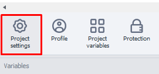

:::info **Please read the [*Material Usage Rules on this site*](../../Disclaimer).**
:::

With these settings, you can set values that will be automatically applied when the template is launched.
_______________________________________________
## How to open the settings?
To open **Project Settings**, you need to click the corresponding button in the ***Static Blocks Panel***.

_______________________________________________
## Available options.
### Android.

Here, you can set up the **Pause between actions**, which will be triggered before the action. After you change it, you need to start the project **From the beginning** using the special button in the top panel.

Here are the actions affected by this option:
- [**Get value**](../../Android/ProLite/GetValue)
- [**Set value**](../../Android/ProLite/SetValue)
- [**Run event**](../../Android/ProLite/RunEvent)
- [**Touch emulation**](../../Android/ProLite/Touch_Emulation)
- [**Swipe emulation**](../../Android/ProLite/Swipe)
- [**Keyboard emulation**](../../Android/ProLite/Keyboard)

Keep in mind some of these actions also have their own pause settings. So, in the end, these two settings will add up — first, the pause from the project settings will run, then the one from the action settings.

:::tip **Example of action pause settings.**

:::
_______________________________________________
### Proxy checker settings.

Here, you can choose the rule for how proxies will be picked when the project starts. The rule for the [**Proxychecker**](../../get-started/ProxyCheckerZD) itself can be changed using the [**Get proxy**](../GetProxy) action.
_______________________________________________
### HTTP settings.

In this tab, you set the way HTTP requests are sent:
- **Default**. The method picked in the *program settings in the "Execution" tab*.
- **Standard method**. The Chilkat library will be used.
- **Alternative method**. *ZennoHttpClient* will be used, which lets you fix issues with certain sites.

These settings are used for request actions. You can read more about how they work in these articles: [**GET request**](../../Project%20Editor/HTTP%20and%20FTP/GET), [**POST request**](../../Project%20Editor/HTTP%20and%20FTP/POST), and [**HTTP requests**](../../Project%20Editor/HTTP%20and%20FTP/HTTP).