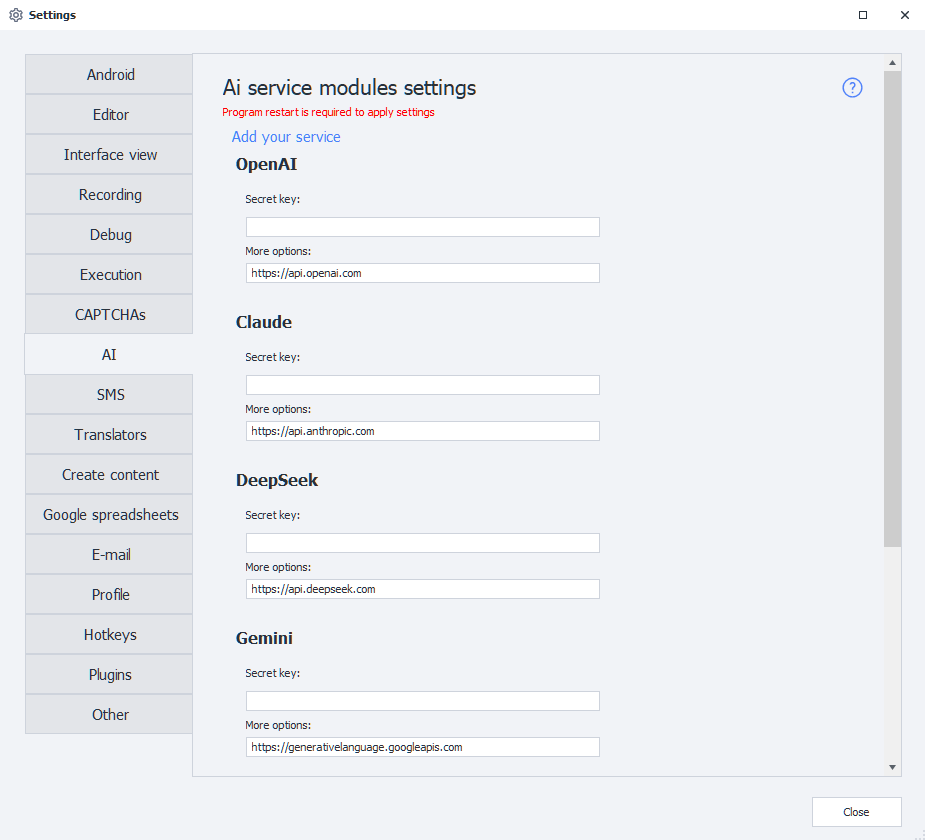
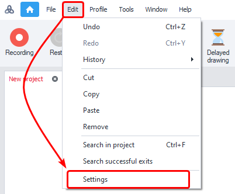
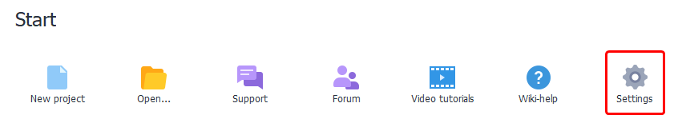
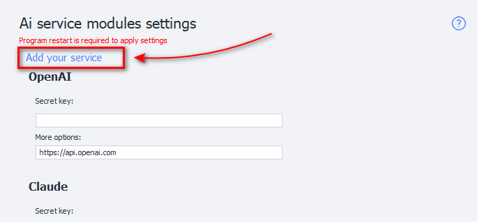
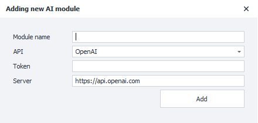
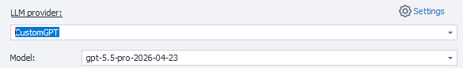

import DisclaimerNotice from '@site/src/components/DisclaimerNotice';

# AI
<DisclaimerNotice />

## Description
**AI services** are services that provide access to language models and other AI tools via API. They enable automatic text generation, comments, descriptions, data analysis, translation, code writing, image processing, and many other tasks.

_______________________________________________
## What are these settings for?
Modern AI models can understand text prompts and generate responses that closely resemble human communication. Through API integration, ZennoDroid can send requests to AI services and use the responses in automation.

**This can be used for:**
- *generating comments, posts, and descriptions*;
- *rewriting and translating text*;
- *content analysis*;
- *creating SEO texts*;
- *code generation*;
- *classifying and processing data*;
- *working with images and OCR*;
- *automating communication and user support*.

The key you enter here is also used by the [**AI assistant**](../get-started/ai-assistant) in ProjectMaker — it will not work without a connected model.

After connecting an API key, you can select a model, configure generation parameters, and use AI directly inside your ZennoDroid project.
_______________________________________________
## How to open this window?
- Via the ProjectMaker top menu **Edit → Settings → AI**.

- Via the [**Welcome Page**](../pm/Welcome_PM) — the **Settings** button in the *Getting started* block.

_______________________________________________
## How to connect?
### Secret key
To work with an AI service you need an **API key** (*Token*). This is a *unique string of characters* used to authorize requests and identify your account in the service. For example, it might look like this: `sk-proj-8fKx2aBcD93kdPqLmN4...`.

To get an API key, go to the website of the selected AI service, register, and create a key in your account dashboard or developer section.

**The API key is required for:**
- *sending requests to AI models*;
- *tracking used tokens*;
- *accessing available models*;
- *billing and API limits*.

:::warning Keep your API key secret.
- Do not publish it publicly.
- If compromised, revoke the key immediately and create a new one.
:::

After adding the key, ZennoDroid will be able to make requests to the selected AI service on your behalf.

### More options
Here you enter the **URL address** for receiving API requests. It is preset in the program by default. If the address is not filled in, check the documentation for your chosen service.

:::warning Do not change the value of this field unless necessary!
:::

:::info Program restart is required to apply settings.
This is warned about by the red text at the top of the settings window.
:::
_______________________________________________
## Available services
- [api.openai.com](https://openai.com) — ChatGPT;
- [api.anthropic.com](https://anthropic.com) — Claude;
- [api.deepseek.com](https://deepseek.com) — DeepSeek;
- [generativelanguage.googleapis.com](https://ai.google.dev) — Gemini;
- [openrouter.ai/api](https://openrouter.ai) — OpenRouter;
- [api.perplexity.ai](https://perplexity.ai) — Perplexity Sonar.
_______________________________________________
## Your own service
### Add your own service (module)
You can also add a custom AI service to the program, based on the API of popular services.

To do this, go to the **Settings** page and select **Add your service**.

A window will appear for entering the data of the new service:

### Required parameters
:::tip If you’re not sure what to enter,
please check with your service provider.
:::
#### Module name
Enter the name of the new service.

#### API
Select the API your module will be based on.

#### Token
Enter the service’s key. This is the same as the **Secret key** you use when connecting a built-in service *(described above)*.

#### Server
The URL address where requests will be sent.

### Working with your added service
After you add the service and restart the program, it appears in the common list alongside the built-in ones. You can select it in the [**AI Agent**](../project-editor/AI_Agent) action and work with it just like a built-in LLM provider.

### Removing a module
To remove a module you created from the program, **you’ll need to delete two files**:
- `c:\Users\USERNAME\AppData\Roaming\ZennoLab\Configs\ModuleName.config.json`
- `c:\Users\USERNAME\AppData\Roaming\ZennoLab\CustomModules\Ai\ModuleName.dll`

`USERNAME` — replace with your operating system username.

:::warning We recommend closing ZennoDroid and ProjectMaker before deleting these files.
:::
_______________________________________________
## Useful links
- [**AI Agent action**](../project-editor/AI_Agent).
- [**AI Assistant in ZennoDroid**](../get-started/ai-assistant).
- [**MCP setup for AI assistants**](../get-started/MCP_Setup).
