---
sidebar_position: 3
title: Appearance
description: Changing the program’s interface.
---
:::info **Please read the [*Material Usage Rules on this site*](../Disclaimer).**
:::
_______________________________________________  
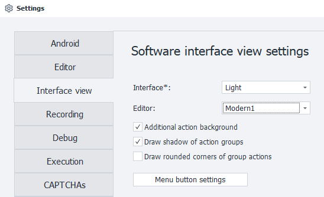  

## Interface  
Choose between dark and light themes

| 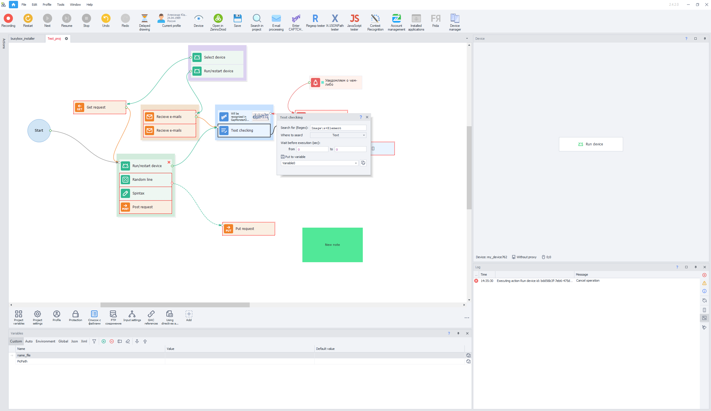    | 
| :--------: | 
| **Light**  |  

| 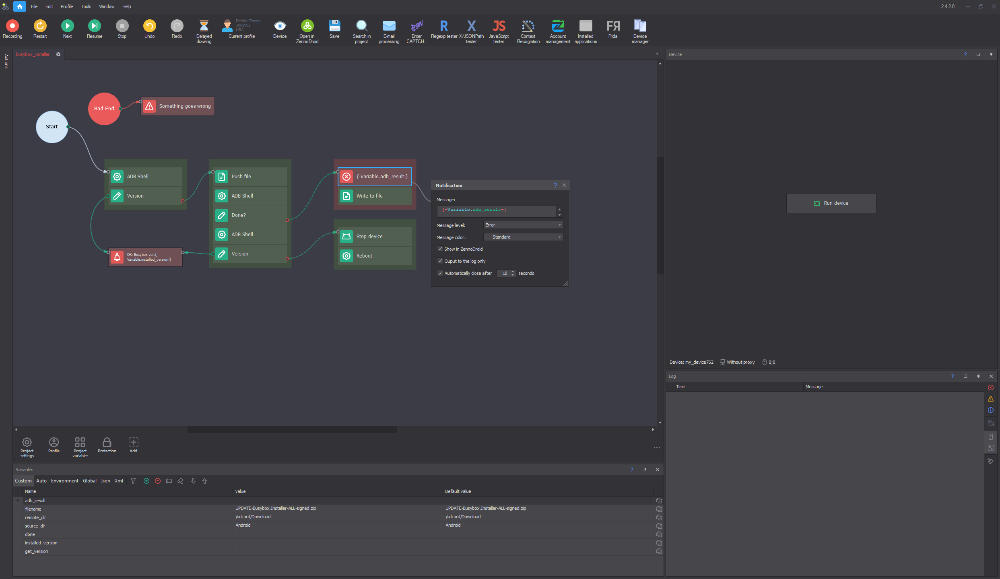    | 
| :--------: | 
| **Dark**  |

:::info **To change the theme, you’ll need to restart the program.**
:::
_______________________________________________

## Editor
Here you can pick a theme for the editor, which changes how the actions look.

| **Modern1** *(this is the default modern look)*    | 
| :--------: | 
|  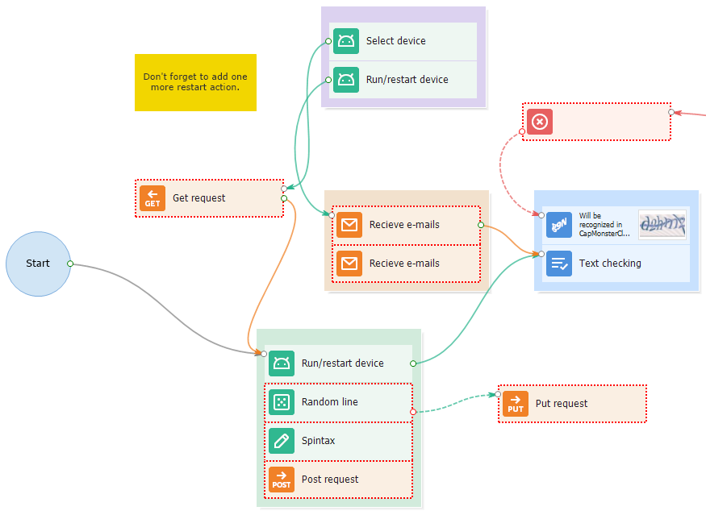 |  

| **Modern2** *(some icons have a different background, otherwise it’s about the same)*    | 
| :--------: | 
|  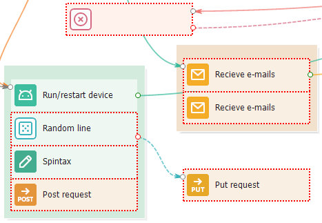 |  

| **Letter** *(icons are replaced with letters and symbols)*    | 
| :--------: | 
|  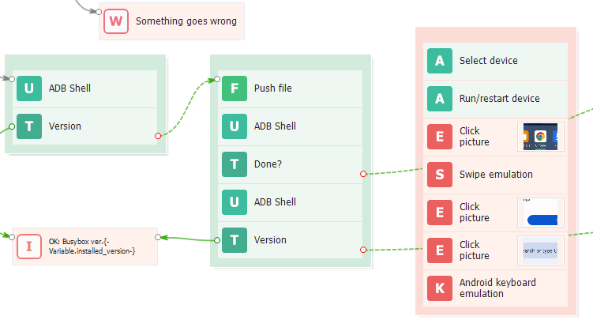 |  

| **Classic** *(how the program used to look, with completely different icons)*    | 
| :--------: | 
|  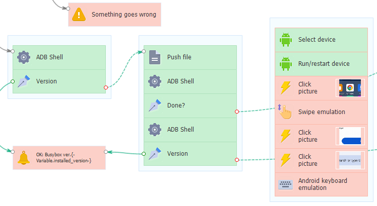 |  

| **Classic2** *(the background for actions becomes more intense)*    | 
| :--------: | 
|  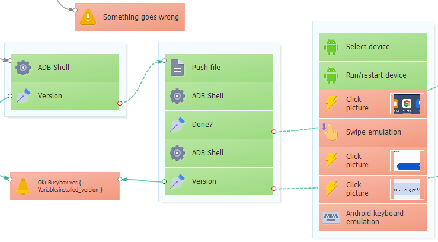 |  
_______________________________________________
## Additional Action Background
:::info **Changing this is not available for *Classic* and *Classic2*.**
:::

| With a solid background    | 
| :--------: | 
|  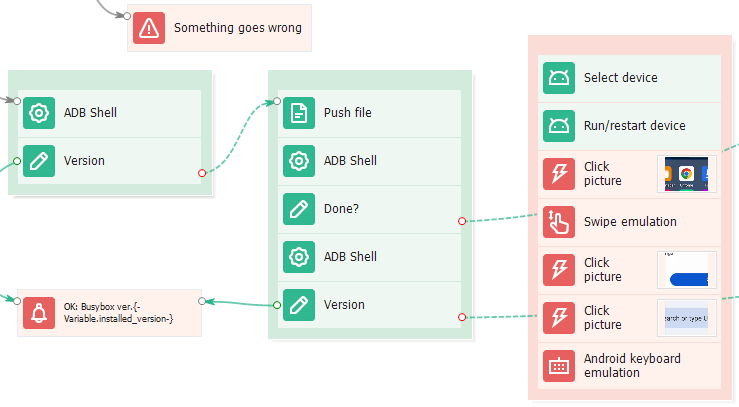 |  

| Without a solid background    | 
| :--------: | 
|  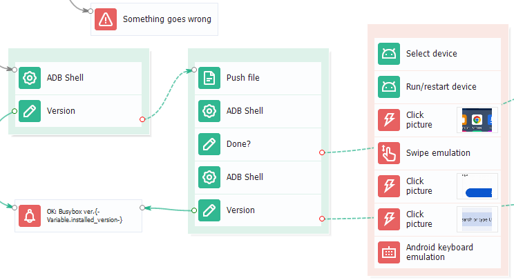 |
_______________________________________________
## Draw shadow for action groups
:::info **Turning on this option may slow down rendering speed!**
:::

| Setting is enabled    | 
| :--------: | 
|  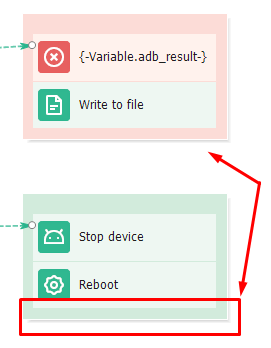 |  

| Setting is disabled    | 
| :--------: | 
|  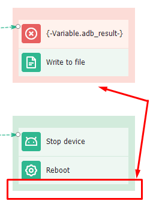 |
_______________________________________________
## Draw rounded corners for actions and groups

| Setting is enabled    | 
| :--------: | 
|  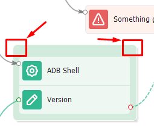 |  

| Setting is disabled    | 
| :--------: | 
|  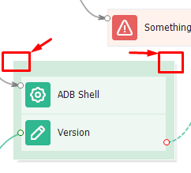 |
_______________________________________________
## Menu button settings  
When you press this button, an extra menu pops up where you can pick which buttons and sections will show in the top panel of the program.

### Tool button settings  
Here you can pick which tool buttons show up in the top menu.

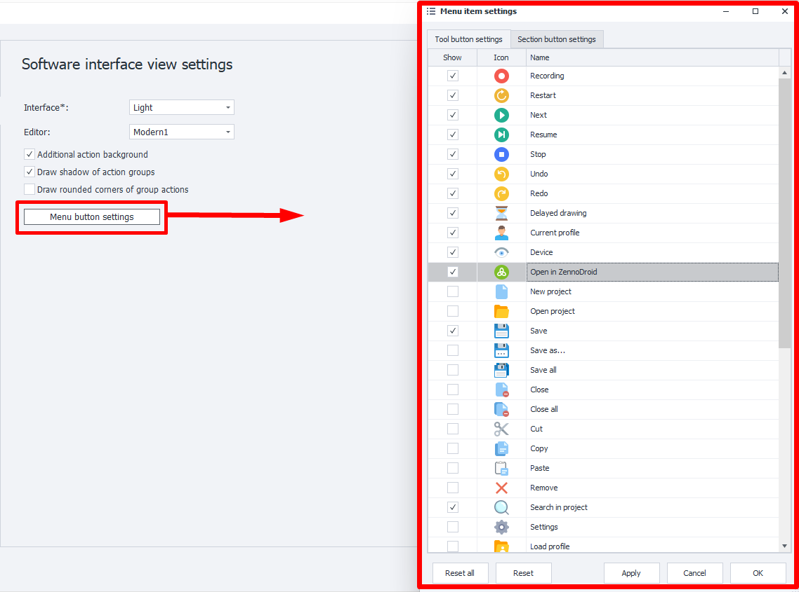  

Once you decide and press **Apply**, the buttons will show up right away in the toolbar:

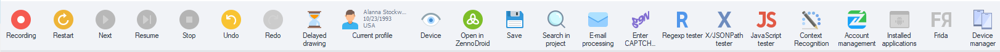  

### Section button settings
Here you choose which sections will be accessible at the top of the program.

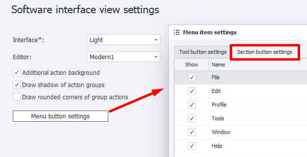  

### Arranging buttons and sections
You can manually arrange the buttons and sections to make them convenient for you. Just hold down the left mouse button on an item and drag it wherever you want.

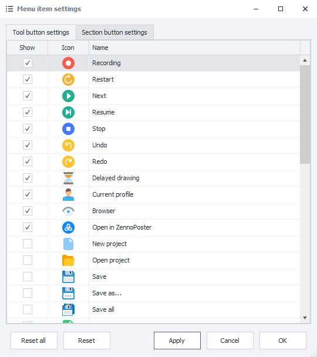  

With the **Reset** button, you can always put the items in this window back to their original spots. The **Reset all** button returns both sets of buttons in both windows back to default.
_______________________________________________  
## Useful links  
- [**ProjectMaker interface**](../category/интерфейс)