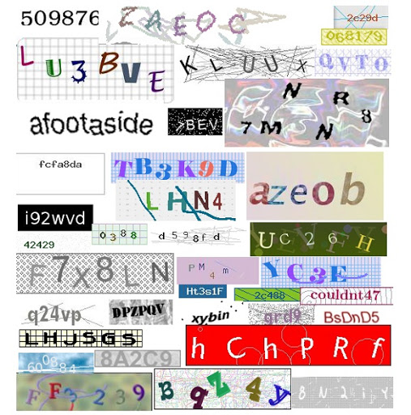

:::info **Please read the [*Terms of Use for materials on this site*](../Disclaimer).**
:::
_______________________________________________
## Description
A **captcha** is an automatically generated test to check whether a user is human or a computer (bot). The simplest ones are usually just distorted text made up of letters and/or numbers. They can appear in different color combinations, with added noise, distortions, lines, or random shapes.

|     | 
| :--------: | 
| **Examples of text captchas.**  |  

There are also other types of captchas, where you don’t just enter characters from a picture, but need to do something more. For example, you might be asked to find buses, palm trees, motorcycles, or other objects; solve a puzzle; arrange things in a certain order; or sort them.

#### More captcha examples:

|     |  |
| :--------: | :-------: |
| [**ReCaptcha**](https://developers.google.com/recaptcha)  | [**HCaptcha**](https://www.hcaptcha.com/)    |  

|     |  |
| :--------: | :-------: |
| [**FunCaptcha**](https://www.arkoselabs.com/arkose-matchkey/)  | [**CloudFlare**](https://www.cloudflare.com/)    |
_______________________________________________
## Why do you need these settings?
ZennoDroid lets you solve text captchas manually. To do this, just pick the `MonkeyEnter.dll` module in the [**Captcha Recognition Action**](../Android/ProLite/CaptchaSolving). But doing this by hand can become a real chore when you have to deal with hundreds or thousands of captchas!

And what if your project runs around the clock and captchas pop up at any given moment?

That’s when these services come in handy. **They’re designed to save you from entering captchas manually.**

_______________________________________________
## How do you connect a service?

### Secret key
Most of the time, you’ll need an **API key** for the service to work. This is a *unique string of random characters* that identifies you to the service. It might look something like this: `8fc9b30e544885b8480fb590dfcbdd71`.

To get an API key, go to the website of a suitable service and check their requirements. Once you’ve chosen a service, sign up and get your *API key* in your account dashboard.

### Login and password
Some services use your login and password (from registration) instead of an API key for authorization.

### Extra parameters
Here, you’ll enter the **URL address (domain)** to send API requests. The program has this filled in by default, and **you shouldn’t change it unless you have to**. If for some reason the URL isn’t prefilled, check the service documentation.

### Balance
After you log in, this field will show your current balance.

This field is also used to show error messages (but not for every service).
Possible errors: `IP_BANNED`, `ERROR_WRONG_USER_KEY`, and so on.

:::warning **If this field stays empty after you enter your API key, something went wrong.**
Possible reasons: invalid key (or login/password), service problems, or your key might be banned.
:::
_______________________________________________
## Available services
- [**CapMonster Cloud**](https://capmonster.cloud/) — Recommended 👍;
- [2captcha](https://2captcha.com/);
- [Anti-Captcha](https://anti-captcha.com/);
- [BypassCaptcha](http://bypasscaptcha.com/);
- [CheapCaptcha](https://cheapcaptcha.com/);
- [DeathByCaptcha](https://deathbycaptcha.com/);
- [DeCaptcher](http://decaptcher.com/);
- [Imagetyperz](http://imagetyperz.com/);
- [Jsdati](https://www.jsdati.com/);
- [RuCaptcha](https://rucaptcha.com/);
- [CapMonster 2 Desktop](https://zennolab.com/ru/products/capmonster/);
_______________________________________________
## Your own module
### Adding a new module (service)
You can also add your own captcha recognition service using an API from one of the popular services.

### Required parameters
:::tip **If you’re not sure what info you need to enter.**
Check with your service provider.
:::
#### Module name
Enter a name for your module, **up to 20 characters**.

#### API
Select the API of the service you want to base your module on.

#### API key
The service key. This is the same key you use in the **Secret key** field when connecting the service.

#### Server
The URL address (domain) to send captcha-solving requests to.

### Sending captchas to your own module
Once you've added your module, you'll be able to pick it in the [**Solve captcha**](../Android/ProLite/CaptchaSolving) action.

### Deleting a module
To remove a created module from the program, **you need to delete two files**:
- `c:\Users\USERNAME\AppData\Roaming\ZennoLab\Configs\ModuleName.dll.config`
- `c:\Users\USERNAME\AppData\Roaming\ZennoLab\CustomModules\Captcha\ModuleName.dll`

:::warning **We recommend closing ZennoDroid and ProjectMaker before deleting these files.**
:::
_______________________________________________
## Useful links
- [**All about captcha recognition**](https://blog.capmonster.cloud/ru).
- [**CapMonster Cloud dashboard**](https://capmonster.cloud/Dashboard).---
sidebar_position: 7
title: Captchas
description: Settings for captcha recognition modules.
---
:::info **Please read the [*Terms of Use for materials on this site*](../Disclaimer).**
:::
_______________________________________________
## Description
A **captcha** is an automatically generated test to check whether a user is human or a computer (bot). The simplest ones are usually just distorted text made up of letters and/or numbers. They can appear in different color combinations, with added noise, distortions, lines, or random shapes.

|     | 
| :--------: | 
| **Examples of text captchas.**  |  

There are also other types of captchas, where you don’t just enter characters from a picture, but need to do something more. For example, you might be asked to find buses, palm trees, motorcycles, or other objects; solve a puzzle; arrange things in a certain order; or sort them.

#### More captcha examples:

|     |  |
| :--------: | :-------: |
| [**ReCaptcha**](https://developers.google.com/recaptcha)  | [**HCaptcha**](https://www.hcaptcha.com/)    |  

|     |  |
| :--------: | :-------: |
| [**FunCaptcha**](https://www.arkoselabs.com/arkose-matchkey/)  | [**CloudFlare**](https://www.cloudflare.com/)    |
_______________________________________________
## Why do you need these settings?
ZennoDroid lets you solve text captchas manually. To do this, just pick the `MonkeyEnter.dll` module in the [**Captcha Recognition Action**](../Android/ProLite/CaptchaSolving). But doing this by hand can become a real chore when you have to deal with hundreds or thousands of captchas!

And what if your project runs around the clock and captchas pop up at any given moment?

That’s when these services come in handy. **They’re designed to save you from entering captchas manually.**

_______________________________________________
## How do you connect a service?

### Secret key
Most of the time, you’ll need an **API key** for the service to work. This is a *unique string of random characters* that identifies you to the service. It might look something like this: `8fc9b30e544885b8480fb590dfcbdd71`.

To get an API key, go to the website of a suitable service and check their requirements. Once you’ve chosen a service, sign up and get your *API key* in your account dashboard.

### Login and password
Some services use your login and password (from registration) instead of an API key for authorization.

### Extra parameters
Here, you’ll enter the **URL address (domain)** to send API requests. The program has this filled in by default, and **you shouldn’t change it unless you have to**. If for some reason the URL isn’t prefilled, check the service documentation.

### Balance
After you log in, this field will show your current balance.

This field is also used to show error messages (but not for every service).
Possible errors: `IP_BANNED`, `ERROR_WRONG_USER_KEY`, and so on.

:::warning **If this field stays empty after you enter your API key, something went wrong.**
Possible reasons: invalid key (or login/password), service problems, or your key might be banned.
:::
_______________________________________________
## Available services
- [**CapMonster Cloud**](https://capmonster.cloud/) — Recommended 👍;
- [2captcha](https://2captcha.com/);
- [Anti-Captcha](https://anti-captcha.com/);
- [BypassCaptcha](http://bypasscaptcha.com/);
- [CheapCaptcha](https://cheapcaptcha.com/);
- [DeathByCaptcha](https://deathbycaptcha.com/);
- [DeCaptcher](http://decaptcher.com/);
- [Imagetyperz](http://imagetyperz.com/);
- [Jsdati](https://www.jsdati.com/);
- [RuCaptcha](https://rucaptcha.com/);
- [CapMonster 2 Desktop](https://zennolab.com/ru/products/capmonster/);
_______________________________________________
## Your own module
### Adding a new module (service)
You can also add your own captcha recognition service using an API from one of the popular services.

### Required parameters
:::tip **If you’re not sure what info you need to enter.**
Check with your service provider.
:::
#### Module name
Enter a name for your module, **up to 20 characters**.

#### API
Select the API of the service you want to base your module on.

#### API key
The service key. This is the same key you use in the **Secret key** field when connecting the service.

#### Server
The URL address (domain) to send captcha-solving requests to.

### Sending captchas to your own module
Once you've added your module, you'll be able to pick it in the [**Solve captcha**](../Android/ProLite/CaptchaSolving) action.

### Deleting a module
To remove a created module from the program, **you need to delete two files**:
- `c:\Users\USERNAME\AppData\Roaming\ZennoLab\Configs\ModuleName.dll.config`
- `c:\Users\USERNAME\AppData\Roaming\ZennoLab\CustomModules\Captcha\ModuleName.dll`

:::warning **We recommend closing ZennoDroid and ProjectMaker before deleting these files.**
:::
_______________________________________________
## Useful links
- [**All about captcha recognition**](https://blog.capmonster.cloud/ru).
- [**CapMonster Cloud dashboard**](https://capmonster.cloud/Dashboard).