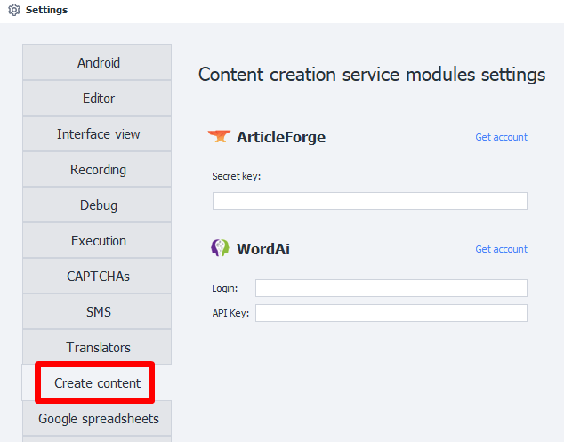
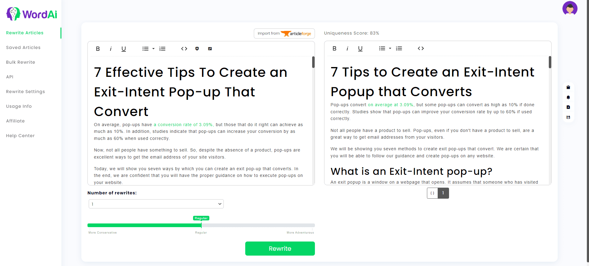

:::info **Please read the [*Material Usage Rules on this site*](../Disclaimer).**
:::
_______________________________________________
## Content Creation Modules
### Description
These modules let you create content based on your input text using third-party services. AI technology writes text that’s on par with what a human would produce.

Perfect for **rewriting text** and **creating unique content**.

:::warning **Works with English only.**
:::

### How it Looks

_______________________________________________
### Setting Up ArticleForge

#### 1. If you don’t have an account, create one.
#### 2. Get your API key in the API Information section.
_______________________________________________
### Setting Up WordAi

#### 1. If you don’t have an account, create one.
#### 2. Enter your login and API key from the API section into ZennoDroid settings.
_______________________________________________
## Useful Link
- [**Content Creation Modules**](../Data/ContentCreator)