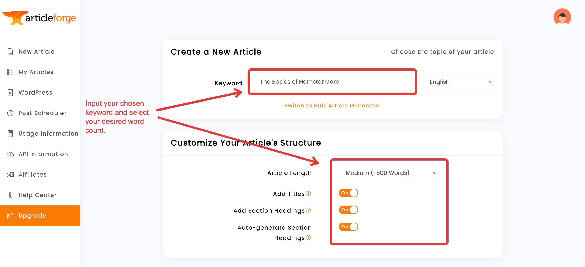

:::info **Please read the [*Material Usage Rules on this site*](../Disclaimer).**
:::
_______________________________________________
## Content Creation Modules
### Description
These modules let you create content based on your input text using third-party services. AI technology writes text that’s on par with what a human would produce.

Perfect for **rewriting text** and **creating unique content**.

:::warning **Works with English only.**
:::

### How it Looks

_______________________________________________
### Setting Up ArticleForge

#### 1. If you don’t have an account, create one.
#### 2. Get your API key in the API Information section.
_______________________________________________
### Setting Up WordAi

#### 1. If you don’t have an account, create one.
#### 2. Enter your login and API key from the API section into ZennoDroid settings.
_______________________________________________
## Google Sheets
In this article, we cover **only** *setting up Google Sheets* in the program. [You can find connection instructions here](../Project%20Editor/Lists%20and%20Google%20Sheets/Connecting_GoogleSheets).

### How it Looks

### Path to the Google OAuth Key
Here you need to select the path to the file with your [Google API connection settings](../Project%20Editor/Lists%20and%20Google%20Sheets/Connecting_GoogleSheets).

:::warning **The file must have a `.json` extension.**
:::

### Timeout for Clearing Unused Google Sheets
This setting determines how long the sheet will be stored in memory.

If no project in ZennoDroid uses a Google Sheet for the number of minutes set here, that sheet will be unloaded from memory to save your computer’s resources.

**A long timeout** can be useful when there’s a break between project launches (like on a schedule, every hour). That way, you won’t have to re-download the sheet from the cloud each time.

**A short timeout** is useful if you generate a new report with each run of your project and save it to a fresh sheet. In that case, you don’t need to keep those sheets in memory after uploading the data.

### Timeout for Loading a Sheet from the Cloud
Set the time allowed to load the sheet from the cloud here.

If the sheet is large, syncing may take a while. This can sometimes cause a loading error if the request takes too long.

### Policy for Handling Sheet Changes
In this setting, you can choose whether ZennoDroid should load outside changes to the sheet while you’re working with it.

If you choose **Never load outside changes while working**, the program will *only send* local data, ignoring whatever's currently in the cloud. This means the program won’t use up your time or computer resources on this. Handy for large sheets.

Turning off syncing is also useful when parsing data, if you don’t need up-to-date info from the cloud.
_______________________________________________
## Useful Links
- [**Connecting Google Sheets**](../Project%20Editor/Lists%20and%20Google%20Sheets/Connecting_GoogleSheets)
- [**Content Creation Modules**](../Data/ContentCreator)