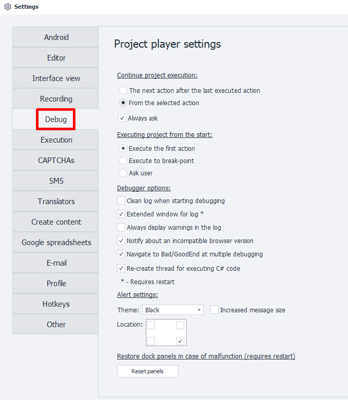
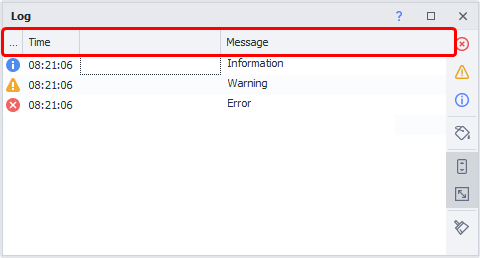
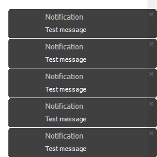
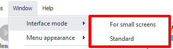

---
sidebar_position: 5
title: Debugging
description: Project playback settings.
---
:::info **Please read the [*Material Usage Rules on this site*](../Disclaimer).**
:::
_______________________________________________

## Where to continue project execution from
These settings control what happens when you click **Next** or **To End** during project playback.

### Next action after the last completed one
If enabled, the project will continue from the next action after the last one that was performed.

### From the selected action
With this one, the project continues running from whichever action you currently have selected in the project scheme.

### Always ask
This checkbox means you’ll be asked to choose between the above two options every time before continuing.
_______________________________________________
## Running the project from the beginning
This setting decides how the project behaves when you click ***From the Beginning***.

### Perform the first action
With this option, the project’s focus will jump to the first action right after you click **From the Beginning**.

### Run until a breakpoint
Actions will be executed up to the first ***Breakpoint***—or straight to the end if there isn’t one.

### Ask
You’ll be asked every time which behavior to use.
_______________________________________________
## Debugger options
### Clear log at the start of debugging
Every time you run the project **From the Beginning**, the log will be wiped automatically.

### Advanced log window
The log will show up in a window with extra features and the ability to copy text.

:::tip This setting turns on simultaneously for both ZennoDroid and ProjectMaker.
:::

Some differences, like headers appearing for example:

:::info You’ll need to restart for this option to take effect.
:::

### Always show warnings in the log
Extra warnings will show up in the log. For example:
- `If statement execution Result: false` if the [**IF**](../Project%20Editor/Logic/IF) action follows the red branch.

### Show warning about unsupported browser version
:::warning Not relevant for ZennoDroid. Doesn't affect anything.
:::

### Switch to Bad/GoodEnd during multiple debug runs
If this option is enabled, an action can transfer execution to [**BadEnd**](../Project%20Editor/Logic/BadEnd) or [**GoodEnd**](../Project%20Editor/Logic/GoodEnd), depending on whether errors occur or things are going smoothly.

But if you turn this option off, you can only hit *Bad/GoodEnd* once per run—after that, you’ll have to restart the project **From the Beginning**.

### Recreate C# code execution thread
This setting helps, in some cases, **prevent memory leaks** in *ProjectMaker* when running C# code on AMD processors. The actual bug is in *.NET Framework*.

:::warning Disables use of ThreadStatic.
If you use [**ThreadStatic**](https://www.c-sharpcorner.com/article/overview-of-threadstatic-attribute-in-c-sharp/) in your C# project, you should turn this option off.
:::
_______________________________________________
## Notification settings
This controls [**Notifications**](../Project%20Editor/Logic/Notification) that pop up on your desktop.

### Theme
Choose a background color for notifications:
- **Black**, black
- **White**, white
- **Blue**, blue
- **Green**, green
- **Orange**, orange
- **WhiteRed**, red and white

### Large message size
Notifications will show up bigger.

### Placement
Choose where notifications appear on your desktop:
- *bottom right (default)*
- *bottom left*
- *top left*
- *top right*
_______________________________________________
## Reset dock panel layout in case of glitches
The **Reset panels** button brings the program’s windows back to their default positions, which is useful if you undocked, moved, or closed them.

:::tip Windows also reset when you change the *Interface Mode*.

:::
_______________________________________________
## Useful links
- [**Log Window**](../pm/Interface/Log_window)
- [**Project Debugging**](../pm/Debugging)