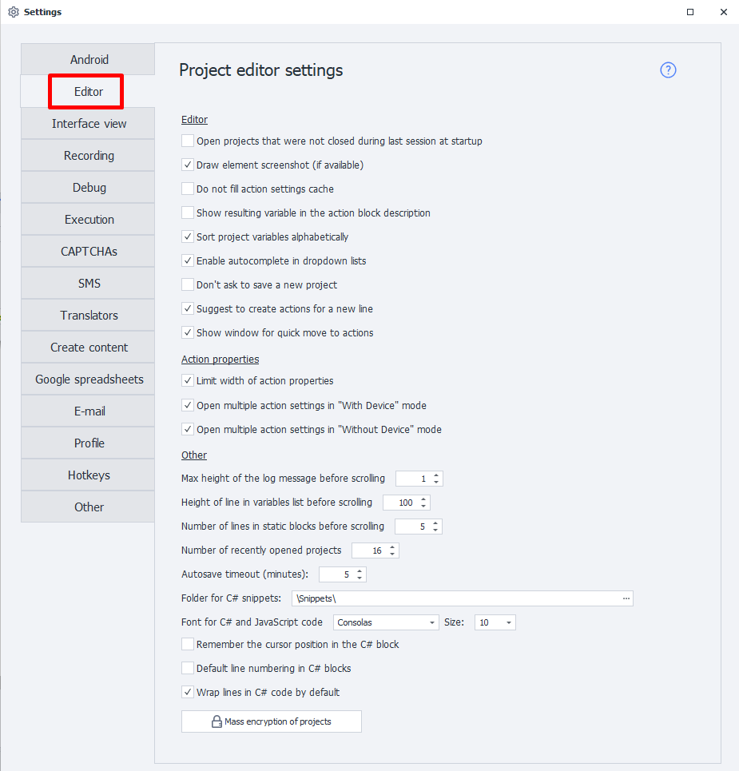
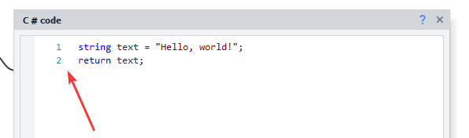

:::info **Please review the [*Terms of Use for materials on this site*](../Disclaimer).**
:::
_______________________________________________  
   

## Editor  
### Open previously opened projects at startup  
If you enable this option, when you launch the program, all projects that weren’t closed before you last exited will open up automatically.

### Draw element screenshot (if available)  
   

You'll see a screenshot of the corresponding element on the action block itself. This will make the overall template heavier, but it helps you navigate it more easily.

### Don’t fill the action settings cache  
Disables loading the action settings cache, which speeds up the program’s startup time.

### Show result variable in action description  
Adds a line to the comments of some blocks (ones that are supposed to return a result) that looks like this: `action name → {variable}`.

 

### Sort project variables alphabetically  
Variables will be arranged in alphabetical order.

### Use autocomplete in dropdown lists  
   

When typing a variable name or list/table in a dropdown field, autocomplete will kick in. This saves you from typing out the whole name and helps fill out the field faster.

:::info **A restart is required to apply this.**
:::

### Don’t suggest saving a new project  
Removes the window asking if you want to save the project after clicking ***Start Over***.

### Suggest actions when creating a new line  
When you create a new line—by dragging an arrow from a block—a list of possible actions to add will automatically pop up.

  

### Show quick jump window for actions  
When you hover over a connector dot, a quick jump window for actions will show up.

## Action Properties  
### Limit width of action properties  
Controls the grid in the **Action Properties** window. If checked, the grid has a fixed size. If unchecked, it will flex and adjust to the window’s width.

### Open multiple action settings in “With/Without Device” mode  
Lets you open several action settings at once next to the block. By default, this option is enabled only in “Without Device” mode. So, if you connect a device, this setting becomes inactive.

|     | 
| :--------: | 
| *You can open two or more settings windows*  |

## Other  
### Max log message height before scroll appears  
Sets how much of a log message will be visible before you have to scroll. The number means how many lines are shown for preview.

### Variable list cell height before scroll  
Likewise, this sets the visible height for cells in the **Variables** window before scrolling becomes necessary.

### Number of lines in static blocks before scroll appears  
Here you set how many lines are visible in the static blocks section before you have to scroll.

### Remember the number of recently opened projects  
Controls how many of your latest projects will show on the [**Welcome page**](../pm/Welcome_PM).

### Autosave timeout  
Sets how many minutes pass before your project is auto-saved.

### C# snippets directory  
Sets the directory from which **C# snippets** are loaded automatically into the program.

**Default directory:**  
`C:\Users\*USERNAME*\AppData\Roaming\ZennoLab\ZennoDroid\2\Snippets` 

### Font for C# and JavaScript code  
Lets you choose the font used in [**C#**](../Project%20Editor/CustomCode/С) and [**JavaScript**](../Project%20Editor/CustomCode/JS) code actions. By default, it’s *Consolas* at size 10.

### Remember cursor position in C# block  
The code will open to the line where you left off last time.

### Show line numbers in C# block by default  
Lines in [**C# code**](../Project%20Editor/CustomCode/С) will be automatically numbered.

### Word wrap in C# block by default  
Turns on automatic word wrap in C# code if the lines don’t fit in the window.

|     |  |
| -------- | ------- |
| Wrap on  | Wrap off    |  

### Bulk project encryption  
This button lets you [**Encrypt**](../Project%20Editor/Static%20Block%20Panel/Encryption) all open projects at once.
_______________________________________________  
## Useful links  
- [**All about working with the editor**](../category/редактор-проектов)  
- [**All about the static blocks panel**](../category/панель-статических-блоков)  
- [**Writing code in ZD**](../category/свой-код)