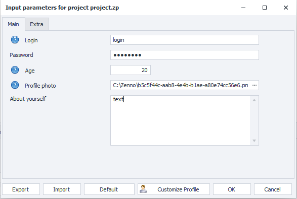
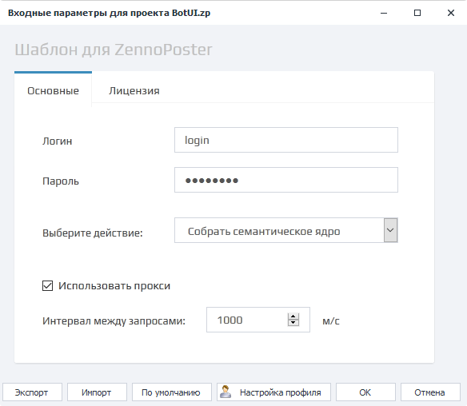
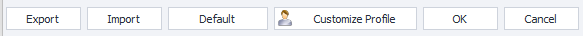
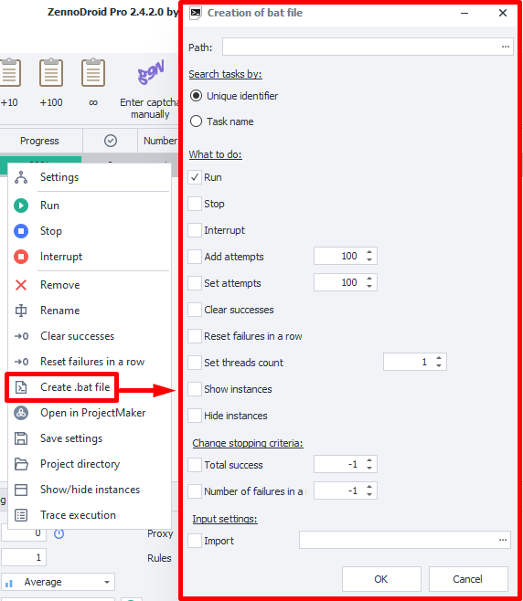
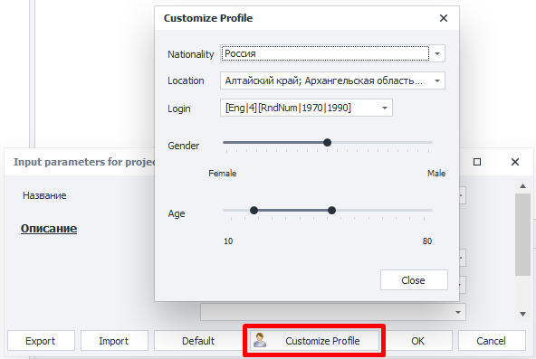

:::info **Please read the [*Rules for Using Materials on this Resource*](../Disclaimer).**
:::
_______________________________________________
## What Are Input Parameters?
These settings are used to pass data into a template. They can contain various types of data, such as file paths, text strings, numbers, captcha services, SMS services, dropdown menus, and so on.

In ZennoDroid, there are two types of input settings — [**Classic**](../Project%20Editor/Project/InputSetting) and [**Bot Interface (BotUI)**](../Project%20Editor/Project/BotInterface).

### Examples of What They Look Like
| Classic Settings    | Bot Interface (BotUI) |
| :--------: | :-------: |
|   |     |

### How to Open?
You can edit this section **only via ZennoDroid** — you won’t find it in ProjectMaker.

Choose the desired **Project → Right-click on it → Settings**.

_______________________________________________
## Control Buttons

### Export
Lets you save a file with the current settings.

| You can also put your settings into a [**.bat file**](../Execution/BatFile)    | 
| :--------: | 
|   |  

### Import
This button lets you load settings from an existing file.

### Default
Resets the input settings to their default values *(the ones set by the template developer)*.

### Profile Settings
When you click this button, a profile generation settings window will pop up. There, you can change nationality, gender, age, and the login generation formula.

You can find more detailed info in the article about [**Profile**](../Project%20Editor/Static%20Block%20Panel/Profile)

### OK and Cancel
These let you either save or discard any changes you’ve made.
_______________________________________________
## Important Note
Input settings are read **only once when the thread starts**!

If you change the settings during execution, it won’t affect the project until it’s started again.

### Example
Let’s say you enter your full name and date of birth in the input settings and launch the template. Once the project is running, you notice the data was entered incorrectly. You go to the settings and change them for the running template.

But in this case, all threads that were started before the new data are going to keep working with the old values. The changes will only affect threads started after you update the settings.
_______________________________________________  
## Useful Links   
- [**Profile Window**](../pm/Interface/Work_with_Profile)  
- [**All About the Static Block Panel**](../category/панель-статических-блоков)  
- [**Task Manager**](../get-started/Task_Manager)