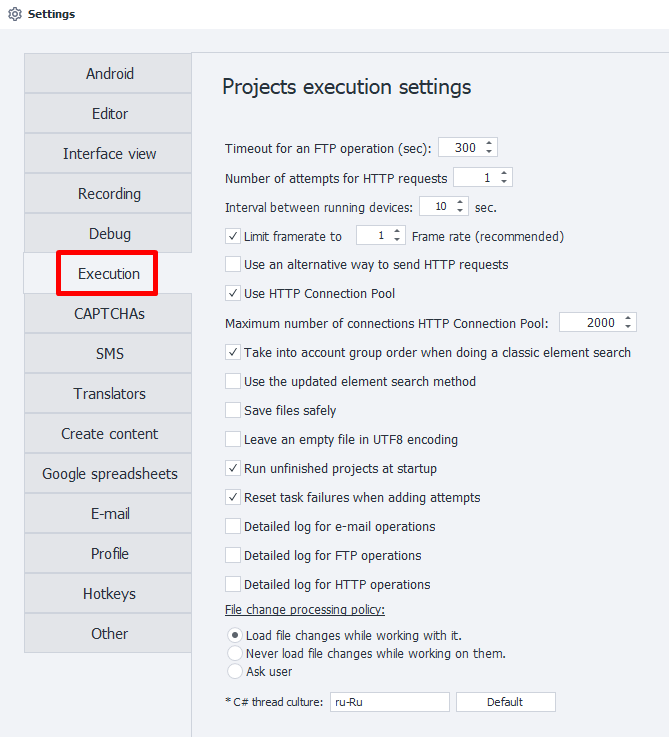
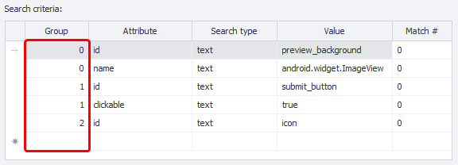

:::info Please read the [*Terms of Use for materials on this resource*](../Disclaimer).
:::
_______________________________________________

_______________________________________________
### FTP Operation Timeout (sec).
Here, you specify the number of seconds the program will wait for an FTP operation to complete.
_______________________________________________
### Number of HTTP Request Attempts.
The number of times the program will try to execute an [**HTTP request**](../Project%20Editor/HTTP%20and%20FTP/HTTP).
_______________________________________________
### Interval Between Device Launches (sec).
This interval helps prevent peak loads when starting multiple devices at once.
_______________________________________________
### Limit Frame Capture Rate.
This setting affects the display of the image in the preview window of the [**Device**](../pm/Interface/DeviceWindow).

If it's turned off, the image will be shown at the FPS value set in the emulator.

:::tip We recommend limiting the frame rate to improve performance.
Especially in multi-threaded projects.
:::
_______________________________________________
### Use Alternative HTTP Request Method.
If you enable this option, the alternative HTTP request method will be used by default.

It is set globally for the entire program and all new projects.

#### What is the alternative method?
In ZennoDroid, there are two ways to handle requests:
- Third-party implementation, used by default (standard method, Chilkat library);
- Our own (alternative method).

If you notice something not working correctly with HTTP requests, try switching to the alternative method.
_______________________________________________
### Use HTTP Connection Pool.
This option optimizes working with [**HTTP requests**](../Project%20Editor/HTTP%20and%20FTP/HTTP), making it more stable.
_______________________________________________
### Maximum Number of Connections in HTTP Connection Pool.
This setting limits the number of connections for ZennoDroid and ProjectMaker, helping stabilize work with a large number of HTTP requests.
_______________________________________________
### Take Group Order Into Account During Classic Element Search.
If you turn this on, the search conditions will be processed in the order shown in the **Group** column.

_______________________________________________
### Safely Save Files.
Prevents lists and files from getting corrupted in case of sudden server reboots.
_______________________________________________
### Leave Empty File in UTF-8 Encoding.
If a list remains empty during template execution, the file will be saved in UTF-8.
_______________________________________________
### Start Unfinished Projects at Startup.
When the program starts, any projects you didn't close during the last session will launch automatically.
_______________________________________________
### Reset Failed Task Counter When Adding Attempts.
The failed task counter will be reset when you add new execution attempts.
_______________________________________________
### Detailed Email Log.
Enables a detailed log for [**email operations**](../Project%20Editor/RecieveEmails).
_______________________________________________
### Detailed FTP Log.
Enables a detailed log for [**FTP operations**](../Project%20Editor/HTTP%20and%20FTP/FTP_Dir).
_______________________________________________
### Detailed HTTP Log.
Enables a detailed log for [**HTTP operations**](../Project%20Editor/HTTP%20and%20FTP/HTTP).
_______________________________________________
### File Change Handling Policy.
Here you set how the program will behave if files linked to lists and tables are changed from outside.

#### Always load file changes while working.
The program will automatically detect and load file updates.

#### Never load external changes while working.
The program will load the file at startup only and won’t check for changes.

#### Ask the user.
The program will always prompt you for confirmation before loading changes from the file.
_______________________________________________
### C# Thread Culture.
This setting controls the localization language for the thread, execution, and debugging of projects and C# blocks. This is called the **Culture**.

In the Russian version, the default is *culture* `ru-RU`. It can affect date parsing, decimal commas in numbers, and more.

To set **InvariantCulture**, simply *clear the input field* and leave it empty.

:::tip Program restart is required.
For changes related to C# thread culture to take effect.
:::
_______________________________________________
## Useful links.
- [**Send mail**](../Project%20Editor/SendEmails).
- [**HTTP requests**](../Project%20Editor/HTTP%20and%20FTP/HTTP).
- [**FTP connection**](../Project%20Editor/HTTP%20and%20FTP/FTP_Connect).