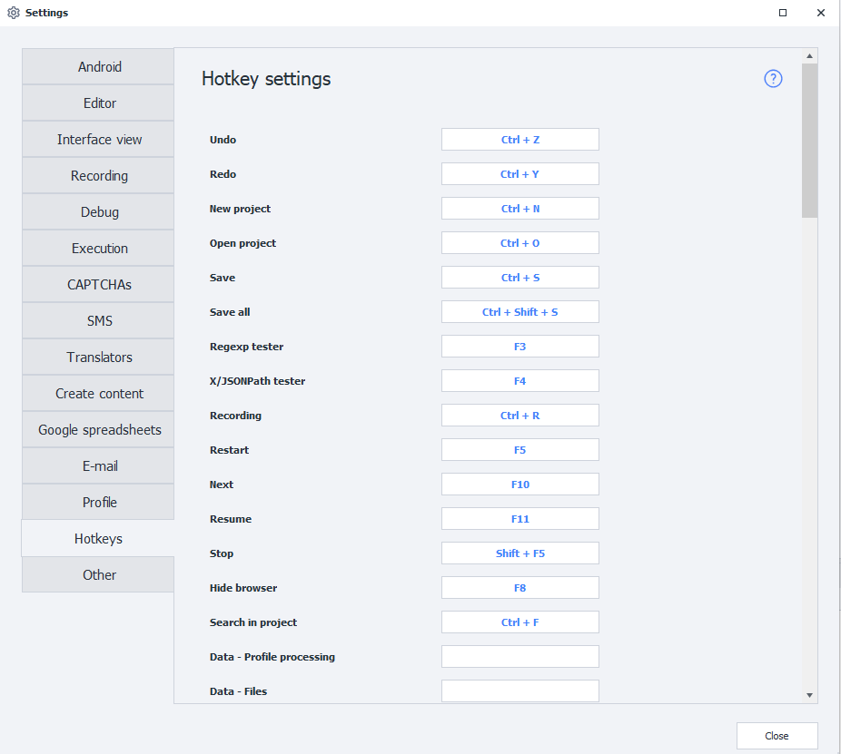

---
sidebar_position: 13
title: Hotkeys
description: List of hotkeys.
---
:::info **Please read the [*Material Usage Rules on this site*](../Disclaimer).**
:::
_______________________________________________
## Description.
You can set up your own hotkeys in the program settings to make your workflow more convenient.

_______________________________________________
## Keyboard Shortcuts
| Keys              | Function |
| :----------------: | :------ |
| `Left click action` + `Enter/Space` |   Opens this action’s settings in a popup window  |
| `Esc`                |   Closes the action settings   |
| `Ctrl` + `C`       | Copies the selected action   |
| `Ctrl` + `X`       |  Cuts the selected action     |
| `Ctrl` + `V`       |  Pastes the action from the clipboard where your cursor is   |
| `Ctrl` + `Z`       |  Undoes the last action   |
| `Ctrl` + `Y`       |  Redoes the last action   |
| `Ctrl` + `N`       |  Creates a new project   |
| `Ctrl` + `O`       |  Opens an existing project   |
| `Ctrl` + `S`       |  Saves the current project   |
| `Ctrl` + `F`       |  Search in the project   |
| `Ctrl` + `Shift` + `S` |  Saves the current project   |
| `Ctrl` + `Alt` + `P`   |  Publishes the current project   |
| `Delete`           |  Deletes the selected action   |
| `Up ᐃ`             |  Moves the cursor up within the group or to the previous action   |
| `Down ᐁ`           |  Moves the cursor down within the group or to the next action via a successful branch   |
| `Left ᐊ`           |  Moves the cursor to the first incoming action or up a group   |
| `Right ᐅ`          |  Moves the cursor to the next action via a successful branch or down a group   |
| `Ctrl` + `Right ᐅ` |  Moves the cursor to the next action via a failed branch  |
| `PageUp`           |  Jumps to the first action in the group   |
| `PageDown`         |  Jumps to the last action in the group   |
| `F3`               |  Opens the [regex builder](../Tools/RegEx_Tester)   |
| `F4`               |  Opens the [X/JSON Path tester](../Tools/JSON_Tester)   |
| `F8`               |  Hides the browser   |
_______________________________________________
## Mouse Controls
| Combination            | Function |
| :----------------: | :------ |
| `Double left-click an action`      |   Opens its settings   |
| `Hold mouse wheel` + `Move mouse`  |   Pans the project canvas   |
| `Ctrl` + `Scroll mouse wheel`      |  Zooms in/out on the canvas   |
| `Double left-click empty canvas area` |  Resets zoom to 100%   |
| `Double left-click any output` + `Double left-click input of another action` |  Creates a connection between them   |
_______________________________________________
## Hotkeys for Project Debugging
| Keys                | Function |
| :----------------: | :------ |
| `Ctrl` + `R`         |   Turn project recording on/off   |
| `F5`                 |    Start the project from the beginning   |
| `F10`                | Step to the next action   |
| `F11`                |  Run to the first breakpoint   |
| `Shift` + `F5`       |  Stop execution   |
_______________________________________________
## Hotkeys for C# Macro Editing
| Keys                | Function |
| :----------------: | :------ |
| `Ctrl` + `C`         |   Copy selected   |
| `Ctrl` + `X`         |   Cut selected   |
| `Ctrl` + `V`         |   Paste selected   |
| `Ctrl` + `G`         |  Go to line number n   |
| `Shift` + `Delete`   |  Cut current line   |
| `Ctrl` + `K`         |  Comment out selected lines   |
| `Ctrl` + `U`         |  Uncomment selected lines   |
_______________________________________________
## Useful Links
- [**Hotkeys in ZennoDroid**](../get-started/Hot_Keys)
- [**Canvas Navigation**](../pm/Interface/MiniMap)
- [**Project Debugging**](../pm/Debugging)