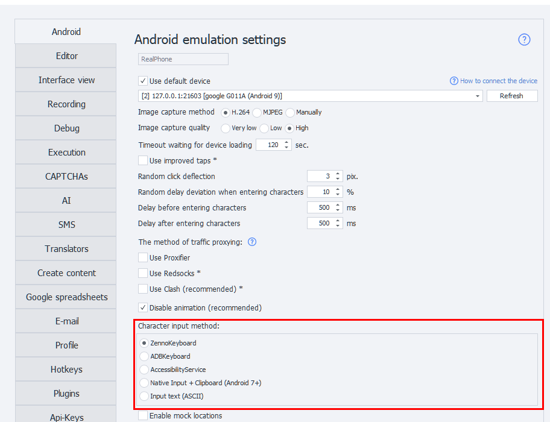

import DisclaimerNotice from '@site/src/components/DisclaimerNotice';

# Input Methods (Enterprise)
<DisclaimerNotice />

## Input Methods
The program has **5 ways** to input characters from the keyboard.
  

Different devices handle character input differently, so having several options lets you pick what works best. The first four let you enter any symbols, including emojis; the last one handles only ASCII.
:::warning The input method is picked on the device when it starts
*If you change the setting while a device is already running, input actions may fail with **Used input method does not match the settings**. Restart the device to apply the new method.*
:::
_______________________________________________
### Details
#### ZennoKeyboard
ZennoLab's own keyboard and, starting from version **2.6.1.0**, the **default** input method. Like ADBKeyboard, it installs automatically when you connect your device and types characters as if you were using a virtual keyboard.
It talks to the program directly, so special characters need no escaping and the device **confirms the result of the input**: if the field would not take the text, or the app has closed, the action fails right away instead of carrying on as if the text had been typed.
While the keyboard is active, a `ZennoKeyboard {ON}` line is shown at the bottom of the screen in place of the keys.
:::tip Keep in mind
*Input only works while a text field has focus* — that is the only moment Android binds the keyboard to the app. With nothing focused, the log shows ***ZennoKeyboard is not responding. Make sure a text field has focus***.
:::

:::info Note
*Requires Android 8.1 or newer. On older devices use **ADBKeyboard**.*
:::

#### ADBKeyboard
This uses a third-party keyboard that installs automatically when you connect your device. With it, you can type characters as if you were using a virtual keyboard.
#### AccessibilityService
Uses [***UiAutomator2***](https://github.com/appium/appium-uiautomator2-driver). Lets you set any value for the field that's currently focused.
Technically, it doesn't input characters—it just changes the field's **Text** property to what you want.
:::tip Keep in mind
*This won't work in apps that don't have a standard element tree. For example, in games.*
:::

#### Native input + Clipboard
Inputs characters via the **IInputManager** and **IClipboard** interfaces. This method is pretty quick.
:::info Note
*Inputting Cyrillic/emojis only works on Android 7 and up. ASCII works on any device.*
:::

#### Input text
Similar to the ***input text*** command, but includes all necessary text conversions so that special characters `< > | ) (` and others get entered correctly. Only supports **ASCII characters**.
:::info Recommendation
*Character-by-character entry is slow, so it's better to choose an input method with **no delay** enabled.*
:::
_______________________________________________
### What if ZennoKeyboard didn't install?
1. You need to install the ***com.zennolab.zennokeyboard.apk*** app on your phone (*the file is in the Android folder inside the main program folder*). For example, use the [**Install App**](../Android/pro-lite/App#install-application) action.
2. On your phone, go to the on-screen keyboard settings, enable ***ZennoKeyboard*** and pick it as the default input method.
3. Run the [**Start VM**](../Android/pro-lite/action#how-do-i-start-or-restart-a-device) action. The keyboard will pop up in any field where you need to enter text—you'll see a `ZennoKeyboard {ON}` line at the bottom.
:::info Note
*If the log shows **Could not enable ZennoKeyboard**, the system is missing the rights to change the input method. On a rooted device ZennoDroid grants them automatically; without root, enable the keyboard by hand — as in step 2.*
:::
_______________________________________________
### What if ADBKeyboard didn't install?
1. You need to install the ***com.android.adbkeyboard.apk*** app on your phone (*the file is in the Android folder inside the main program folder*). For example, use the [**Install App**](../Android/pro-lite/App#install-application) action.
2. On your phone, go to your language input settings and enable ***AdbKeyboard***.
3. Run the [**Start VM**](../Android/pro-lite/action#how-do-i-start-or-restart-a-device) action. This activates the keyboard. It'll pop up in any field where you need to enter text—you'll see a small `Adb keyboard ON` notification at the bottom.