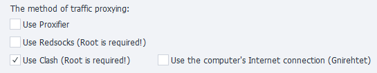

---
sidebar_position: 1
sidebar_label: Traffic proxying (Enterprise) (up to version 2.4.2)
title: Traffic proxying (Enterprise) (up to version 2.4.2) | ZennoDroid Documentation | ZennoLab
description: Traffic proxying (Enterprise) — a section of the official ZennoDroid documentation by ZennoLab. Detailed instructions, usage examples, and a configuration guide
---  
import DisclaimerNotice from '@site/src/components/DisclaimerNotice';


## Description.  
:::warning **Outdated information**
Relevant for ZennoDroid versions up to 2.4.2
:::
ZennoDroid lets you choose how traffic is proxied when performing the [**Set proxy**](../Android/Enterprise/setting#как-поставить-прокси) action.  

The parameters are configured on the [**Android Settings**](../Android/Enterprise/setting#как-поставить-прокси) tab. By default, **Proxifier** is used.  

    
_______________________________________________ 
## [Proxifier](https://proxifier.com/).  
This is a powerful and flexible application for redirecting internet traffic through a proxy server. It allows applications that do not support proxying to use it.  

The computer’s internet connection is used. All traffic from the phone is wrapped into a VPN using Gnirehtet and sent to the PC, where it is then proxied via the Proxifier application.  

:::tip **Gnirehtet is a tool that lets you share internet from a computer to an Android device.**
It works like the familiar “hotspot,” but in reverse. This is useful when your phone has no mobile internet or Wi‑Fi access, but your computer is connected to the network.  

The program works via a USB cable or wirelessly and does not require root access on the device. 
:::
__________________________________________ 
## Redsocks.  
This utility is used to redirect network traffic through a proxy server without the need to manually configure a proxy in each individual application. A transparent redirect of TCP/UDP connections to the proxy is performed.  

All required files are copied to the device automatically during the first proxy installation.

:::warning **Works only on devices with Root.**
:::  

### By default, DNS queries will be routed through the proxy server.  
If the proxy server blocks DNS queries—there is no internet or the error `DNS_PROBE_FINISHED_NO_INTERNET` occurs—you need to disable redirection.  

> Disable redirection using C# code:  
> ```
> instance.DroidInstance.Proxy.UseDnsTcp = false;  
> instance.DroidInstance.Proxy.UseDnsUdp = false;  
> ```  
> **This code must be executed *before* setting up the proxy.**
_______________________________________________ 
## Clash.  
This is an advanced proxy client with the ability to route traffic based on predefined rules. It features a powerful rule-based approach and decides on its own which server to route traffic through depending on the configured rules. 

Simple and complete proxying of all UDP traffic—unlike redsocks, there is no need to configure separate proxying for each IP. Thanks to this, when using a proxy that supports UDP, even the IP address via WebRTC is shown as the proxy address.  

:::warning **Works only on devices with Root.**
BusyBox version 1.36.1 or higher is required.
:::  
__________________________________________
## Use the computer’s internet connection (Gnirehtet).  
If this setting is **disabled**, all internet traffic will be transmitted directly through the phone’s Wi‑Fi connection. However, when it is **enabled**, all traffic from the phone starts going through a bypass via Gnirehtet and is sent to the computer.  

When using this method, you need to turn off data transmission on the phone to prevent accidental traffic leaks to the network. You can do this manually or using an action.  

Console commands to disable:  
```
svc wifi disable
svc data disable
```  

This approach guarantees that all traffic will pass strictly through the computer’s internet connection.  

### Local IP.  
Configure the device’s local IP address.  

If you set the last number of the address to **zero**, for example `192.168.20.0`, a random address from the specified subnet (`192.168.20.2`–`192.168.20.254`) will be generated.  

A local IP can be set when using:  
- Proxifier, 
- Redsocks + the computer’s internet connection.  

> C# code to specify a local IP for each thread individually:  
> ```
> instance.DroidInstance.Proxy.SetLocalAddress("192.168.50.0");
> ```  
> **This code must be executed *before* setting up the proxy.**  

### DNS addresses  
Configure the DNS server address. You can specify several, separated by commas: `8.8.8.8,1.1.1.1`.  

> C# code to specify DNS server addresses for each thread individually:  
> ```
> instance.DroidInstance.Proxy.SetDnsServers("8.8.8.8,8.8.4.4");
> ```  
> **This code must be executed *before* setting up the proxy.**  
_______________________________________________
- [**Installing Clash (Box for Root).**](../Android/Enterprise/Clash).