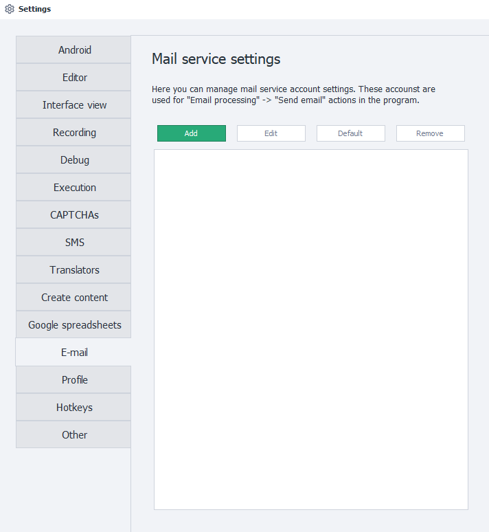
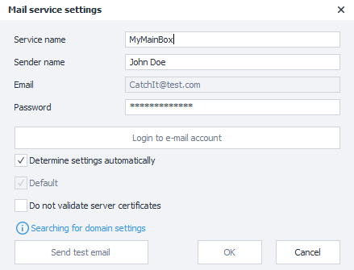
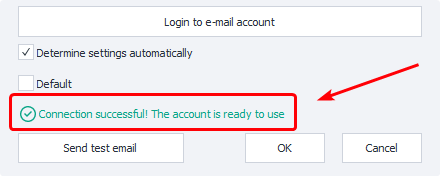
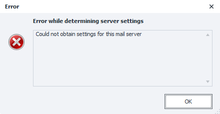
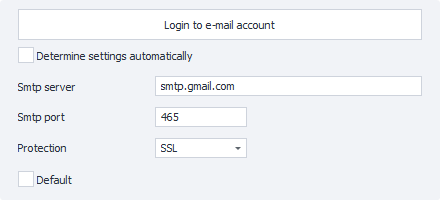

---
sidebar_position: 12
title: E-mail
description: Setting up connections to mailboxes.
---
:::info **Please read the [*Material Usage Rules on this site*](../Disclaimer).**
:::
_______________________________________________  
## Description  
This settings section is for connecting mailboxes, which you can then use for [**sending emails**](../Project%20Editor/SendEmails).

_______________________________________________
## "Add" Button  
Clicking this button opens the window for adding a new connection.

### Service Name  
A custom name for this account, which you make up yourself. This is how it’ll show up in the available list, for example, in the [**Send Mail**](../Project%20Editor/SendEmails) action.

:::warning This is a required field and must be unique within the program.
:::

### Sender Name  
This is the name your recipient will see as the sender.

### Email  
The full email address from which emails will be sent. It has to be real, otherwise the program will give an error.

### Password  
The password for this mailbox.

For security reasons, some email providers require a special password for third-party programs. It’s called an **App Password**. You can get it in the settings of your chosen service.
_______________________________________________
### "Login to e-mail" Button  
After clicking this, the program will check if your SMTP server connection details are correct. However, it does not check if the *Email-Password* pair is correct.

If the connection is successful, a green message will show up at the bottom of the window:

If the program fails to connect to the server, you’ll get a pop-up error window:

If this happens, you’ll have to set up the connection manually. To do this, uncheck **Determine settings automatically**.

### Determine Settings Automatically  

When this option is enabled, the program will try to figure out the right SMTP connection settings based on the email address you’ve entered.

If you get an error after using automatic settings, uncheck this and enter them manually, using info from your provider’s website.

### Default  
If you switch this on, this connection will be used by default every time in [Mail Sending](../Project%20Editor/SendEmails) blocks, unless you specify otherwise.
_______________________________________________
### Do Not Validate Server Certificates  
Sometimes, when connecting an account, you might get an error like:  
**`An error occured while attempting to establish an SSL or TLS connection`**.

This usually happens if the connection to the mail server isn’t secured. Because of this, the provider refuses the connection since the system can’t verify the authenticity of SSL/TLS certificates.

There can be different reasons for this. The most common are:  
- An old version of Windows with outdated trusted certificates;
- An antivirus that replaces server certificates to decrypt and check incoming traffic;
- Firewall or security software is turned on.

The solution depends on the cause. You might need to update Windows or disable the firewall. For antivirus, pay extra attention to its email and traffic scanning settings.

If nothing else helps, you can enable this option. With it, any certificates sent by the server for connecting won’t be checked, and the connection will show as secure.

:::warning Disabling certificate checks means your traffic with the email provider could be intercepted.
:::  
_______________________________________________
### "Send Test Email" Button  
When you click this button, ZennoDroid will try to send an email to your account using the specified SMTP server. This is to make sure your details are set up correctly.

If the account details are correct, you’ll see a status: **`Test email sent successfully`**. That means your mail service is ready to use in the program.

If there’s incorrect info, you’ll get an error: **`Failed to send test email`**, with a more detailed description in the window.

:::tip Some email providers require you to explicitly enable third-party mail access.
You can find suitable settings by searching:  
`smtp connection settings <YOUR_PROVIDER_NAME>`
:::
_______________________________________________
## "Edit" Button  
You can use this button to edit mail accounts you added earlier.

## "Default" Button  
This lets you change which account will be used by default.

## "Delete" Button  
Deletes the selected account from the program settings.
_______________________________________________  
## Useful Links  
- [**Receive Mail**](../Project%20Editor/SendEmails)
- [**Variables Window**](../pm/Interface/Variables)