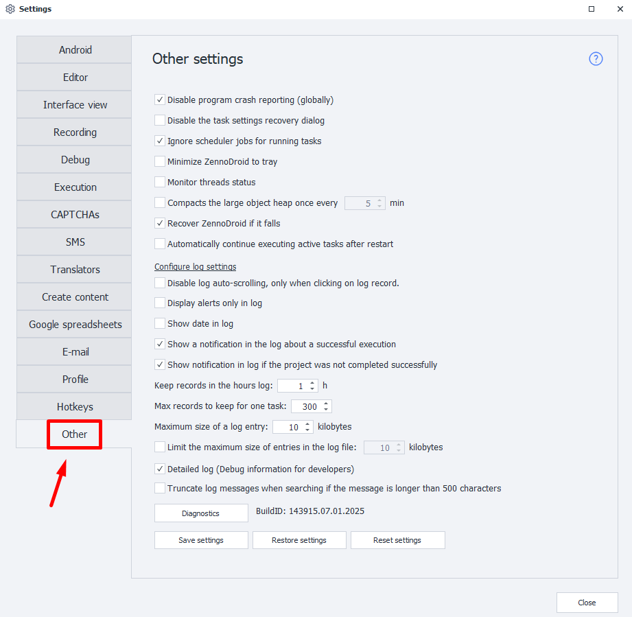

---
sidebar_position: 14
title: Other
description: Other available settings.
---
:::info **Please read the [*Material Usage Rules on this site*](../Disclaimer).**
:::
_______________________________________________
## Appearance

## General Settings
### Disable program crash reporting (globally)
Sometimes, due to internal issues, the device might crash. ZennoDroid tracks these problems and tries to restore its operation. But if a notification window pops up at that moment, there’s a chance the device won’t be able to reboot.

### Disable the task settings recovery dialog
This option disables the ability to recover settings in case of a program crash. It can be useful if this recovery window blocks ZennoDroid from auto-starting.

:::warning We don’t recommend turning off this option.
:::

### Ignore scheduler jobs for running tasks
If a project is already running when you want to launch it using the scheduler, that scheduled task will be delayed until the current job finishes.

### Minimize ZennoDroid to tray
When you minimize the program window, it’ll go to the system tray.

### Monitor threads status
Enables monitoring of thread status in the program for statistics. This info is only helpful if you contact tech support. So **we don’t recommend turning on this option just for fun**.

### Compacts the large object heap once every
This feature is handy when processing big text data, for example, with auto search enabled in ProxyChecker.

You can also set how often compression happens, like, every 5 or 10 minutes.  

### Recover ZennoDroid if it fails  
This option restores the program’s operation in case of an unexpected termination.

### Automatically continue executing active tasks after restart
Controls whether to resume tasks that were active before the last program shutdown.
_______________________________________________
## Configure Log Settings
### Disable log auto-scrolling, only when clicking on log record.
Log autoscrolling will only pause after you click on any record in the log.

### Display alerts only in log 
Messages sent using the [**Notification**](../Project%20Editor/Logic/Notification) action will only show up in the log, without a popup window, no matter how the action’s settings are set.

### Show date in log
The current date will also be shown in the log.

### Show a notification in the log about a successful execution
If a project completes successfully, the log will show a message about it.

### Show a notification in log if the project was not completed successfully
If a project fails, you’ll also see a message about it in the log.

### Keep records in the hours log
Sets the max amount of time log entries are stored (in hours).

### Max records to keep for one task
Here you set the maximum number of log entries that can be stored for a single task.

:::info The max allowed value is 9999.
:::

### Maximum size of a log entry 
Limits the maximum size (in kilobytes) of a single entry displayed in the log window.

### Limit the maximum size of entries in the log file
This setting limits the size of each entry that can be saved in the log file. We recommend enabling this limit if you aren’t working with large data sets and don’t need full logs, since it’ll boost ZennoDroid performance and reduce memory consumption.

Log files are stored in the directory where ZennoDroid is installed, in the `Logs` folder. Possible path:  
`C:\Program Files\ZennoLab\RU\ZennoPoster Pro V7\7.4.0.0\Progs\Logs\`

:::warning Program restart is required for changes to take effect.
:::
_______________________________________________
## Different
### Detailed log (Debug info for developers)
More detailed info about what’s happening in the software will be logged. This can come in handy if you need support.  

### Truncate log messages when searching if the message is longer than 500 characters

### Diagnostics
This button starts the diagnostic tool (`diagnostic.exe`) to collect info in case something goes wrong.

After running diagnostics, a file called `report.zip` will be created in the ZennoDroid installation folder.

:::tip Check [here for how to run diagnostics properly](https://zennolab.atlassian.net/wiki/spaces/RU/pages/870419658).
:::

### Save settings
Opens the manager for saving the current program settings. To do it right, close ZennoDroid and ProjectMaker manually after starting the manager, then click **Save**.

### Restore settings
Use this manager to restore previously saved settings. It works the same way as the save manager above.

### Reset settings
Resets the program settings to factory defaults.

### BuildId
This string is a mix of letters and numbers unique to each program version. It also contains the release date for the current version.

:::tip You can select and copy the value in this field.

:::
_______________________________________________
## Useful links
- [**Log window**](../pm/Interface/Log_window)
- [**Task manager**](../get-started/Task_Manager)
- [**ZD logic**](../category/логика-в-zd)