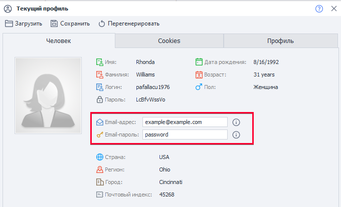

import DisclaimerNotice from '@site/src/components/DisclaimerNotice';

# Profile
<DisclaimerNotice />

## Profile settings  

Here you can set the default characteristics that will be generated when you start a project.
_______________________________________________
### Default nationality

The nationality used for profile generation. You can also change it at the template level in your project profile settings.
_______________________________________________
### Registration Email
The email you enter here will be used for all new profiles.
You can change it too by reassigning fields in **Profile Operations**.
The value is stored in the environment variable `{-Profile.Email-}`.

_______________________________________________
### Registration email password
This email password will be used for all new profiles. You can also change it in  
**Profile Operations**. The value is stored in the environment variable `{-Profile.EmailPassword-}`.
_______________________________________________
## Useful links
- [**Generating a profile for your project**](../project-editor/static-block-panel/Profile)
- [**Profile window**](../pm/Interface/Work_with_Profile)
- [**Profile operations**](../Data/WorkWithProfile)