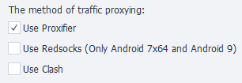

:::info Please check out the [*Rules for using materials on this site*](../Disclaimer).
:::
_______________________________________________
## Description
ZennoDroid lets you choose how you want to proxy traffic when running the [**Set Proxy**](../Android/ProLite/setting#как-поставить-прокси) action.

You set this up on the [**Android Settings**](../Android/ProLite/setting#как-поставить-прокси) tab. By default, **Proxifier** is used.

**If you enable both options at once,** traffic proxying will automatically switch based on the device image:
- Android 7x64 and Android 9.0: **Redsocks2**
- Android 5.1 and Android 7x86: **Proxifier**
_______________________________________________
### [Proxifier](https://proxifier.com/)
This is a powerful and flexible app that redirects internet traffic through a proxy server. It lets applications that don’t normally support proxy work with one.

The emulator’s traffic is proxied based on its PID in Windows.

:::tip PID (Process Identifier)
A PID is a unique numeric ID given to each process by the operating system. It helps manage, track, and interact with processes.

A PID is only unique at a single point in time. When a process ends, its PID can be assigned to another process later on.
:::
_______________________________________________
### Redsocks
This tool lets you route network traffic through a proxy server without having to manually set up a proxy in every single app. It transparently redirects TCP/UDP connections to a proxy.

All the necessary files are copied to your device automatically when you set up a proxy for the first time.

:::warning Only works with Android 7x64 and Android 9.0 images.
:::
_______________________________________________
### Clash
Clash is an advanced proxy client that routes traffic based on customizable rules. It uses a powerful rule-based approach to decide which server your traffic should go through, depending on how you set it up.

It easily and fully proxies all UDP traffic—in contrast to redsocks, you don’t have to configure proxying for each IP separately. This means when you use a proxy that supports UDP, even your IP address through WebRTC shows as the proxy address.
_______________________________________________
## Useful links
- [**Android Settings. Setting up a proxy.**](../Android/ProLite/setting#как-поставить-прокси)