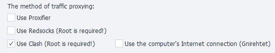

:::info **Please review the [*Terms of Use for materials on this site*](../Disclaimer).**
:::
_______________________________________________
## Description
ZennoDroid lets you choose how to proxy traffic when running the [**Set Proxy**](../Android/Enterprise/setting#как-поставить-прокси) action.

You can set up your preferences under the [**Android Settings**](../Android/Enterprise/setting#как-поставить-прокси) tab. By default, **Proxifier** is used.

_______________________________________________
### [Proxifier](https://proxifier.com/)
This is a powerful and flexible program that reroutes internet traffic through a proxy server. It even lets apps that don’t have built-in proxy support use one.

It uses your computer's internet connection. All your phone's traffic is tunneled into a VPN using Gnirehtet and sent to your PC, where Proxifier handles the rest.

:::tip **Gnirehtet is a tool for sharing your computer’s internet with your Android device.**
It works kind of like a hotspot, but in the opposite direction. This comes in handy if your phone doesn’t have mobile data or Wi-Fi access, but your computer does.

Gnirehtet works over USB or wirelessly, and doesn't need root access.
:::
__________________________________________
### Redsocks
This utility is used to redirect network traffic through a proxy server, so you don’t have to manually set up a proxy for each app. It transparently redirects TCP/UDP connections to the proxy.

All necessary files are automatically copied to your device the first time you set up a proxy.

:::warning **Works only on rooted devices.**
:::
_______________________________________________
### Clash
Clash is an advanced proxy client that can route traffic based on specific rules. It’s really flexible and can decide which proxy server to use for different types of traffic, depending on how you set it up.

It can easily and completely proxy all UDP traffic — unlike redsocks, you don't need to set up proxy rules for each IP individually. This means when you're using a proxy that supports UDP, even your IP address through WebRTC shows up as the proxy's address.

:::warning **Works only on rooted devices.**
You’ll need BusyBox version 1.36.1 or higher.
:::
__________________________________________
### Use Computer’s Internet Connection (Gnirehtet)
If this option is turned off, all internet traffic from your phone goes through its Wi-Fi connection.

But if you turn it on, all the traffic from your phone is tunneled into a VPN using Gnirehtet and routed through your computer.

:::info **Be sure to turn off your phone’s data connection.**
We recommend doing this if you’re proxying traffic through your computer’s internet connection. That way, you can avoid accidentally leaking traffic through your phone’s Wi-Fi or mobile network.

You can do it manually or by running the [Console Commands](../Android/ProLite/ADB_Shell) action:

- Turn off Wi-Fi: `svc wifi disable`
- Turn off mobile data: `svc data disable`
:::
_______________________________________________
- [**How to Install Clash (Box for Root).**](../Android/Enterprise/Clash)