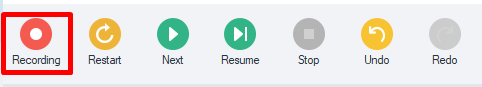
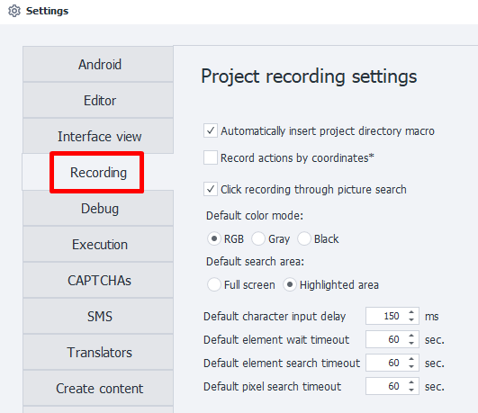
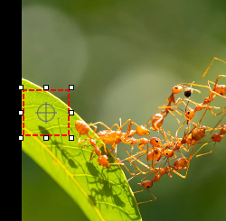
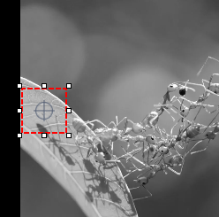
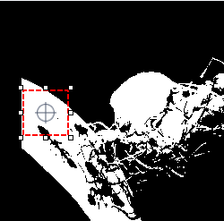

---
sidebar_position: 4
title: Project recording
description: Project recording.
---
:::info **Please read the [*Material Usage Rules on this site*](../Disclaimer).**
:::
_______________________________________________
## Project Recording

This tab contains the settings that get activated when project recording is turned on.

_______________________________________________
## Automatically insert project directory macro
:::tip This setting works even *when project recording is off*.
:::

ZennoDroid has [**environment variables**](../pm/Creating/Variables). For example, `{-Project.Directory-}`, which stores the path to the directory where your project file is saved.
:::info If the project isn't saved to disk, the variable contains an empty string.
:::

When you turn on this setting, ProjectMaker will automatically insert the **project directory macro** wherever possible while creating a project. For example, in other settings or actions. The chosen path should either be in the same folder as the project file, or in one of its subfolders.
_______________________________________________
## Record actions by coordinates
This setting controls whether all clicks inside the [**Emulator Window**](../pm/Interface/DeviceWindow) get recorded along with their coordinates when recording your project. The project will include [**touch emulation actions**](../Android/ProLite/Touch_Emulation) with the click coordinates filled in automatically.
:::warning The emulator's resolution must be the same when creating and running your project!
:::
_______________________________________________
## Click recording through search
When you turn on this option, every click inside the [**Emulator Window**](../pm/Interface/DeviceWindow) will be saved to your project as a [**touch action**](../Android/ProLite/RunEvent) using [**Image Search**](../pm/Creating/SearchByPic).
### Color mode
Image search will use one of the following modes by default:
- **RGB**. Search by colored image.
- **Gray**. Grayscale only.
- **Black**. Black and white only.

| RGB              | Gray | Black (Threshold 140) |
| :----------------: | :------: | :----: |
|         |      |  |
  
:::tip Our advice
*To speed up the search, use either **Gray** or **Black** mode*
:::

### Search area
Choose the default area for image search:
- Entire screen
- Selected area of the screen

:::info To reduce CPU load, it's better to search only in a designated screen area.
:::
_______________________________________________
## Character Input Delay
Used in [**Keyboard Emulation**](../Android/ProLite/Keyboard) and [**Set Value**](../Android/ProLite/SetValue) actions as the *default* setting.
_______________________________________________
## Element Wait Timeout
Used in [**Set Value**](../Android/ProLite/SetValue), [**Get Value**](../Android/ProLite/GetValue), and [**Run Event**](../Android/ProLite/RunEvent) as the *default* for the field ***"Wait for element no more than (sec)"***.
_______________________________________________
## Element Search Timeout
Used in the [**Image Search**](../pm/Creating/SearchByPic) action as the *default* value for  
***"Wait for element no more than (sec)"***.  
_______________________________________________  
## Pixel Search Timeout
Used in the [**Pixel Search**](../pm/Creating/SearchByPix) action as the *default* value for  
***"Wait for element no more than (sec)"***.  
_______________________________________________
